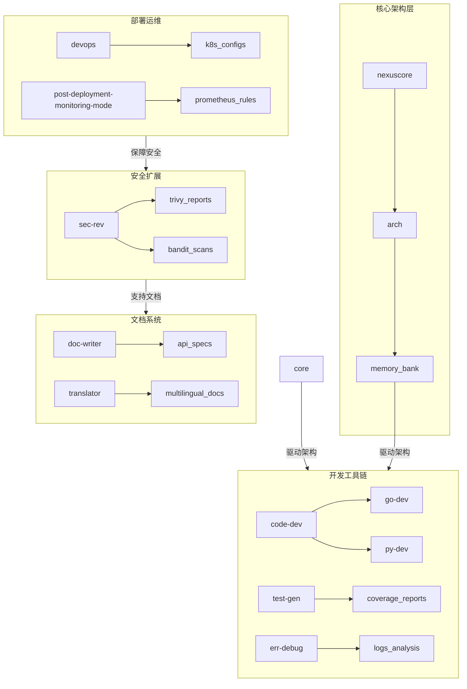

# 模式文档总览

1. **模式文档总览**  
    - 本文档遵循ISO 21468标准，整合系统架构与开发规范  
    - 核心章节包含：架构设计、开发流程、部署运维、知识管理  

---

2. **内存银行管理规范**  

   **初始化协议**：  
    - NexusCore通过`list_files`检查`memory_bank/`目录结构  
    - 加载顺序：`systemPatterns.md` → `decisionLog.md` → `progress.md`  
   **更新触发条件**：  
    - 关键章节生成时自动触发`apply_diff`更新  
    - 决策变更需记录到`decisionLog.md`（格式：---\n### 文档设计 [类型] [时间] - [摘要]）  
   **状态标记规则**：  
    - 成功加载时标记`[MEMORY BANK: ACTIVE]`  
    - 异常状态时标记`[MEMORY BANK: INACTIVE]`并记录到`activeContext.md`  

   **安全集成参数**：  

   ```yaml
   security_scans:
     - trivy --ignore-unfixed .
     - bandit -r src/ --format junit
   compliance_checks:
     - GDPR: check_gdpr_compliance.sh
     - HIPAA: audit_hipaa_integration.py
   ```

---


3. **各模式分组说明**

| 模式分类      | 典型模式示例          | 核心功能                         | 配置文件路径                          |
|:----------|:-------------------|:----------------------------|:------------------------------------|
| **系统集成器** | `integ`            | 接口兼容性验证、依赖版本管理、回滚测试 | custom_models_split/integ.yaml         |
| **架构协调器** | `nexuscore`        | 跨模式任务调度、Memory Bank管理、决策日志维护 | custom_models_split/nexuscore.yaml     |
| **架构设计**  | `arch`             | 系统蓝图设计、模式定义、Memory Bank初始化 | custom_models_split/architecture/arch.yaml |
| **代码开发**  | `code-dev`, `go-dev`, `py-dev` | 语言专项开发、测试用例生成、代码规范检查 | dev/code-dev.yaml, go-dev.yaml等       |
| **错误调试**  | `err-debug`        | 日志分析、异常定位、修复方案生成       | dev/err-debug.yaml                     |
| **测试生成**  | `test-gen`         | 单元测试覆盖、性能基准测试、测试框架配置 | dev/test-gen.yaml                      |
| **运维部署**  | `devops`           | CI/CD流水线、容器化部署、基础设施配置    | devops/devops.yaml                     |
| **部署监控**  | `post-deployment-monitoring` | Prometheus指标监控、告警策略配置、故障注入测试 | devops/post-deployment-monitoring.yaml |
| **文档工程**  | `doc-writer`, `translator` | 技术文档生成、多语言翻译、术语库维护   | doc/doc-writer.yaml等                  |
| **安全审查**  | `sec-rev`          | 依赖项扫描、漏洞修复、合规性验证       | security/security-review.yaml          |
| **提示工程**  | `prompt`           | 专业提示词设计、优化规则管理、生命周期维护 | prompt/prompt.yaml                     |

---


4. **目录结构与模式映射** 



---


5. **安全审查配置扩展**

### 安全审查模式配置

```yaml
# security/security-review.yaml 关键参数
customInstructions:
    security_scans:
        - trivy --ignore-unfixed .
        - bandit -r src/ --format junit
    compliance_checks:
        - GDPR: check_gdpr_compliance.sh
        - HIPAA: audit_hipaa_integration.py
```

---

6. **提示工程配置示例**


### 提示词工程模式参数

```yaml
# prompt/prompt.yaml 核心配置
prompt_lifecycle:
    optimization_rules:
        - 避免绝对化表述 ✅
```