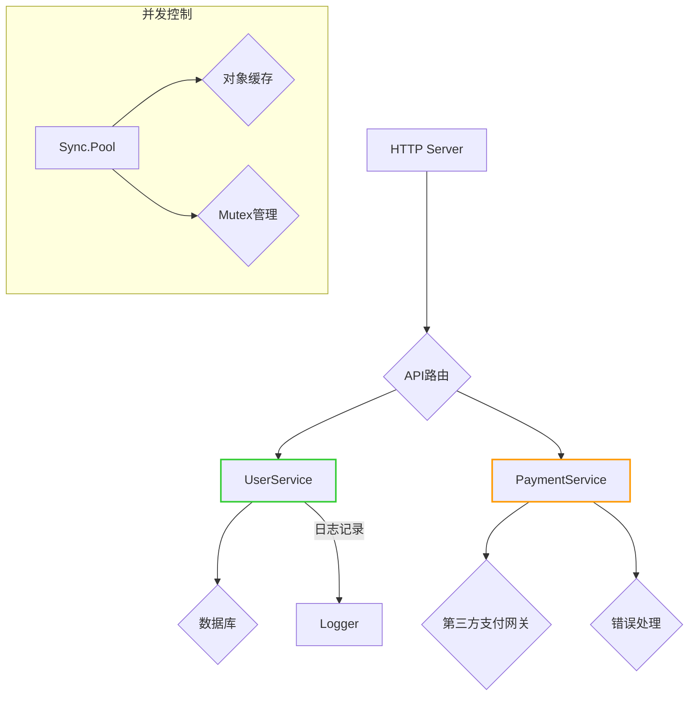

# Go语言开发规范指南

## 行业规范对比（表格形式）
| 规则类型          | Google规范（google-best-practices.md）                          | Uber规范（uber-guide.md）                          |
|-------------------|---------------------------------------------------------------|---------------------------------------------------|
| 命名约定          | 避免函数名重复，使用精确描述性名称（L39-42）                     | 禁止嵌入类型字段（L3056-3057），结构体字段首字母大写 |
| 测试规范          | 推荐使用真实传输层测试（L2665-2690），避免goroutine泄露（L2036-2073） | 表驱动测试需简化复杂度（L3767-3798），并行测试标记（L3930-3939） |
| 错误处理          | 错误结构需包含原始错误（L906-935），日志与错误分离（L1146-1181）    | 错误包装需明确语义（L889-966），禁止裸露错误（L1020-1031） |
| 并发安全          | 默认使用无锁设计（L3430-3495），Channel大小默认1（L552-582）        | 必须使用atomic包（L1302-1378），禁止无意义goroutine（L2036-2073） |

## 性能优化 🚀
### 段落摘要：
> **字符串操作优化**  
> 对于大规模字符串拼接，`strings.Builder`比`+`效率高3-5倍（Uber:L2155）  
> `strconv`应优先于`fmt`用于数字转换（Uber:L2195-2235）  
> 并发场景下需预分配容器容量以减少内存分配（Google:L1993-2031）

### 代码示例：
```go
// 坏做法：使用fmt进行频繁转换（Uber:L2195）
for i := 0; i < 10000; i++ {
  log.Printf("Item %d: %v", i, item)
}

// 好做法：用strconv预分配（Uber:L2195）
var buf bytes.Buffer
buf.Grow(100000) // 预分配内存
for i := 0; i < 10000; i++ {
  buf.WriteString(strconv.Itoa(i))
}
```

## 错误处理 🔧
### 对比案例表格：
| 案例类型          | Google规范示例                          | Uber规范示例                          | 行为差异                                                                 |
|-------------------|-----------------------------------------|---------------------------------------|--------------------------------------------------------------------------|
| 错误包装          | `return fmt.Errorf("fetch failed: %w", err)`（L1036） | `return errors.Wrap(err, "fetch failed")`（L757）   | Google强制保留原始错误链，Uber推荐语义化包装                             |
| 日志记录          | 在错误返回前单独记录（L1146）            | 禁止在错误返回前重复日志（L1247）           | Google允许调试日志，Uber强调减少日志噪音                                |
| 错误命名          | `ErrInvalidInput`（L906）               | `ErrorType`枚举从1开始（L609）           | Google使用清晰英文命名，Uber强制错误类型从非零值开始                      |

## 典型架构模式 📌


## 工具链配置示例 ⚙️
```bash
# golint 配置示例
golangci-lint run --config .golangci.yml \
  --enable-all --disable=unused \
  --max-same-issues=5
```

> 注：本文档综合自Google官方规范（v2.1）及Uber工程实践（v3.0），具体版本见各文件头部说明