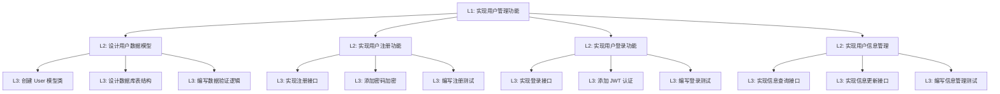

# 📋 LazyGophers 项目开发规范

> 本文档定义了 LazyGophers 项目的核心开发准则和最佳实践，确保项目的高质量交付和可维护性。

## 🏗️ 项目概览

- **项目名称**: lazygophers
- **Github 地址**: https://github.com/lazygophers/roo，当前工作区根目录位于仓库的 `mcp` 目录下
- **核心理念**: 工程化、结构化、可复用、可扩展
- **架构原则**: 无第三方服务依赖，使用嵌入式数据库

## 🚀 部署与运行模式

### 支持的部署方式

- stdio

### 构建与启动

- 针对不同部署方式构建对应的 Docker tag
- 使用 `uv run` 启动，通过命令行参数区分启动模式
- 默认启动 stdio 模式，无需额外参数
- 日志控制：仅在 `--debug` 模式下输出控制台日志
- 优先使用 `code-python` 模式编写 python 代码

## ⚙️ 技术栈与依赖管理

### 包管理规范

- **统一使用 uv** 作为 Python 包管理工具
- **禁止使用 python 命令**，必须使用 `.venv/bin/python`
- **依赖安装**: 使用 `uv add <package name>`
- **禁止使用 requirements.txt** 进行依赖管理

### 数据存储

- 推荐使用嵌入式数据库：
  - LanceDB
  - DuckDB
  - TinyDB
- 禁止依赖外部服务（如 MySQL、Redis 等）

### 配置管理

- 使用 `config.yaml` + 环境变量的混合配置方案
- 支持配置文件热更新
- 允许通过配置文件、环境变量或运行环境控制 MCP 工具的启用状态

## 📝 渐进式开发理念

> **一步一步构建大厦**：先打好地基，再逐层建设，确保每个阶段都有可用的产出。

### 核心理念

- **先初始化，后功能**：优先完成项目基础架构和初始化逻辑，确保系统能够正常运行
- **增量迭代**：每个功能模块都应独立可测试，完成后立即验证
- **渐进式增强**：从最小可用产品开始，逐步添加新功能

### 项目目录结构

```
mcp/                          # 项目根目录
├── main.py                    # 应用程序入口文件
├── config.yaml                # 配置文件
├── src/                       # 源代码目录
│   ├── core/                  # 核心功能模块
│   ├── tools/                 # MCP工具实现
│   └── utils/                 # 工具函数
├── test/                      # 测试文件目录
├── docs/                      # 文档目录
├── .memory/                   # 任务记忆存储
├── .gitignore
├── pyproject.toml             # 项目配置
└── README.md                  # 项目说明
```

### 三层任务分解结构

#### L1：战略任务层（里程碑）

- **定义**：项目的重大里程碑，代表一个完整的功能模块或重要交付物
- **特点**：
  - 需要用户确认决策
  - 完成后必须提交到 Git
  - 产生可独立运行的成果
- **示例**：
  - 完成项目基础架构搭建
  - 实现用户认证功能模块
  - 集成第一个 MCP 工具

#### L2：战术任务层（功能模块）

- **定义**：实现 L1 任务的具体功能模块
- **特点**：
  - 可独立测试验证
  - 完成后建议提交（可选）
  - 依赖 L1 任务的指导
- **示例**：
  - 设计数据库模型
  - 实现用户注册接口
  - 开发工具调用逻辑

#### L3：执行任务层（具体操作）

- **定义**：具体的开发、测试、文档编写等操作
- **特点**：
  - 原子性操作，不可再分
  - 快速执行，即时反馈
  - 批量处理优化效率
- **示例**：
  - 编写单元测试
  - 修复一个 Bug
  - 更新 API 文档

### Git 提交策略

#### 提交原则

- **L1 任务完成后强制提交**：每个 L1 任务完成后必须立即提交
- **提交信息规范**：使用清晰、语义化的提交信息
  - 格式：`<类型>: <描述>`
  - 类型：feat（新功能）、fix（修复）、docs（文档）、refactor（重构）等
- **分支管理**：
  - main：主分支，保持稳定可运行
  - develop：开发分支，集成最新功能
  - feature/xxx：功能分支，开发特定功能

#### 提交检查清单

- [ ] 所有测试通过
- [ ] 代码符合规范
- [ ] 文档已更新
- [ ] 无临时文件或调试代码
- [ ] 提交信息清晰明确

### 任务分解示例

以"实现用户管理功能"为例：



### 最佳实践

#### 任务管理

1. **可视化任务依赖**：使用任务看板或流程图展示任务关系
2. **定期回顾**：每周回顾任务完成情况，调整计划
3. **持续优化**：根据实际情况调整任务粒度和分解方式

#### 开发流程

1. **每日站会**：同步进度，识别阻塞
2. **结对编程**：复杂任务建议两人协作
3. **代码审查**：重要功能必须经过审查

#### 质量保证

1. **测试驱动**：先写测试，再实现功能
2. **持续集成**：自动化测试和部署
3. **文档同步**：代码和文档保持同步更新

## 📝 开发工作流

### 文档驱动开发

1. **先完善文档**，再更新代码
2. 文档完善后需**经用户确认**才能进行代码更新
3. 代码变更时**及时更新对应文档**

### 开发优先级

1. **优先完成底层代码**，再完善上层代码
2. 开发流程：文档 → 编码 → 测试 → 验证 → 下一步

### 代码组织

- 相同类型的工具应在同一个文件内，避免过多小文件
- 测试文件必须位于 `test` 目录下
- 文档文件名必须使用小写

## 🧪 质量保证

### 测试要求

- 确保测试覆盖率至少达到 90%
- 编写完代码后立即编写对应测试
- 测试验证通过后才能进入下一步开发
- 测试过程中产生的临时文件必须在退出前清理（无论测试结果）

### 代码规范

- MCP tools 的函数和字段注释使用英文
- 其他代码注释使用中文
- 保持代码的可读性和可维护性

## 🔧 工具与命令管理

### 构建工具

- 使用 `Makefile` 管理所有常用命令
- 禁止直接执行 shell 命令或使用 shell 脚本
- 使用 `Dockerfile` 管理镜像构建

### 命令执行规范

- 不得使用 `&&` 组合多个命令
- 每个命令在独立的终端实例中运行

## 📊 任务与进度管理

### 任务追踪

- 及时更新任务清单，记录进度和短期输出结果
- 将任务相关信息存放在 `.memory` 目录下
- 每完成一个小 MVP 后自动提交到 Git

### Git 工作流

- 每次 MVP 完成后自动提交变更（无需 push）
- 提交时生成合理的提交信息
- 发现临时文件或测试文件时，及时更新 `.gitignore`
- 避免误上传临时文件到版本库
- 只提交当前目录下的 git 变更

## 💡 决策原则

- **尽可能由用户决策**而非自动决策
- 在需要多种选择时，提供清晰的选项和建议
- 保持代码的灵活性和可配置性

## 🔄 持续集成与部署

### 构建策略

- 不同部署模式对应不同的构建 tag
- 确保构建过程的一致性和可重复性
- 自动化测试和构建流程

### 部署规范

- 支持多种部署环境的无缝切换
- 配置文件支持环境变量覆盖
- 提供健康检查和监控接口
