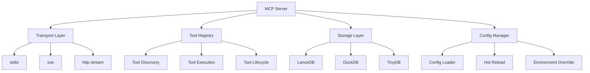

# MCP 服务器

一个基于 Python + uv 的高性能、可扩展的 MCP (Model Context Protocol) 服务器实现。

## ✨ 特性

- 🚀 **高性能**: 使用 uv 作为包管理器，提供极快的依赖安装和项目启动速度
- 🔧 **多种通信方式**: 支持 stdio、sse、http-stream 及其 Docker 版本
- 📦 **零外部依赖**: 使用嵌入式数据库（LanceDB、DuckDB、TinyDB），无需安装第三方服务
- ⚙️ **配置热更新**: 支持配置文件热重载，无需重启服务
- 🧪 **高测试覆盖率**: 确保代码质量，测试覆盖率不低于 90%
- 🏗️ **工程化设计**: 结构清晰、模块化、易于扩展和维护

## 🏗️ 架构设计



## 📦 安装

### 使用 uv 安装

```bash
# 克隆项目
git clone https://github.com/lazygophers/roo.git
cd roo/mcp

# 使用 uv 安装依赖
uv sync
```

### 使用 Docker

```bash
# 构建镜像
docker build -t mcp-server .

# 运行容器
docker run -p 8000:8000 mcp-server
```

## 🚀 快速开始

### 1. 配置文件

创建 `config.yaml` 文件：

```yaml
server:
  name: "my-mcp-server"
  version: "1.0.0"

transport:
  type: "stdio" # stdio, sse, http-stream
  host: "0.0.0.0"
  port: 8000

storage:
  type: "lancedb" # lancedb, duckdb, tinydb
  path: "./data"

tools:
  enabled: true
  auto_discover: true
  directories:
    - "./tools"

logging:
  level: "INFO"
  format: "text"
  # stdio 模式默认不输出日志，其他模式默认输出到控制台
```

### 2. 启动服务

```bash
# 开发模式
uv run mcp_server

# 生产模式
uv run mcp_server --config config.yaml --prod

# 使用 Docker
docker run -v $(pwd)/config.yaml:/app/config.yaml mcp-server
```

### 3. 测试连接

```bash
# stdio 模式
echo '{"jsonrpc": "2.0", "id": 1, "method": "initialize", "params": {}}' | uv run mcp_server

# HTTP 模式
curl http://localhost:8000/tools/list
```

## 🛠️ 开发指南

### 项目结构

```
.
├── src/                    # 源代码目录
│   ├── __init__.py
│   ├── server.py       # 服务器核心
│   ├── transport/      # 传输层实现
│   │   ├── __init__.py
│   │   ├── stdio.py
│   │   ├── sse.py
│   │   └── http_stream.py
│   ├── storage/        # 存储层实现
│   │   ├── __init__.py
│   │   ├── base.py
│   │   ├── lancedb.py
│   │   ├── duckdb.py
│   │   └── tinydb.py
│   ├── tools/          # 工具实现
│   │   ├── __init__.py
│   │   ├── base.py
│   │   └── builtin_tools.py
│   ├── config/         # 配置管理
│   │   ├── __init__.py
│   │   ├── config.py
│   │   └── schema.py
│   └── utils/          # 工具函数
│   │   ├── __init__.py
│   │   ├── logger.py
│   │   └── helpers.py
│   └── tools/              # MCP 工具实现
├── tests/                  # 测试文件
│   ├── __init__.py
│   ├── conftest.py
│   ├── test_server.py
│   ├── test_transport/
│   ├── test_storage/
│   └── test_tools/
├── docs/                   # 文档
│   ├── api.md
│   ├── deployment.md
│   └── development.md
├── main.py                 # 主入口文件
├── config.yaml            # 配置文件示例
├── pyproject.toml         # 项目配置
├── .pre-commit-config.yaml
├── .gitignore
├── Dockerfile
├── Makefile
└── README.md
```

### 开发环境设置

```bash
# 安装开发依赖
uv sync --dev

# 运行测试
make test

# 代码格式化
make format

# 类型检查
make type-check
```

### 创建新工具

1. 在 `src/tools/` 目录下创建工具文件
2. 实现 MCP 工具接口
3. 添加测试用例
4. 更新文档

示例：

```python
# src/tools/calculator.py
from mcp_server.server.fastmcp import FastMCP
from mcp.types import Tool, TextContent

mcp = FastMCP("Calculator")

@mcp.tool()
async def add(a: int, b: int) -> list[TextContent]:
    """Add two numbers together.

    Args:
        a: First number
        b: Second number

    Returns:
        The sum of a and b
    """
    result = a + b
    return [TextContent(type="text", text=str(result))]
```

## 📖 API 文档

详细的 API 文档请参考 [docs/api.md](docs/api.md)

## 🚀 部署指南

部署相关的详细信息请参考 [docs/deployment.md](docs/deployment.md)

## 🤝 贡献指南

欢迎贡献代码！请参考 [docs/development.md](docs/development.md) 了解开发指南。

## 📄 许可证

MIT License - 详见 [LICENSE](LICENSE) 文件

## 🙏 致谢

- [MCP (Model Context Protocol)](https://modelcontextprotocol.io/)
- [uv](https://github.com/astral-sh/uv) - 极快的 Python 包管理器
- [FastMCP](https://github.com/jlowin/fastmcp) - MCP 的 Python 实现
