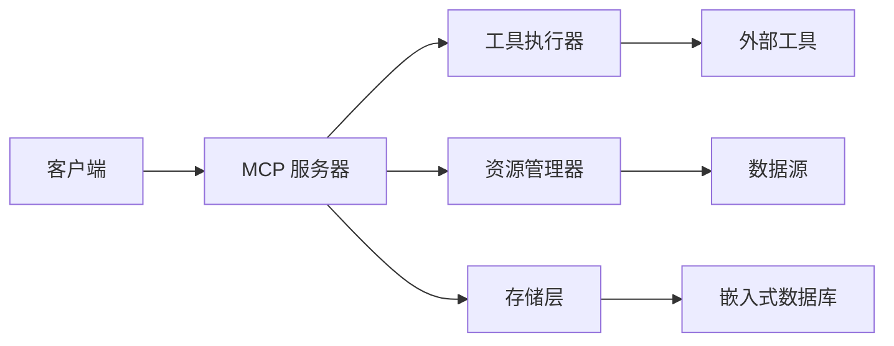

# API 文档

本文档详细描述了 MCP 服务器的 API 接口、数据结构和使用方法。

## 📋 目录

- [核心概念](#核心概念)
- [传输协议](#传输协议)
- [JSON-RPC 接口](#json-rpc-接口)
- [工具 API](#工具-api)
- [资源 API](#资源-api)
- [错误处理](#错误处理)
- [示例代码](#示例代码)

## 核心概念

### MCP 协议

MCP (Model Context Protocol) 是一个标准化的协议，用于 AI 模型与外部工具和服务之间的通信。本实现遵循 MCP 规范，提供以下核心功能：

- **工具调用**: 允许 AI 模型执行外部工具
- **资源访问**: 提供对数据资源的访问能力
- **提示管理**: 管理和执行提示模板

### 数据流



## 传输协议

### 1. STDIO 模式

通过标准输入输出进行通信，适用于本地开发测试。

```bash
# 启动 STDIO 模式
uv run mcp_server --transport stdio

# 发送请求
echo '{"jsonrpc": "2.0", "id": 1, "method": "tools/list", "params": {}}' | uv run mcp_server
```

### 2. SSE (Server-Sent Events) 模式

基于 HTTP 的 Server-Sent Events，支持实时通信。

```bash
# 启动 SSE 模式
uv run mcp_server --transport sse --port 8000

# 访问端点
curl http://localhost:8000/sse
```

### 3. HTTP Stream 模式

基于 HTTP 的流式通信，支持双向数据流。

```bash
# 启动 HTTP Stream 模式
uv run mcp_server --transport http-stream --port 8000

# 访问端点
curl -N http://localhost:8000/stream
```

## JSON-RPC 接口

所有通信都基于 JSON-RPC 2.0 协议。

### 请求格式

```json
{
  "jsonrpc": "2.0",
  "id": 1,
  "method": "tools/call",
  "params": {
    "name": "calculator_add",
    "arguments": {
      "a": 10,
      "b": 20
    }
  }
}
```

### 响应格式

```json
{
  "jsonrpc": "2.0",
  "id": 1,
  "result": {
    "content": [
      {
        "type": "text",
        "text": "30"
      }
    ]
  }
}
```

## 工具 API

### 列出工具

**方法**: `tools/list`

**请求**:

```json
{
  "jsonrpc": "2.0",
  "id": 1,
  "method": "tools/list",
  "params": {}
}
```

**响应**:

```json
{
  "jsonrpc": "2.0",
  "id": 1,
  "result": {
    "tools": [
      {
        "name": "calculator_add",
        "description": "Add two numbers",
        "inputSchema": {
          "type": "object",
          "properties": {
            "a": { "type": "number" },
            "b": { "type": "number" }
          },
          "required": ["a", "b"]
        }
      }
    ]
  }
}
```

### 调用工具

**方法**: `tools/call`

**请求**:

```json
{
  "jsonrpc": "2.0",
  "id": 2,
  "method": "tools/call",
  "params": {
    "name": "calculator_add",
    "arguments": {
      "a": 10,
      "b": 20
    }
  }
}
```

**响应**:

```json
{
  "jsonrpc": "2.0",
  "id": 2,
  "result": {
    "content": [
      {
        "type": "text",
        "text": "30"
      }
    ]
  }
}
```

## 资源 API

### 列出资源

**方法**: `resources/list`

**请求**:

```json
{
  "jsonrpc": "2.0",
  "id": 1,
  "method": "resources/list",
  "params": {}
}
```

**响应**:

```json
{
  "jsonrpc": "2.0",
  "id": 1,
  "result": {
    "resources": [
      {
        "uri": "file:///path/to/data.txt",
        "name": "Data File",
        "description": "A sample data file",
        "mimeType": "text/plain"
      }
    ]
  }
}
```

### 读取资源

**方法**: `resources/read`

**请求**:

```json
{
  "jsonrpc": "2.0",
  "id": 2,
  "method": "resources/read",
  "params": {
    "uri": "file:///path/to/data.txt"
  }
}
```

**响应**:

```json
{
  "jsonrpc": "2.0",
  "id": 2,
  "result": {
    "contents": [
      {
        "uri": "file:///path/to/data.txt",
        "mimeType": "text/plain",
        "text": "Hello, World!"
      }
    ]
  }
}
```

## 错误处理

### 错误格式

```json
{
  "jsonrpc": "2.0",
  "id": 1,
  "error": {
    "code": -32601,
    "message": "Method not found",
    "data": {
      "details": "The requested method 'tools/unknown' does not exist"
    }
  }
}
```

### 错误代码

| 代码   | 名称                  | 描述         |
| ------ | --------------------- | ------------ |
| -32700 | Parse error           | 解析错误     |
| -32600 | Invalid Request       | 无效请求     |
| -32601 | Method not found      | 方法未找到   |
| -32602 | Invalid params        | 无效参数     |
| -32603 | Internal error        | 内部错误     |
| -32001 | Tool not found        | 工具未找到   |
| -32002 | Tool execution failed | 工具执行失败 |
| -32003 | Resource not found    | 资源未找到   |

## 示例代码

### Python 客户端

```python
import asyncio
import json

async def http_client():
    import aiohttp

    async with aiohttp.ClientSession() as session:
        # 发送初始化请求
        init_request = {
            "jsonrpc": "2.0",
            "id": 1,
            "method": "initialize",
            "params": {
                "protocolVersion": "2024-11-05",
                "capabilities": {},
                "clientInfo": {
                    "name": "example-client",
                    "version": "1.0.0"
                }
            }
        }

        async with session.post("http://localhost:8000", json=init_request) as resp:
            response = await resp.json()
            print(f"初始化响应: {response}")

        # 调用工具
        tool_request = {
            "jsonrpc": "2.0",
            "id": 2,
            "method": "tools/call",
            "params": {
                "name": "calculator_add",
                "arguments": {"a": 5, "b": 3}
            }
        }

        async with session.post("http://localhost:8000", json=tool_request) as resp:
            response = await resp.json()
            print(f"工具调用结果: {response}")

asyncio.run(http_client())
```

### JavaScript 客户端

```javascript
// 使用 HTTP 连接
async function callTool() {
  const response = await fetch("http://localhost:8000", {
    method: "POST",
    headers: {
      "Content-Type": "application/json",
    },
    body: JSON.stringify({
      jsonrpc: "2.0",
      id: 1,
      method: "tools/call",
      params: {
        name: "calculator_add",
        arguments: { a: 10, b: 20 },
      },
    }),
  });

  const data = await response.json();
  console.log("响应:", data);
}

callTool();
```

### cURL 示例

```bash
# 列出所有工具
curl -X POST http://localhost:8000/tools/list \
  -H "Content-Type: application/json" \
  -d '{"jsonrpc": "2.0", "id": 1, "method": "tools/list"}'

# 调用计算器工具
curl -X POST http://localhost:8000/tools/call \
  -H "Content-Type: application/json" \
  -d '{
    "jsonrpc": "2.0",
    "id": 2,
    "method": "tools/call",
    "params": {
      "name": "calculator_add",
      "arguments": {"a": 15, "b": 25}
    }
  }'
```

## 性能考虑

### 缓存策略

- 工具列表缓存 5 分钟
- 资源列表缓存 1 分钟
- 配置信息支持热更新

## 日志

### 日志格式

```
2024-01-01 12:00:00 INFO - Tool called: calculator_add, duration: 0.023s, request_id: req_123456
```

stdio 模式默认不输出日志，其他模式默认输出到控制台。
