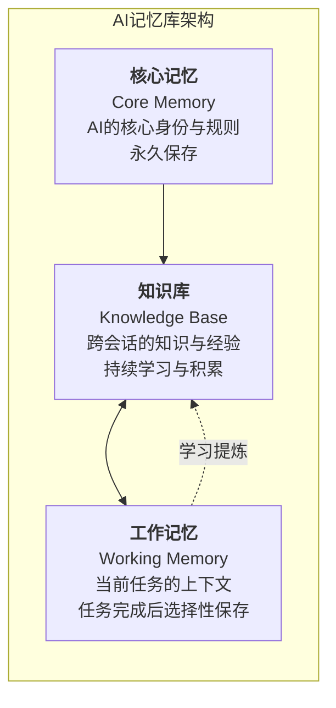
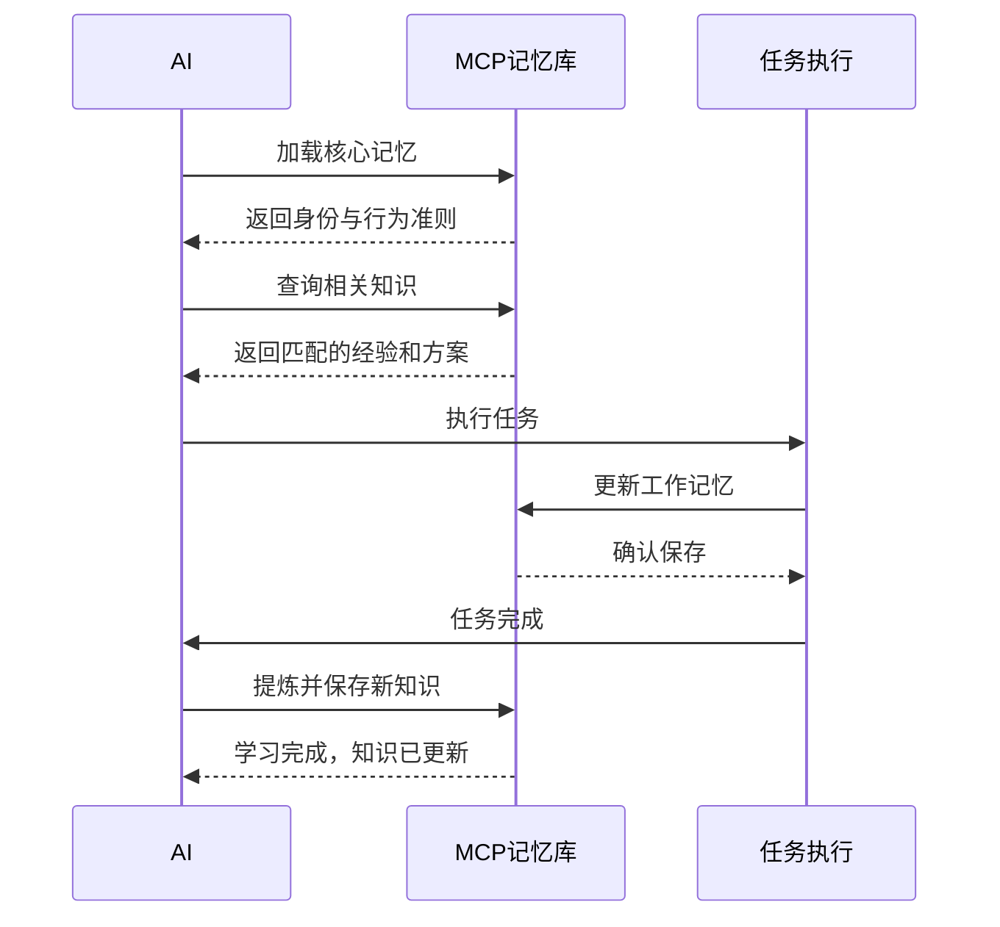
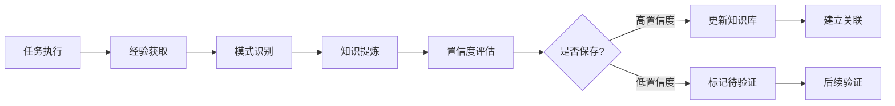

# MCP AI记忆库工具设计

## 概述

MCP记忆库是一个专为AI设计的持久化记忆管理工具，通过MCP协议提供标准化的记忆存储和检索能力。它使AI能够在不同会话间保持知识的连续性，实现真正的学习和经验积累。

作为AI的认知基础设施，记忆库不仅仅是一个存储系统，更是AI智能化的核心支撑。它通过三种精心设计的存储类型，支持AI从基础规则到复杂知识的全方位记忆管理，让AI能够像人类一样积累经验、提炼知识、持续成长。

## 1. 核心概念：三种存储类型

记忆库采用了借鉴人类认知模型的设计，通过三种不同用途的存储类型来管理AI的记忆。每种存储类型都有其特定的认知功能、生命周期和管理策略，共同构成了一个完整的AI认知系统。

下图展示了三种存储类型的核心特征与相互关系：



下表对各存储类型的关键特性进行了详细对比：

| 存储类型 | AI用途 | 访问模式 | 更新策略 | 默认TTL |
| :--- | :--- | :--- | :--- | :--- |
| **核心记忆** | 定义AI身份与边界 | 启动时加载 | AI提议+人工审批 | 永久 |
| **知识库** | 跨会话学习积累 | 按需检索 | AI学习+人工导入 | 90天 |
| **工作记忆** | 当前任务上下文 | 高频读写 | AI筛选+人工标记 | 24小时 |

### 1.1 核心记忆 (Core Memory)

**定义**: 存储定义AI核心身份、价值观和行为准则的基础配置，是AI运行的根本依据。

**内容类型**:
- **身份定义**: AI的角色定位、核心职责、专业领域
- **行为规范**: 必须遵守的规则、禁止执行的操作、伦理边界
- **交互原则**: 沟通风格、语言偏好、响应模式

**AI调用场景**:
- 启动时加载核心身份配置
- 决策时参考行为准则
- 生成内容前的合规性检查
- 处理敏感请求时的权限验证

**管理策略**:
- AI可通过MCP工具提议更新，需人工审批
- 管理员可直接更新，AI自动同步
- 变更需要版本控制和审计日志
- 支持条件触发的规则激活
- 全局生效，跨会话持久

**生命周期管理**:
- **默认TTL**: 永久保存（不设置过期时间）
- **更新策略**: 仅通过显式更新操作修改
- **版本保留**: 保留最近10个版本的历史记录

### 1.2 知识库 (Knowledge Base)

**定义**: 存储可在不同会话间复用的知识、技能和经验，是AI能力的核心资产和学习成果。

**内容类型**:
- **解决方案(solution)**: 经过验证的问题解决方案
- **设计模式(pattern)**: 可复用的架构和设计模式
- **事实知识(fact)**: 确定的技术事实和规范
- **技能方法(skill)**: 具体的操作技能和方法
- **经验总结(experience)**: 从实践中提炼的经验
- **指导原则(principle)**: 特定领域的指导原则

**AI调用场景**:
- 执行任务时检索相关知识和经验
- 遇到问题时查找类似解决方案
- 学习新知识后主动保存到知识库
- 建立知识间的关联和推理链

**智能特性**:
- **双向学习**: AI主动学习新知识，人工可导入专家知识
- **协同优化**: AI建议优化方案，人工审核确认
- **语义搜索**: 基于含义理解的智能检索
- **知识关联**: 自动发现和建立知识点之间的联系
- **置信度评分**: AI对知识准确性的信心评估，人工可调整
- **版本管理**: 支持知识的版本控制和回滚

**生命周期管理**:
- **默认TTL**: 90天（可根据重要性调整）
- **自动续期**: 高频使用的知识自动延长TTL
- **过期处理**:
  - 置信度 > 0.8: 延长至180天
  - 置信度 0.5-0.8: 标记为待复审
  - 置信度 < 0.5: 归档后删除

### 1.3 工作记忆 (Working Memory)

**定义**: 存储当前任务的即时工作数据和认知上下文，支持AI的短期记忆和任务执行。

**内容类型**:
- **任务上下文**: 当前目标、执行步骤、待办事项
- **中间状态**: 推理过程、计算结果、决策路径
- **临时知识**: 任务相关的即时信息、工作假设
- **注意焦点**: 当前关注的问题、活动的资源

**AI调用场景**:
- 维护复杂任务的执行状态
- 保持多轮对话的连贯性
- 存储推理链和思考过程
- 记录任务执行的中间结果

**认知特性**:
- **选择性保存**: AI智能筛选，人工可标记重要内容
- **注意力机制**: AI自动调整优先级，人工可手动设置
- **工作集管理**: 自动维护最相关的信息集合
- **学习提炼**: AI自动提炼，人工可主动提升到知识库
- **协同清理**: AI建议清理项，人工确认执行

**生命周期管理**:
- **默认TTL**: 24小时（1天）
- **灵活配置**:
  - 简单任务: 2-4小时
  - 常规任务: 24小时
  - 复杂项目: 7天
- **自动清理**: TTL到期后自动清除
- **提炼机制**: 重要内容在过期前提升至知识库

## 2. AI调用场景与行为

### 2.1 核心调用场景

MCP记忆库工具为AI提供了完整的记忆管理能力，支持以下核心场景：

- **任务初始化**: AI启动时加载核心记忆和相关知识，建立认知基础
- **知识检索**: 执行任务时查询相关经验、解决方案和最佳实践
- **经验学习**: 任务完成后将有价值的经验提炼并保存到知识库
- **上下文管理**: 在复杂任务中维护工作记忆，保持执行的连贯性
- **知识演进**: 根据新的反馈和结果更新和优化已有知识

### 2.2 AI行为模式

记忆库支持AI展现出类人的认知行为：

- **主动学习**: AI主动识别新知识、新模式，并请求保存到知识库

### 2.3 人机协同模式

记忆库的设计理念强调人机协同，充分发挥各自优势：

- **AI的优势**: 
  - 快速处理大量信息
  - 自动发现模式和关联
  - 持续监控和优化
  - 实时响应和调整

- **人工的优势**:
  - 提供领域专家知识
  - 做出关键决策
  - 审核和验证AI的学习成果
  - 设定价值观和边界

- **协同工作流**:
  - AI提议 → 人工审核 → 共同优化
  - 人工输入 → AI学习 → 智能增强
  - 双向反馈，持续改进
- **知识关联**: 自动发现并建立不同知识点之间的联系，形成知识网络
- **遗忘机制**: 根据使用频率和重要性，定期清理低价值或过时的记忆
- **记忆优先级**: 动态调整记忆的重要性，优先保留高价值内容
- **经验泛化**: 从具体案例中提取通用模式，形成可复用的方法论

### 2.4 调用流程示例



## 3. MCP工具功能清单

### 3.1 核心功能

| 功能名称 | 描述 | 使用场景 | 参数要求 |
|---------|------|---------|----------|
| **save_knowledge** | 保存新知识到知识库 | 学习新技能、总结经验、记录解决方案 | type, tags, content, confidence, ttl(可选，默认90天) |
| **search_knowledge** | 搜索相关知识 | 解决问题时查找参考、获取历史经验 | query, tags, limit |
| **update_working_memory** | 更新工作记忆 | 维护任务上下文、保存中间状态 | key, value, ttl(可选，默认24小时) |
| **get_core_memory** | 获取核心记忆 | 初始化、决策参考、行为校准 | category |
| **update_core_memory** | 更新核心记忆 | AI提议更新，需人工审批 | content, reason, confidence |
| **relate_knowledge** | 建立知识关联 | 构建知识图谱、发现知识联系 | source_id, target_id, relation_type |
| **forget_knowledge** | 删除过时知识 | 知识库维护、清理无效内容 | knowledge_id, reason |
| **get_working_memory** | 读取工作记忆 | 获取任务状态、恢复上下文 | key |
| **clear_working_memory** | 清理工作记忆 | 任务完成后主动清理无用内容 | task_id, preserve_keys |

### 3.2 高级功能

| 功能名称 | 描述 | 技术特性 |
|---------|------|----------|
| **semantic_search** | 语义搜索 | 基于向量相似度的智能检索，理解查询意图 |
| **knowledge_reasoning** | 知识推理 | 从已有知识推导新结论，支持链式推理 |
| **batch_operations** | 批量操作 | 支持批量导入导出知识，提高操作效率 |
| **version_control** | 版本管理 | 知识的版本控制、变更追踪和回滚 |
| **knowledge_merge** | 知识合并 | 自动识别和合并相似知识，避免冗余 |
| **confidence_update** | 置信度更新 | 根据使用反馈动态调整知识的可信度 |
| **knowledge_graph** | 知识图谱 | 可视化知识关系，支持图遍历和路径查找 |
| **auto_tagging** | 自动标签 | 基于内容自动生成和优化标签 |

### 3.3 查询能力

- **多维度检索**: 支持按标签、类型、时间、置信度等多个维度组合查询
- **模糊匹配**: 支持关键词模糊匹配和同义词扩展
- **相关性排序**: 根据相关性、使用频率、时效性综合排序
- **上下文感知**: 基于当前工作记忆优化查询结果

## 4. 调用方式与参数

### 4.1 基础调用模式

通过MCP协议调用记忆库工具的标准格式：

```json
{
  "tool": "mcp_memory",
  "operation": "save_knowledge",
  "parameters": {
    "type": "solution",
    "tags": ["python", "async", "performance"],
    "content": "使用asyncio.gather()并发执行多个异步任务可以显著提升性能...",
    "confidence": 0.95,
    "ttl": 7776000,  // 90天，知识库默认值
    "source": "task_execution",
    "metadata": {
      "task_id": "task_12345",
      "timestamp": "2024-01-15T10:30:00Z",
      "context": "优化API响应时间"
    }
  }
}
```

### 4.2 参数说明

#### 通用参数
- **type** (string): 知识类型
  - `principle`: 指导原则
  - `solution`: 解决方案
  - `pattern`: 设计模式
  - `fact`: 事实知识
  - `skill`: 技能方法
  - `experience`: 经验总结

- **tags** (array): 标签列表，用于分类和检索
  - 支持层级标签: `["python/async", "optimization/performance"]`
  - 建议3-5个标签，过多会降低检索精度

- **content** (string/object): 知识内容
  - 文本知识: 直接传递字符串
  - 结构化知识: 传递JSON对象
  - 支持Markdown格式

- **confidence** (float): AI对知识准确性的信心度 (0-1)
  - 0.9-1.0: 高度确信
  - 0.7-0.9: 较为确信
  - 0.5-0.7: 一般确信
  - <0.5: 低确信度（建议标记为待验证）

#### 高级参数
- **ttl** (integer): 知识的有效期（秒）
  - 存储类型默认值:
    - 核心记忆: 永久保存（不设置TTL）
    - 知识库: 7776000秒（90天）
    - 工作记忆: 86400秒（24小时）
  - **TTL单位说明**:
    - API参数: 使用秒为单位（整数）
    - 文档描述: 使用天/小时便于理解
    - 换算关系: 1天=86400秒, 1小时=3600秒
  - 自定义设置:
    - 临时知识: 可设置更短的时长
    - 重要知识: 可延长或设为永久
  - 自动处理:
    - 过期前评估: 高价值内容自动续期
    - 过期后清理: 低价值内容自动移除

- **priority** (integer): 知识的重要性等级 (1-10)
  - 10: 核心知识，永不遗忘
  - 7-9: 重要知识，优先保留
  - 4-6: 一般知识，正常管理
  - 1-3: 低优先级，可被替换

- **relations** (array): 与其他知识的关联
  ```json
  {
    "relations": [
      {"target": "knowledge_id_123", "type": "extends"},
      {"target": "knowledge_id_456", "type": "conflicts_with"}
    ]
  }
  ```

### 4.3 响应格式

```json
{
  "status": "success",
  "operation": "save_knowledge",
  "result": {
    "knowledge_id": "k_20240115_abc123",
    "stored_at": "2024-01-15T10:30:00Z",
    "index_status": "completed",
    "related_knowledge": ["k_20240110_def456", "k_20240112_ghi789"]
  },
  "metadata": {
    "processing_time": 0.125,
    "storage_used": 2048,
    "confidence_adjusted": 0.95
  }
}
```

### 4.4 错误处理

```json
{
  "status": "error",
  "error_code": "DUPLICATE_KNOWLEDGE",
  "message": "Similar knowledge already exists",
  "suggestion": "Consider updating existing knowledge instead",
  "existing_knowledge": {
    "id": "k_20240110_xyz789",
    "similarity": 0.92
  }
}
```


## 5. AI认知模型与架构设计

本章节深入探讨MCP记忆库如何模拟和支撑AI的认知过程，以及背后的架构设计理念。

### 5.1 认知模型映射

记忆库的设计深度借鉴了人类认知科学的研究成果，将AI的记忆系统映射为三个认知层次：

#### 核心身份层（核心记忆）
- **类比**: 人类的价值观和信念系统
- **功能**: 定义AI的核心身份、道德边界和行为准则
- **特性**: 极其稳定，深度影响所有决策

#### 长期记忆层（知识库）
- **类比**: 人类的语义记忆和程序性记忆
- **功能**: 存储事实、概念、技能和经验
- **特性**: 持续学习、不断优化、可被检索和推理

#### 工作记忆层（工作记忆）
- **类比**: 人类的短期记忆和注意力焦点
- **功能**: 维持当前任务的上下文和推理状态
- **特性**: 容量有限、高度动态、支持复杂认知任务

### 5.2 学习与遗忘机制

#### 主动学习流程


#### 智能遗忘策略
- **使用频率评估**: 长期未使用的知识降低优先级
- **时效性检查**: 过时的技术知识自动标记
- **冲突解决**: 新旧知识冲突时的智能裁决


### 5.3 知识网络构建

记忆库不仅存储独立的知识点，更重要的是构建知识之间的关联网络：

- **层级关系**: 从抽象概念到具体实现的知识层级
- **依赖关系**: 知识点之间的前置依赖和后续应用
- **相似关系**: 基于语义相似度的知识聚类
- **冲突关系**: 互斥或矛盾的知识标记

## 6. 总结与未来展望

MCP AI记忆库工具的设计理念是为AI构建一个完整的认知基础设施，使其能够像人类一样学习、记忆和成长。通过精心设计的三层记忆架构和丰富的MCP工具接口，我们为AI的智能化演进提供了坚实的基础。

### 6.1 核心价值与创新

#### 技术创新
- **认知模型驱动**: 基于认知科学原理设计的记忆系统
- **智能学习机制**: 自动提炼、关联和优化知识
- **MCP标准化**: 通过标准协议提供记忆服务
- **语义理解**: 深度理解知识含义而非简单存储

#### 产品价值
- **持续学习能力**: AI可以积累经验，越用越智能
- **跨会话连续性**: 知识和经验不会因会话结束而丢失
- **个性化演进**: 每个AI实例都能发展独特的知识体系
- **决策可追溯**: 所有决策都有清晰的知识依据

### 6.2 未来演进路线图

#### 近期目标（3-6个月）
- **向量数据库集成**: 引入专业的向量数据库提升语义搜索能力
- **知识图谱可视化**: 提供直观的知识关系展示界面
- **多语言支持**: 扩展到支持多种编程语言的知识存储
- **性能优化**: 提升大规模知识检索的响应速度

#### 中期目标（6-12个月）
- **联邦学习**: 多个AI实例间的安全知识共享
- **自动知识发现**: 主动从数据中挖掘新知识
- **推理引擎**: 支持复杂的逻辑推理和知识推导
- **版本分支**: 知识的版本管理和实验性分支

#### 长期愿景（1-2年）
- **认知架构**: 构建完整的AI认知架构，包括感知、记忆、推理、决策
- **元学习能力**: AI能够学习如何更好地学习
- **创造性思维**: 基于已有知识创造新的概念和解决方案
- **情境感知**: 根据不同情境动态调整记忆和行为模式

### 6.3 技术挑战与机遇

#### 挑战
- **知识一致性**: 确保分布式环境下的知识一致性
- **隐私保护**: 在知识共享时保护敏感信息
- **认知偏差**: 避免AI在学习过程中产生偏见
- **可解释性**: 让AI的记忆和决策过程可理解

#### 机遇
- **AGI基础**: 为通用人工智能提供记忆基础设施
- **行业应用**: 在各垂直领域构建专业知识库
- **人机协作**: 促进人类专家知识与AI能力的融合
- **智能演进**: 推动AI从工具向智能伙伴的转变

### 6.4 结语

MCP AI记忆库不仅是一个技术工具，更是AI认知能力的基石。它让AI能够：

- 记住过去的经验
- 理解当前的任务
- 预见未来的可能

通过持续的学习和演进，每个配备记忆库的AI都将成为一个独特的、不断成长的智能体。这不仅改变了AI的工作方式，更重要的是改变了AI与人类的协作模式——从执行指令的工具，转变为能够学习、思考和创新的智能伙伴。

我们相信，随着记忆库功能的不断完善和扩展，AI将展现出前所未有的智能水平，最终实现真正的认知智能，成为人类探索未知、解决复杂问题的得力助手。