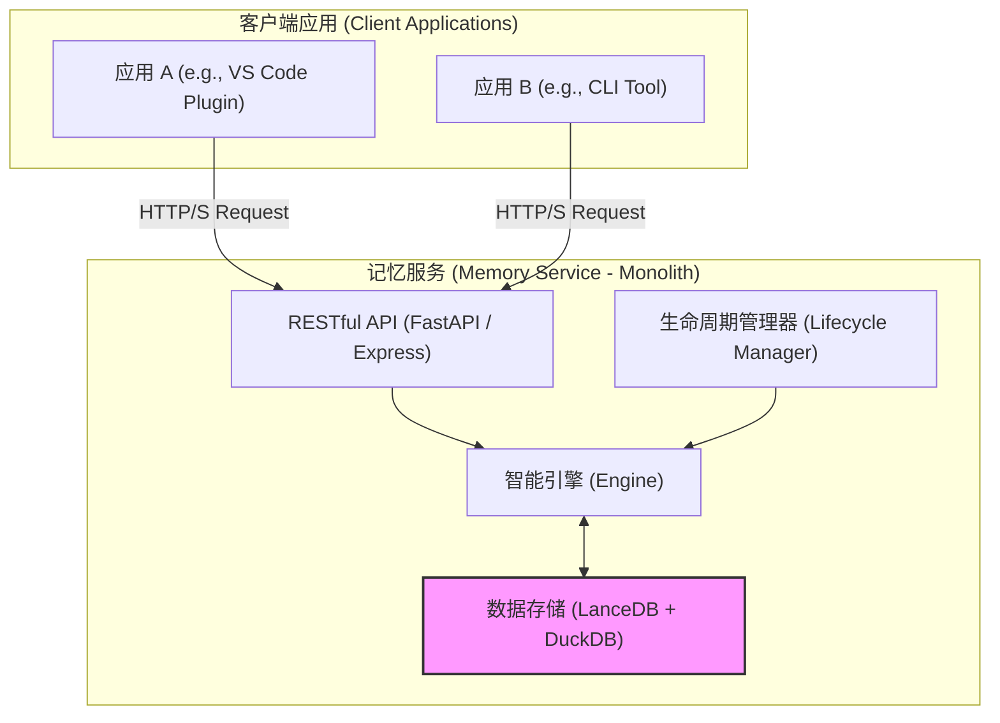
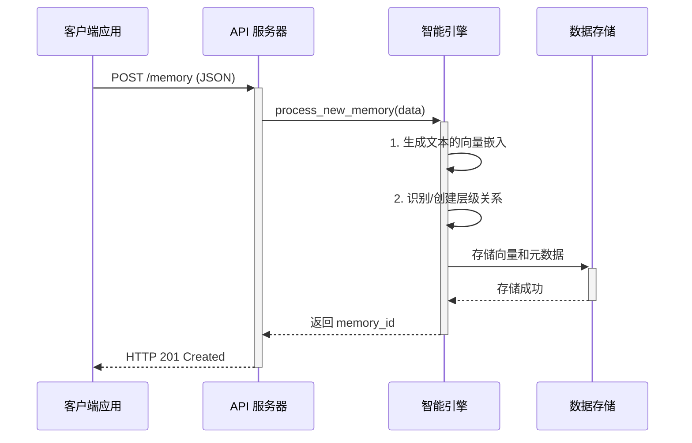
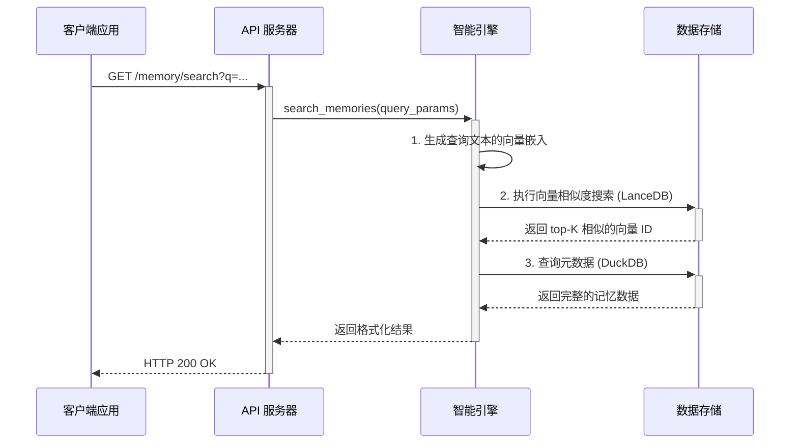

# 架构总览：单体服务架构

## 核心摘要

**(面向非技术读者的简化说明)**

Memory 的核心架构是**单体服务 (Monolithic Service)**。

该架构将所有核心记忆功能（如数据处理、智能检索、生命周期管理）封装在一个独立、统一的服务中。所有客户端应用（例如笔记软件、开发工具）都通过标准化的接口与该服务通信。这种设计带来了三大核心优势：

1.  **高度内聚 (High Cohesion)**: 所有与记忆相关的复杂逻辑都集中在单一服务内部，确保了功能的一致性与完整性。
2.  **简化交互 (Simplified Interaction)**: 客户端应用无需关心记忆功能的内部实现，只需通过清晰的 API 即可调用，从而保持自身的轻量与专注。
3.  **高效运维 (Efficient Operations)**: 系统的部署、监控、扩展和维护都围绕着一个中心服务进行，极大地降低了运维复杂性。

因此，单体服务架构为系统提供了稳定、高效且易于维护的坚实基础。

---

## 1. 架构设计理念

**(面向开发者与架构师的详细说明)**

单体服务架构将记忆引擎封装为一个独立的、职责单一的服务。所有客户端应用（如 VS Code 插件、CLI 工具）通过统一的 RESTful API 与该服务进行通信，以此实现业务逻辑与核心记忆能力的物理隔离。这一设计带来了以下关键优势：

### 1.1. 架构核心优势

- **快速迭代与交付**: 高度集成的架构使得新功能的开发、测试和部署流程极为高效，能够快速响应需求变化。
- **技术栈统一**: 服务内部技术栈保持一致，降低了团队的技术管理复杂度和新成员的学习成本。
- **性能优势**: 组件间的通信在进程内完成，避免了分布式架构中的网络延迟，从而保证了高性能。
- **清晰的演进路径**: 架构本身具备良好的模块化潜力，为未来向“微服务化”的平滑演进奠定了坚实基础。

### 1.2. 高层级架构图



### 1.3. 核心设计原则

Memory 的架构设计与技术实现遵循以下核心原则：

- **自动化优先，人工为辅**：系统的首要目标是无缝、自动化地捕捉和组织信息，将人工干预降至最低。同时，提供清晰、简单的指令接口，允许用户进行手动管理和校准。
- **关注点分离 (SoC)**：LanceDB 专注于其最擅长的向量存储与检索；DuckDB 专注于其最擅长的结构化数据分析。各司其职，组合发挥最大效能。
- **分层记忆，逐步沉淀**：信息严格按照 `Project -> RootTask -> SubTask` 的三层结构进行组织和隔离。这种分层结构不仅保证了信息的有序性，也为后续的记忆晋升和生命周期管理奠定了基础。

## 2. 核心组件职责

记忆服务主要由以下四个核心组件构成：

### 2.1. API 服务器 (APIServer)

- **核心职责**: 作为系统的统一入口，负责处理所有来自客户端的 HTTP/S 请求。它解析并验证请求，然后将任务分派给智能引擎 (Engine)。
- **技术选型**: 推荐采用 `FastAPI` (Python) 或 `Express` (Node.js) 等高性能 Web 框架。
- **交互协议**: 通过 RESTful API 接收客户端调用，并将内部处理指令传递给 `Engine`，最终将结果封装成标准 HTTP 响应返回。

### 2.2. 智能引擎 (Engine)

- **核心职责**: 作为记忆服务的大脑，负责执行核心业务逻辑，包括层级识别、查询优化以及与底层数据库的交互（CRUD 操作）。
- **交互协议**: 接收来自 `APIServer` 的内部函数或方法调用，并直接与 `DB` 组件进行数据交互。

### 2.3. 生命周期管理器 (Lifecycle)

- **核心职责**: 负责执行各类后台任务和系统维护工作，如数据清理、索引重建和健康检查，以确保服务的长期稳定与高效。
- **交互协议**: 由定时任务调度器或特定事件触发，直接调用 `Engine` 提供的服务接口来完成维护任务。

### 2.4. 数据存储 (DB)

- **核心职责**: 作为系统的持久化层，负责高效、可靠地存储和检索所有记忆数据。
- **技术选型**:
  - **`LanceDB`**: 用于存储和查询由 AI 模型生成的向量嵌入 (Embeddings)。
  - **`DuckDB`**: 用于存储和管理结构化的元数据（如时间戳、来源、标签等）。
- **交互协议**: `Engine` 组件通过官方 SDK 直接与 `LanceDB` 和 `DuckDB` 进行交互。

## 3. API 端点设计

### 3.1. 捕捉记忆 (`POST /memory`)

- **功能**: 创建一个新的记忆条目。
- **请求体 (Request Body)**:
  ```json
  {
    "content": "学习了如何使用 FastAPI 构建高效的 Web 服务。",
    "source": "VSCode Plugin",
    "tags": ["python", "fastapi", "webdev"],
    "confidence": 0.95,
    "metadata": {
      "file_path": "/Users/user/projects/api/main.py",
      "timestamp": "2023-10-27T10:00:00Z"
    }
  }
  ```
- **成功响应 (201 Created)**:
  ```json
  {
    "status": "success",
    "memory_id": "mem_a1b2c3d4e5f6"
  }
  ```

### 3.2. 检索记忆 (`GET /memory/search`)

- **功能**: 根据关键词、标签或元数据搜索相关记忆。
- **查询参数 (Query Parameters)**: `q` (string, required), `tags` (string, optional), `limit` (integer, optional, default=10)。
- **请求示例**: `GET /memory/search?q=FastAPI&tags=python&limit=5`
- **成功响应 (200 OK)**:
  ```json
  {
    "status": "success",
    "results": [
      {
        "memory_id": "mem_a1b2c3d4e5f6",
        "content": "学习了如何使用 FastAPI 构建高效的 Web 服务。",
        "source": "VSCode Plugin",
        "tags": ["python", "fastapi", "webdev"],
        "relevance_score": 0.92,
        "metadata": { ... }
      }
    ]
  }
  ```

## 4. 数据流详解

### 4.1. 记忆捕捉 (Memory Capture)



### 4.2. 记忆检索 (Memory Retrieval)



## 5. 部署策略

推荐使用 **Docker 进行容器化部署**，以确保环境一致性、简化部署流程并增强可移植性。

### 5.1. 示例 `Dockerfile` (Python/FastAPI)

完整的 `Dockerfile` 示例已提取到项目根目录下的 [`Dockerfile.example`](../../Dockerfile.example) 文件中，以方便直接使用和修改。

```dockerfile
# 示例: 节选自 Dockerfile.example
FROM python:3.11-slim
WORKDIR /app
COPY requirements.txt .
RUN pip install --no-cache-dir -r requirements.txt
# ... 更多指令请参见源文件
```

### 5.2. 运行与数据持久化

通过 Docker Volume 机制将数据目录挂载到宿主机，以防止容器重启导致数据丢失。

```bash
# 构建镜像
docker build -t memory-service .

# 运行容器并挂载数据卷
docker run -d -p 8000:8000 \
  -v /path/on/host:/app/data \
  --name memory-service-container \
  memory-service
```

## 6. 非功能性需求 (NFR)

### 6.1. 性能 (Performance)

- **核心指标**: P95 检索延迟应低于 **200ms**；吞吐量应支持至少 **100 QPS**。
- **优化策略**: 建立高效索引、引入缓存层、对写入操作采用异步处理。

### 6.2. 安全性 (Security)

- **核心措施**:
  - **认证授权**: 所有 API 端点应通过 `OAuth 2.0` 或 `API Key` 机制进行保护。
  - **传输加密**: 客户端与服务间的所有通信必须使用 `HTTPS`。
  - **输入验证**: 对所有客户端输入进行严格校验，防止注入攻击。
  - **依赖扫描**: 定期扫描并修复项目依赖中的已知安全漏洞。

### 6.3. 可观测性 (Observability)

- **核心措施**:
  - **结构化日志**: 输出 JSON 格式的日志，便于聚合与分析。
  - **指标监控**: 通过 `/metrics` 端点暴露 `Prometheus` 格式的核心性能指标。
  - **分布式追踪**: 集成 `OpenTelemetry` 以实现端到端请求追踪。
  - **告警**: 配置关键指标的异常告警规则。
