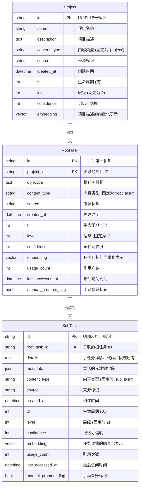

# 3. 核心数据模型

## 核心摘要

本文档详细阐述了 Roo-Code 记忆系统的核心数据结构。该结构采用分层模型，旨在以系统化、可扩展的方式捕捉、组织和检索复杂的开发任务信息。

- **对于管理者和产品负责人**: 本系统通过将复杂的开发任务分解为`项目`、`根任务`和`子任务`三个层级，实现了对工作上下文的清晰管理和追溯。这有助于理解任务的全貌，并为未来的知识复用和自动化奠定基础。
- **对于开发者和架构师**: 本文档定义了基于 Pydantic 和 LanceDB 的精确数据模型、实体关系、数据库视图、索引策略以及代码实现。这为系统的二次开发、数据分析和长期维护提供了坚实的技术规范。

---

## 3.1. 概述

数据模型是记忆系统的基石，它以 **Pydantic 模型驱动**，利用 LanceDB 的原生支持，以代码即文档的方式定义数据结构，确保了开发过程中的一致性与准确性。

## 3.2. 实体关系图 (ERD)

下图展示了核心数据实体及其相互关系。



## 3.3. 分层模型架构

记忆系统采用三层结构化设计，每一层级都由一个 LanceDB Pydantic 模型（用于数据写入与检索）和对应的 DuckDB SQL 视图（用于数据分析）共同定义。

#### **Level 0: 项目 (Project)**

代表最高层级的记忆单元，定义了一个工作的总体范围和上下文。

#### **Level 1: 根任务 (RootTask)**

隶属于一个项目，代表一个具体、独立的核心任务目标。

#### **Level 2: 子任务 (SubTask)**

由根任务分解而来，是最细粒度的记忆单元，用于记录具体的实现步骤、代码片段或关键思考。

## 3.4. 模型字段规范

本章节为每个 Pydantic 模型中的核心字段提供详尽的技术说明。

### `BaseMemory` (通用基础模型)

所有记忆模型的抽象基类，定义了跨层级的通用字段。

| 字段名                | 数据类型      | 描述                                                           | 默认值/说明         |
| :-------------------- | :------------ | :------------------------------------------------------------- | :------------------ |
| `id`                  | `str`         | 唯一标识符，采用 UUIDv4 格式。                                 | `uuid.uuid4()`      |
| `embedding`           | `Vector(768)` | 内容的文本嵌入向量，维度为 768，用于向量相似度搜索。           | N/A                 |
| `source`              | `str`         | 记忆来源的标识，例如 'user_input', 'api_call'。                | `'manual'`          |
| `created_at`          | `datetime`    | 记录创建的 UTC 时间。                                          | `datetime.utcnow()` |
| `usage_count`         | `int`         | 记录被引用或检索的次数，用于评估记忆的重要性。                 | `0`                 |
| `last_accessed_at`    | `datetime`    | 记录最后一次被访问的 UTC 时间，用于实现 LRU 淘汰策略。         | `datetime.utcnow()` |
| `manual_promote_flag` | `bool`        | 手动标记，用于强制提升记忆层级或防止其被自动降级。             | `False`             |
| `confidence`          | `int`         | 记忆的可信度 (0-100)。值越高表示系统对该记忆的准确性越有信心。 | `100`               |

### `ProjectMemory` (L0: 项目)

| 字段名         | 数据类型 | 描述                                | 默认值/说明 |
| :------------- | :------- | :---------------------------------- | :---------- |
| `name`         | `str`    | 项目的正式名称。                    | N/A         |
| `description`  | `str`    | 项目的详细描述，用于生成嵌入向量。  | N/A         |
| `content_type` | `str`    | 内容类型标识，固定为 `'project'`。  | `'project'` |
| `ttl`          | `int`    | 生命周期（天）。`-1` 表示永不过期。 | `-1`        |
| `level`        | `int`    | 层级标识，固定为 `0`。              | `0`         |

### `RootTaskMemory` (L1: 根任务)

| 字段名         | 数据类型 | 描述                                 | 默认值/说明   |
| :------------- | :------- | :----------------------------------- | :------------ |
| `project_id`   | `str`    | 所属 `ProjectMemory` 的 `id`。       | N/A           |
| `objective`    | `str`    | 根任务的核心目标描述。               | N/A           |
| `content_type` | `str`    | 内容类型标识，固定为 `'root_task'`。 | `'root_task'` |
| `ttl`          | `int`    | 生命周期（天）。                     | `90`          |
| `level`        | `int`    | 层级标识，固定为 `1`。               | `1`           |

### `SubTaskMemory` (L2: 子任务)

| 字段名         | 数据类型         | 描述                                                             | 默认值/说明  |
| :------------- | :--------------- | :--------------------------------------------------------------- | :----------- |
| `root_task_id` | `str`            | 所属 `RootTaskMemory` 的 `id`。                                  | N/A          |
| `details`      | `str`            | 子任务的详细内容、代码或思考。                                   | N/A          |
| `metadata`     | `Dict[str, Any]` | 可扩展的元数据字段，用于存储结构化信息，如代码语言、关联文件等。 | `{}`         |
| `content_type` | `str`            | 内容类型标识，固定为 `'sub_task'`。                              | `'sub_task'` |
| `ttl`          | `int`            | 生命周期（天）。                                                 | `30`         |
| `level`        | `int`            | 层级标识，固定为 `2`。                                           | `2`          |

## 3.5. DuckDB 分析视图

为便于进行数据分析与聚合查询，在 DuckDB 中为每个记忆层级创建了对应的 SQL 视图，直接映射自 LanceDB 的存储表。

#### `v_project_memory`

```sql
CREATE OR REPLACE VIEW v_project_memory AS
SELECT
    id,
    name,
    description,
    source,
    created_at,
    ttl,
    usage_count,
    last_accessed_at,
    confidence
FROM project_memory_table;
```

#### `v_root_task_memory`

```sql
CREATE OR REPLACE VIEW v_root_task_memory AS
SELECT
    id,
    project_id,
    objective,
    source,
    created_at,
    ttl,
    usage_count,
    last_accessed_at,
    manual_promote_flag,
    confidence
FROM root_task_memory_table;
```

#### `v_sub_task_memory`

```sql
CREATE OR REPLACE VIEW v_sub_task_memory AS
SELECT
    id,
    root_task_id,
    details,
    metadata,
    source,
    created_at,
    ttl,
    usage_count,
    last_accessed_at,
    manual_promote_flag,
    confidence
FROM sub_task_memory_table;
```

## 3.6. LanceDB 索引策略

为保证系统的高效检索性能，必须采用合理的索引策略。除了对 `embedding` 向量字段默认创建的 IVF_PQ 向量索引外，还需为频繁用于过滤查询的标量字段创建索引。

**推荐建立标量索引的字段：**

- **`source`**: 用于按记忆来源进行过滤查询。
- **`created_at`**: 用于基于时间的范围查询。
- **`level`**: 用于跨层级查询或按层级筛选。
- **`project_id` / `root_task_id`**: 作为核心关联外键，是层级化查询的关键过滤条件，必须建立索引。

创建标量索引可以极大加速 `WHERE` 子句的执行效率，避免在海量数据下进行全表扫描。

## 3.7. 模型演进与兼容性

数据模型的演进是系统迭代的必然过程。为确保向后兼容性，推荐遵循以下原则：

1.  **增加字段 (Additive Changes)**:

    - 在 Pydantic 模型中增加新字段时，必须提供一个合理的 `default` 值。
    - 此为安全操作，旧数据在读取时，新字段将自动填充为默认值。

2.  **修改字段类型 (Breaking Changes)**:

    - **严禁直接修改字段类型**，此举将导致旧数据反序列化失败。
    - **标准流程**:
      1.  新增一个字段（`new_field`）以替代旧字段 (`old_field`)。
      2.  部署代码，使新数据写入 `new_field`。
      3.  执行数据迁移脚本，将 `old_field` 的数据转换并填充至 `new_field`。
      4.  在应用层将所有对 `old_field` 的读取逻辑切换到 `new_field`。
      5.  在系统稳定运行一段时间后，再考虑移除 `old_field`。

3.  **删除字段 (Breaking Changes)**:
    - **不建议直接删除**。应先在代码逻辑中移除对该字段的依赖，待系统稳定后，再通过数据迁移任务将其从物理存储中移除。

## 3.8. LanceDB Pydantic 模型实现

以下是数据模型在代码层面的核心实现。

完整的 Pydantic 模型定义已提取到 [`src/memory_prototype/models.py`](../../src/memory_prototype/models.py) 文件中。这确保了文档与代码的解耦，便于独立维护。

```python
# 示例: 节选自 src/memory_prototype/models.py

class BaseMemory(LanceModel):
    id: str = Field(default_factory=lambda: str(uuid.uuid4()), description="唯一标识符")
    embedding: Vector(768)
    # ... 更多字段请参见源文件

class ProjectMemory(BaseMemory):
    name: str = Field(description="项目名称")
    # ... 更多字段请参见源文件

# ... RootTaskMemory 和 SubTaskMemory 定义
```
