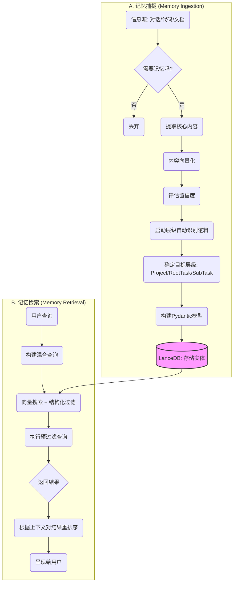
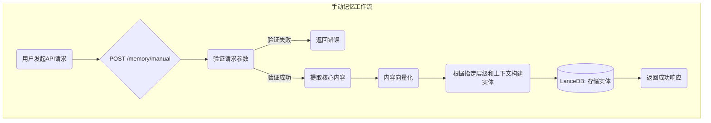

## 4. 智能引擎核心逻辑

### 核心摘要

本章深入阐述了智能引擎的核心架构与工作机制。该引擎旨在实现对信息的全生命周期管理，从自动捕捉、层级化存储到上下文感知的精准检索。其关键特性包括：

- **层级化记忆**: 自动将信息归类到项目 (Project)、根任务 (RootTask) 和子任务 (SubTask) 三个层级。
- **上下文感知**: 在检索时利用当前上下文进行预过滤和结果重排序，显著提升信息相关性。
- **混合控制**: 同时提供全自动的层级识别与精准的手动指令接口。
- **高度可配**: 核心行为（如向量化模型、检索阈值）均可通过配置文件调整。

本文档面向开发者与系统架构师，详细解析了其工作流、核心算法、API 设计及容错机制。

### 4.1. 核心工作流

智能引擎定义了从信息捕捉到检索的完整生命周期，其核心是**层级自动识别逻辑**。



### 4.2. 层级自动识别逻辑

引擎根据当前上下文 (`current_project_id`, `current_root_task_id`) 和内容特征，遵循一套决策树来自动归类新的记忆实体。以下是该逻辑的伪代码实现，展示了详细的判断流程。

该算法的伪代码实现已提取到 [`src/memory_prototype/engine_logic.py`](../../src/memory_prototype/engine_logic.py) 文件中，您可以查看 `auto_assign_level` 函数以了解完整逻辑。

```python
# 示例: 节选自 engine_logic.py
def auto_assign_level(text_content: str, context: Context) -> (str, float):
    # 1. 最高优先级 - SubTask
    if context.current_root_task_id:
        return "SubTask", 0.9
    # ... 更多逻辑请参见源文件
```

### 4.3. 上下文感知查询

查询接口 `query(text, context)` 利用上下文信息构建高效的**预过滤 (Pre-filtering)** 混合查询。该策略不仅提升了搜索效率，也显著增强了结果的相关性。

该查询逻辑的伪代码实现已提取到 [`src/memory_prototype/engine_logic.py`](../../src/memory_prototype/engine_logic.py) 文件中，您可以查看 `contextual_query` 函数以了解完整实现。

```python
# 示例: 节选自 engine_logic.py
def contextual_query(query_text: str, context: QueryContext, lance_table: pa.Table):
    # 1. 将查询文本向量化
    # ...
    # 2. 基于上下文动态构建 SQL 过滤器
    # ...
    # 3. 执行预过滤搜索
    # ...
    # 4. 结果重排序 (Re-ranking)
    # ...
    pass
```

### 4.4. 手动指令：精准记忆工作流

为实现对记忆存储的精确控制，系统提供了手动指令接口。该接口允许用户绕过层级自动识别逻辑，直接指定记忆实体的内容、层级及元数据。

**API 端点**: `POST /memory/manual`

#### 4.4.1. 工作流程

当用户调用手动记忆接口时，引擎将执行以下简化流程：



#### 4.4.2. 请求体详解

请求体是一个 JSON 对象，包含以下字段，允许用户精确控制记忆的存储方式：

| 参数                   | 类型      | 是否必须 | 描述                                                                    |
| :--------------------- | :-------- | :------- | :---------------------------------------------------------------------- |
| `content`              | `string`  | 是       | 需要被记忆的核心文本内容。                                              |
| `level`                | `string`  | 是       | 指定记忆的层级。必须是 `"Project"`, `"RootTask"`, 或 `"SubTask"` 之一。 |
| `context`              | `object`  | 否       | 提供记忆归属的上下文。例如，存储`SubTask`时需提供`root_task_id`。       |
| `context.project_id`   | `string`  | 否       | 记忆所属的项目 ID。                                                     |
| `context.root_task_id` | `string`  | 否       | 记忆所属的根任务 ID。                                                   |
| `confidence`           | `float`   | 否       | 手动指定该记忆的置信度，范围 0.0 到 1.0。若不提供，则默认为 1.0。       |
| `ttl`                  | `integer` | 否       | 记忆的生存时间（Time-To-Live），单位为秒。过期后记忆将被自动清理。      |

#### 4.4.3. 使用示例

假设我们正在为一个已存在的项目 (`proj_123`) 下的根任务 (`task_abc`) 添加一条关键的技术备注。

**请求:**

```bash
curl -X POST http://localhost:8000/memory/manual \
-H "Content-Type: application/json" \
-d '{
  "content": "使用 LanceDB 的 pre-filter 功能可以显著提升混合查询的性能，尤其是在大规模数据集上。",
  "level": "SubTask",
  "context": {
    "project_id": "proj_123",
    "root_task_id": "task_abc"
  },
  "confidence": 0.95,
  "ttl": 86400
}'
```

**响应:**

```json
{
  "status": "success",
  "message": "Memory entity created successfully.",
  "memory_id": "mem_xyz789"
}
```

通过这个接口，开发者可以轻松地将外部信息、用户配置或关键日志等结构化地注入到记忆系统中。

### 4.5. 向量化策略

高质量的向量表示是实现精准语义检索的基础。引擎采用一套精细化的策略，确保文本内容能够被准确地转化为向量。

#### 4.5.1. 文本预处理

在将文本送入 Embedding 模型之前，会执行以下预处理步骤，以提升向量质量：

1.  **清洗 (Cleaning)**:

    - 移除无关字符，如 HTML 标签、Markdown 标记、URL 等。
    - 标准化文本，例如将所有文本转为小写，统一处理特殊符号。
    - 对于代码片段，保留其结构但移除不影响语义的格式。

2.  **分块 (Chunking)**:
    - **动机**: Embedding 模型通常有输入长度限制（如 512 或 1024 tokens）。对于长文本，必须将其分割成语义完整的块。
    - **策略**: 采用基于语义的文本分割器（如 `RecursiveCharacterTextSplitter`），优先根据段落、句子等自然边界进行分割，避免破坏语义完整性。
    - **块大小 (Chunk Size)**: 这是一个关键的可调参数，通常设置为略小于模型最大输入长度，以为特殊 tokens 预留空间。
    - **重叠 (Overlap)**: 在相邻的块之间设置一定的重叠内容（如 10% 的块大小），确保上下文在块的边界处不会丢失。

#### 4.5.2. Embedding 模型选型

模型的选择直接影响检索的相关性和准确性。我们推荐并优先考虑以下模型：

- **首选模型**: `bge-m3` (BAAI General Embedding)

  - **优势**:
    - **多语言支持**: 能够处理超过 100 种语言，非常适合多语言项目环境。
    - **高维度**: 提供高维度的向量表示，能够捕捉更丰富的语义细节。
    - **混合检索优化**: 对同时包含稀疏（关键词）和密集（语义）检索的场景有特别优化。
  - **适用场景**: 需要高精度语义理解、处理多语言内容或代码片段的项目。

- **备选模型**: `text-embedding-3-small` (OpenAI)
  - **优势**:
    - **性能与成本的平衡**: 在保持较高检索精度的同时，提供了更低的成本和更快的推理速度。
    - **成熟的生态**: 作为 OpenAI 的产品，拥有完善的文档和社区支持。
  - **适用场景**: 对成本和响应速度有较高要求的应用，且主要处理英文内容。

引擎的设计允许通过配置轻松切换不同的 Embedding 模型，以适应不同项目的特定需求和预算。

### 4.6. 错误处理与容错机制

生产级系统必须具备强大的容错能力。因此，智能引擎在关键流程中内置了详细的错误处理逻辑。

| 发生阶段     | 常见错误           | 处理策略                                                                                                                                                                                                                                                                                                                                                                            |
| :----------- | :----------------- | :---------------------------------------------------------------------------------------------------------------------------------------------------------------------------------------------------------------------------------------------------------------------------------------------------------------------------------------------------------------------------------- |
| **记忆捕捉** | **向量化失败**     | - **原因**: 第三方 Embedding 服务不可用、API 密钥无效、输入文本超长或格式不兼容。<br>- **策略**: <br> 1. **重试机制**: 实现带指数退避的自动重试逻辑（如重试 3 次，间隔分别为 1s, 3s, 5s）。<br> 2. **服务降级**: 如果主模型持续失败，可自动切换到备用 Embedding 模型。<br> 3. **死信队列**: 多次重试后仍失败的请求，将被发送到死信队列（Dead-Letter Queue），供后续手动排查和处理。 |
|              | **数据库写入失败** | - **原因**: 数据库连接中断、磁盘空间不足、数据格式校验失败。<br>- **策略**: <br> 1. **事务回滚**: 确保写入操作的原子性，失败时回滚所有变更。<br> 2. **连接池管理**: 监控并自动恢复失效的数据库连接。<br> 3. **告警**: 触发关键指标告警（如写入延迟、失败率），通知运维人员。                                                                                                        |
| **记忆检索** | **查询语法错误**   | - **原因**: 用户输入的查询包含 LanceDB 不支持的 SQL `WHERE` 语法。<br>- **策略**: <br> 1. **输入校验**: 在执行查询前，对用户构建的过滤器进行语法校验和净化（Sanitization），防止 SQL 注入等安全风险。<br> 2. **友好提示**: 向用户返回清晰的错误信息，指导其修正查询语法。                                                                                                           |
|              | **查询超时**       | - **原因**: 查询过于复杂、数据量过大或索引效率低下。<br>- **策略**: <br> 1. **设置超时**: 为所有数据库查询设置合理的超时时间（如 5000ms）。<br> 2. **查询优化**: 记录慢查询日志，定期分析并优化索引策略和查询逻辑。<br> 3. **部分结果返回**: 在超时的情况下，如果已有部分查询结果，可以考虑返回这些部分结果，并附带超时提示。                                                       |

### 4.7. 可配置性与灵活性

为适应多样化的应用场景，智能引擎的核心行为被设计为高度可配置。通过配置文件（如 `config.yaml`），开发者能够在不修改代码的情况下，对引擎的行为进行微调。

| 配置项                 | 模块         | 描述                                                                             | 默认值                               |
| :--------------------- | :----------- | :------------------------------------------------------------------------------- | :----------------------------------- |
| `embedding_model`      | **向量化**   | 指定用于文本向量化的 Embedding 模型。可以是本地模型路径或 API 端点。             | `bge-m3`                             |
| `max_chunk_size`       | **向量化**   | 文本分块的最大长度（tokens）。                                                   | `512`                                |
| `chunk_overlap`        | **向量化**   | 相邻文本块之间的重叠长度（tokens）。                                             | `50`                                 |
| `task_start_keywords`  | **层级识别** | 用于识别新 `RootTask` 的信号词列表。                                             | `["目标是", "任务是", ...]`          |
| `similarity_threshold` | **检索**     | 向量搜索的最低相似度阈值，低于此值的结果将被过滤。                               | `0.75`                               |
| `rerank_weights`       | **检索**     | 结果重排序时，赋予不同上下文的权重。例如：`{"root_task": 1.5, "project": 1.2}`。 | `{"root_task": 1.5, "project": 1.2}` |
| `query_timeout_ms`     | **错误处理** | 数据库查询的超时时间（毫秒）。                                                   | `5000`                               |
| `retry_attempts`       | **错误处理** | 调用外部服务（如 Embedding API）失败时的最大重试次数。                           | `3`                                  |

通过调整这些参数，开发者可以将引擎的行为与特定领域的语言习惯、性能要求和成本预算进行精确匹配，从而最大化系统的效能。
