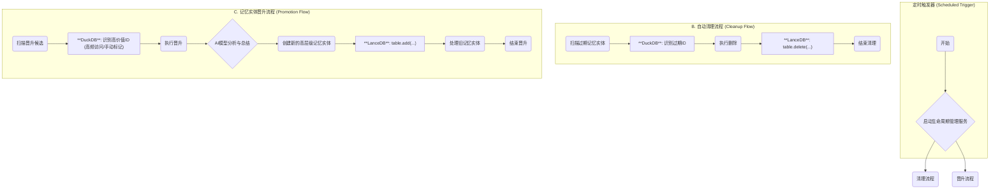

## 5. 全生命周期管理

### 核心摘要

本章节详细阐述了记忆实体（Memory）的全生命周期管理机制。该机制旨在通过自动化流程，实现系统资源的高效利用和知识价值的最大化。

其核心功能主要包括两个方面：

1.  **自动清理 (Auto Cleanup)**: 系统会为不同类型的记忆实体信息设定一个“保质期”（即 TTL, Time-To-Live）。一旦信息过期，后台任务会自动将其清理，从而释放存储空间，确保系统持久高效运行。
2.  **记忆实体晋升 (Memory Promotion)**: 对于那些被频繁访问或被用户特别标记的重要信息，系统会启动“晋升”流程。通过人工智能（AI）的分析与提炼，将这些零散的、瞬时的信息，升华为结构化的、可长期复用的核心知识。

通过这两项后台任务的协同工作，生命周期管理不仅保障了系统的健康状态，更构建了一套知识沉淀与演化的智能体系。

生命周期管理旨在通过自动化的后台任务，实现**资源高效利用**与**知识价值最大化**。其核心机制包括**自动清理**与**记忆实体晋升**。本章将详细阐述其技术流程、实现策略及运维保障。

### 5.1. 核心流程

下图展示了生命周期管理的核心服务流程，涵盖了从定时触发到执行清理与晋升的完整路径。



### 5.2. 自动清理 (TTL)

自动清理机制通过为不同类型的记忆实体实体设置存活时间（Time-To-Live, TTL），定期移除过期数据，以回收存储资源并维持系统性能。

- **职责划分**: DuckDB 负责高效**识别**过期记忆实体，LanceDB 负责物理**删除**。
- **默认 TTL**:
  - `SubTask`: 30 天
  - `RootTask`: 90 天
  - `Project`: 永久 (-1)
- **核心流程**: 后台任务定时使用 DuckDB 查询出过期 ID，然后调用 LanceDB 的 `delete` 方法进行批量删除。详细的批处理策略见 [5.4. 批处理优化](#54-批处理优化)。

### 5.3. 记忆实体晋升

记忆实体晋升机制负责将瞬时、高价值的 `SubTask` 记忆实体，通过 AI 模型进行提炼与固化，生成长期的 `RootTask` 知识，从而实现知识的沉淀与复用。

- **触发条件**:
  - **高频引用**: `usage_count` 超过阈值。
  - **用户手动标记**: `manual_promote_flag` 为 `True`。
  - **高置信度**: `confidence` 分数高于预设阈值（例如 > 0.9）。
  - **AI 模型识别**: （高级功能）通过聚类分析发现主题簇。
- **核心流程**:
  1.  **识别**: DuckDB 找出满足条件的候选记忆实体。
  2.  **提炼**: 调用 LLM 对候选记忆实体内容进行总结，生成新 `RootTask` 的目标（Objective）。
  3.  **创建**: 在 LanceDB 中创建新的 `RootTask` 实体。
  4.  **归档**: 删除或归档原始的 `SubTask` 记忆实体，避免信息冗余。详细的晋升算法见 [5.5. 高级晋升算法](#55-高级晋升算法)。

### 5.4. 调度与执行策略

本节详细阐述生命周期任务的调度机制与批处理优化方案，以确保任务能够高效、稳定地执行。

#### 5.4.1. 调度策略设计

生命周期管理的调度策略采用 **Cron 表达式** 实现定时触发，该机制支持灵活的时间规则配置。

```yaml
# 调度配置示例 (config/lifecycle.yaml)
scheduler:
  # 清理任务调度
  cleanup:
    enabled: true
    expression: "0 2 * * *" # 每天凌晨 2:00 执行
    timezone: "Asia/Shanghai"
    max_execution_time: 3600 # 最大执行时间（秒）
    retry_policy:
      max_attempts: 3
      backoff_multiplier: 2
      initial_interval: 60

  # 晋升任务调度
  promotion:
    enabled: true
    expression: "0 3 * * 0" # 每周日凌晨 3:00 执行
    timezone: "Asia/Shanghai"
    max_execution_time: 7200
    retry_policy:
      max_attempts: 3
      backoff_multiplier: 2
      initial_interval: 120
```

不同频率的调度策略适用于不同的业务场景：

|  调度频率  | Cron 表达式 | 适用场景                     | 资源消耗 |   推荐度   |
| :--------: | :---------: | :--------------------------- | :------: | :--------: |
| **每小时** | `0 * * * *` | 高频交互系统，实时性要求高   |    高    |   ⭐⭐⭐   |
|  **每天**  | `0 2 * * *` | 常规业务系统，平衡性能与资源 |    中    | ⭐⭐⭐⭐⭐ |
|  **每周**  | `0 3 * * 0` | 低频使用系统，资源敏感场景   |    低    |  ⭐⭐⭐⭐  |
|  **每月**  | `0 4 1 * *` | 归档型系统，长期存储为主     |   极低   |    ⭐⭐    |

为进一步提升智能化水平，系统还支持基于当前负载动态调整调度频率。此外，通过优先级队列、资源隔离、互斥锁和超时控制等机制，可有效处理潜在的调度冲突。

#### 5.4.2. 批处理优化

为降低 I/O 负载、提升数据处理吞吐量并有效控制内存占用，清理与晋升过程均采用了精细化的批处理策略。

**1. 批量查询 (Batch Query)**

- **策略**: 使用 DuckDB 的 `IN` 子句或 `JOIN` 操作，一次性查询出需要处理的 ID 列表。
- **最佳实践**:
  - **分批获取**: 当待处理 ID 数量巨大时，通过 `LIMIT` 和 `OFFSET` 分批获取。
  - **ID 集合管理**: 使用 `Redis` 或内存中的 `Set` 结构来管理待处理的 ID 集合，支持增量处理和去重。

**2. 批量删除 (Batch Delete)**

- **策略**: LanceDB 的 `delete` 方法支持传入 ID 列表，实现高效的批量删除。
- **最佳实践**:
  - **合理 Batch Size**: 根据业务场景选择合适的批处理大小（Batch Size），在延迟和吞吐量之间找到平衡。一般推荐在 500-2000 之间。
  - **动态调整**: 根据系统负载和网络状况，动态调整 Batch size。

### 5.5. 高级晋升算法

为实现高质量的知识萃取，系统采用基于 AI 的高级晋升算法，旨在将零散的 `SubTask` 提炼并转化为结构化的 `RootTask`。

#### 5.5.1. 晋升候选识别

除了基本的计数和手动标记，引入了更复杂的识别算法：

- **相似度聚类 (Similarity Clustering)**: 通过 Embedding 和聚类算法（如 `K-Means`）发现语义相关的 `SubTask` 簇。
- **主题模型 (Topic Modeling)**: 使用 `LDA` 等模型发现 `SubTask` 中的潜在主题，聚合属于同一主题的记忆实体。

#### 5.5.2. LLM 驱动的知识萃取

**1. 提示工程 (Prompt Engineering)**

通过精心设计的提示（Prompt），可以有效指导大语言模型（LLM）将多个 `SubTask` 的内容总结并提炼成一个高质量的 `RootTask`。

```json
{
  "prompt_template": {
    "role": "You are an expert in knowledge distillation and summarization.",
    "task": "Summarize the following SubTasks into a coherent and high-level RootTask. The RootTask should capture the core objective, provide necessary context, and list key deliverables.",
    "input": {
      "subtasks": [
        { "content": "{subtask_1_content}" },
        { "content": "{subtask_2_content}" }
      ]
    },
    "output_format": {
      "type": "json",
      "schema": {
        "objective": "string",
        "context": "string",
        "deliverables": ["string"]
      }
    }
  }
}
```

**2. 多轮总结与精炼 (Multi-turn Summarization & Refinement)**

该过程采用分层总结与验证修正的策略，以确保生成内容的准确性和一致性。同时，系统还引入了人工反馈回路（Human-in-the-loop）以持续优化模型性能。

#### 5.5.3. 晋升后的处理

- **建立关联**: 在新生成的 `RootTask` 中记录原始 `SubTask` 的 ID 列表，方便溯源。
- **状态变更**: 将原始 `SubTask` 的状态标记为 `Archived` 或 `Promoted`，并可以选择性删除以节省空间。

### 5.6. 监控与运维

为保障生命周期管理服务的稳定性与可靠性，系统建立了一套全面的监控、告警及故障恢复机制。

#### 5.6.1. 关键性能指标 (KPI) 与监控

系统通过暴露一个 Prometheus Metrics 端点，对以下核心 KPI 进行持续监控：

| 指标 (KPI)             | 描述                            | 业务价值                   | 告警阈值           |
| :--------------------- | :------------------------------ | :------------------------- | :----------------- |
| **每日清理记忆实体数** | `cleanup_daily_count`           | 衡量清理任务的效率和健康度 | `count < 100`      |
| **每周晋升成功率**     | `promotion_weekly_success_rate` | 评估晋升算法的有效性       | `rate < 80%`       |
| **任务执行平均耗时**   | `task_avg_duration_seconds`     | 识别潜在性能瓶颈           | `duration > 3600s` |
| **任务失败次数**       | `task_failure_count`            | 监控任务稳定性             | `count > 3` (连续) |

使用 Grafana 创建可视化 Dashboard，并配置 Alertmanager 实现关键指标的自动告警。

#### 5.6.2. 故障恢复与数据一致性

**1. 恢复策略**

- **自动重试机制**: 对网络抖动等临时性错误，采用**指数退避**策略自动重试。
- **幂等性设计**: 通过事务性状态标记（`PROCESSING`, `COMPLETED`），确保任务重复执行不会产生副作用。
- **死信队列 (Dead-Letter Queue)**: 对于无法自动恢复的持久性错误，将其隔离到死信队列，待人工干预。

**2. 数据一致性保障**

系统采用**最终一致性**模型。为保障数据准确，后台会通过定期的对账任务，扫描并修复因异常中断导致的状态不一致数据。
