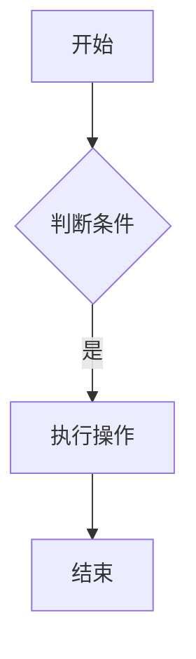
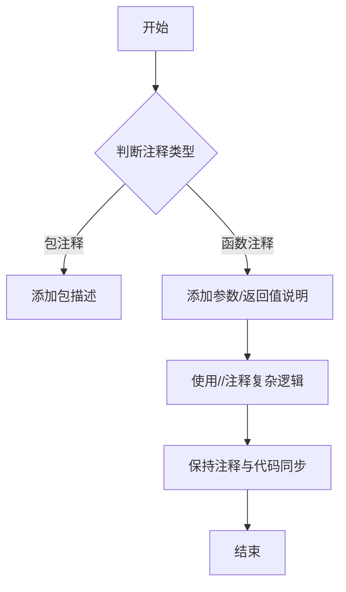

# Go编程规范

## 代码风格

### 格式化要求

- 所有代码必须通过 `gofmt -s` 格式化
- 行长度建议不超过120字符，超过时优先重构逻辑
- 缩进使用Tab(四个空格)

### 注释规范

1. **包注释**：每个包应有简短说明
```go
// Package mypackage 实现 xxx 功能
package mypackage
```

2. **函数注释**：包含功能描述、参数说明和示例
```go
// MyFunction 执行核心业务逻辑
// 参数：
//   - i: 输入整数
// 返回：
//   - 转换后的字符串
// 示例：
//     result := MyFunction(42)
//     fmt.Println(result) // 输出 "42"
func MyFunction(i int) string {
    return strconv.Itoa(i)
}
```

3. **Mermaid流程图示例**


- 包注释必须位于包声明前

```go
// Package network 提供网络连接管理功能
package network
```

- 导出函数必须包含文档注释

```go
// Connect 建立到指定主机的网络连接
func Connect(host string) (*Connection, error) { ... }
```

### 命名规则

- 包名使用小写单单词，如 `database`、`httpclient`
- 导出类型使用驼峰命名法，如 `HTTPClient`
- 未导出类型首字母小写，如 `httpClient`
- 常量全大写下划线分隔，如 `MAX_CONNECTION_COUNT`

## 错误处理

### 错误设计原则

- 禁止在业务逻辑中使用 `panic`
- 优先使用 `errors.New` 或 `fmt.Errorf` 创建错误

```go
var ErrNotFound = errors.New("资源未找到")

func ReadFile(path string) ([]byte, error) {
    _, err := os.Stat(path)
    if err != nil {
        if os.IsNotExist(err) {
            return nil, ErrNotFound
        }
        log.Errorf("err:%s", err)
        return nil, err
    }
    if _, err := os.Stat(path); os.IsNotExist(err) {
        return nil, fmt.Errorf("文件不存在: %w", ErrNotFound)
    }
    // ...
}
```

### 错误处理模式

- 采用尽早返回模式减少嵌套

```go
func Process(data []byte) error {
    if len(data) == 0 {
        return errors.New("数据不能为空")
    }
    // 处理逻辑
    return nil
}
```

## 并发编程

### 协程管理

- 使用 channel 控制协程生命周期

```go
func worker(stopChan <-chan struct{}) {
    ticker := time.NewTicker(1s)
    defer ticker.Stop()
    for {
        select {
        case <-stopChan:
            return
        case <-ticker.C:
            // 处理逻辑
        }
    }
}

```

## **1. 代码风格**

### **1.1 格式化**

- 所有代码必须通过`gofmt -s`格式化

### **1.2 注释规范**

**完整规范要求**：
- 所有公开API必须包含注释
- 注释应包含功能说明、参数描述、返回值解释
- 推荐包含使用示例
- 使用自然流畅的中文技术文档风格

```go
// 包注释：描述包的用途和设计原则
package http

// 导出函数注释：遵循"Name ..."格式
// Get fetches a resource by URL and handles retries automatically.
func Get(url string) ([]byte, error) {
    // 内部注释：解释复杂逻辑
    // Use exponential backoff for retries
    for attempt := 0; attempt < maxRetries; attempt++ {
        // ...
    }
}
```

### **1.3 命名约定**

| 元素    | 命名规则           | 示例                |
|-------|----------------|-------------------|
| 包名    | 小写单单词          | `net`, `http`     |
| 导出类型  | 驼峰命名（首字母大写）    | `HTTPClient`      |
| 未导出类型 | 驼峰命名（首字母小写）    | `httpClient`      |
| 常量    | 全大写+下划线        | `MAX_CONNECTIONS` |
| 变量    | 短名（局部）/描述名（全局） | `i`, `maxRetries` |
| 接口    | 以`-er`结尾或单一动作  | `Reader`, `Close` |

## **2. 错误处理**

### **2.1 错误设计**

```go
// 静态错误
var ErrNotFound = errors.New("resource not found")

// 动态错误（使用%w保留原始错误）
return fmt.Errorf("parse config: %w", err)

// 结构化错误
type HTTPError struct {
    Code int
    Msg  string
}

func (e *HTTPError) Error() string {
    return fmt.Sprintf("HTTP %d: %s", e.Code, e.Msg)
}
```

### **2.2 错误处理模式**

```go
// 推荐：尽早返回，减少嵌套
func ReadFile(path string) ([]byte, error) {
    f, err := os.Open(path)
    if err != nil {
        log.Errorf("err:%s", err)
        return nil, err
    }
    defer f.Close()

    data, err := io.ReadAll(f)
    if err != nil {
        log.Errorf("err:%s", err)
        return nil, err
    }
    return data, nil
}
```

## **3. 并发编程**

### **3.1 goroutine管理**

```go
// 使用channel控制goroutine退出
func worker(jobs <-chan Job, stop <-chan struct{}) {
    for {
        select {
        case job, ok := <-jobs:
            if !ok {
                return
            }
            process(job)
        case <-stop:
            return
        }
    }
}

// 启动和停止示例
stopCh := make(chan struct{})
jobsCh := make(chan Job)

go worker(jobsCh, stopCh)

// 停止工作
close(stopCh)
```

### **3.2 并发原语**

| 场景      | 推荐原语      | 示例代码                                         |
|---------|-----------|----------------------------------------------|
| 协程间通信   | Channel   | `jobs := make(chan Job, 10)`                 |
| 共享资源保护  | Mutex     | `var mu sync.Mutex`                          |
| 等待多协程完成 | WaitGroup | `wg.Add(2); go func() { defer wg.Done() }()` |
| 单次初始化   | Once      | `var once sync.Once; once.Do(init)`          |

## **4. 性能优化**

### **4.1 内存分配**

```go
// 预分配切片容量
data := make([]int, 0, 100)

// 对象复用（sync.Pool）
var bufPool = sync.Pool{
    New: func() interface{} {
        return make([]byte, 1024)
    },
}

func process() {
    buf := bufPool.Get().([]byte)
    defer bufPool.Put(buf)
    // 使用buf
}
```

### **4.2 字符串操作**

```go
// 推荐：使用strings.Builder替代+
var builder strings.Builder
for i := 0; i < 1000; i++ {
    builder.WriteString("part")
}
result := builder.String()

// 数值转字符串：使用strconv而非fmt
s := strconv.Itoa(123) // 比fmt.Sprintf快3-4倍
```

## **5. 测试规范**

### **5.1 单元测试**

```go
func TestAdd(t *testing.T) {
    tests := []struct {
        a, b int
        want int
    }{
        {1, 2, 3},
        {0, 0, 0},
        {-1, 1, 0},
    }

    for _, tt := range tests {
        t.Run(fmt.Sprintf("%d+%d", tt.a, tt.b), func(t *testing.T) {
            if got := Add(tt.a, tt.b); got != tt.want {
                t.Errorf("Add() = %v, want %v", got, tt.want)
            }
        })
    }
}
```

### **5.2 基准测试**

```go
func BenchmarkAdd(b *testing.B) {
    for i := 0; i < b.N; i++ {
        Add(1, 2)
    }
}
### **6. 注释规范增强**
#### 6.1 代码注释标准
```go
// 包注释应描述包的用途
package main

// 函数注释应遵循Google风格
func calculateTotal(items []int) int {
    // 函数体
}
```

#### 6.2 Mermaid流程图示例


#### 6.3 注释维护原则
1. 每次代码修改时更新相关注释
2. 使用中文注释中文项目
3. 关键算法需添加注释水印