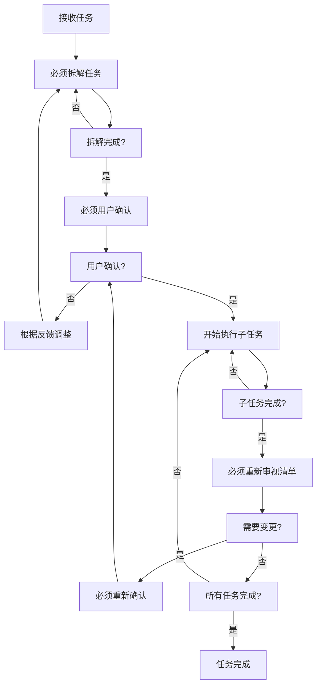
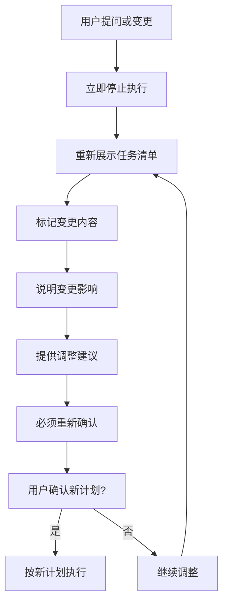

# 任务管理指南

## 核心理念

- **简洁明了**: 描述清晰，避免冗余
- **精准匹配**: 信息高度聚焦，仅提供任务相关上下文
- **模式驱动**: 根据任务性质选择最适合的专业模式
- **价值导向**: 每个任务明确价值点和预期产出

## 任务层级

### 两层架构

```
调度层 (orchestrator)
    ↓ 任务分解与委派
执行层 (各专业模式)
```

### 层级职责

| 层级       | 职责                         | 模式           |
| ---------- | ---------------------------- | -------------- |
| **调度层** | 任务分解、依赖管理、结果汇总 | `orchestrator` |
| **执行层** | 专业实现、原子操作、直接交付 | 各专业模式     |

### 任务流向

1. **复杂任务进入调度层**

   - `orchestrator` 接收并分析
   - 分解为可执行的子任务
   - 委派给对应的专业模式

2. **子任务进入执行层**
   - 各模式按专业领域执行
   - 完成后返回结果
   - 由 `orchestrator` 汇总

## 模式协作机制

### 协作流程

#### 标准流程

1. **任务接收** → `orchestrator`

   - 分析任务复杂度
   - 识别所需专业领域
   - 制定任务分解策略

2. **任务分解** → `orchestrator`

   - 创建子任务清单
   - 确定任务依赖关系
   - 分配执行模式

3. **专业执行** → 各专业模式

   - 按专业领域执行
   - 必要时进行模式间协作
   - 保持上下文传递

4. **结果汇总** → `orchestrator`
   - 收集各子任务结果
   - 验证整体完成度
   - 准备最终交付

#### 强制委托任务清单要求

- **强制要求**: 委托任务时必须同时委托完整的相关任务清单，禁止零散委托
- **清单完整性**: 每次委托必须包含当前任务的所有相关子任务和依赖任务
- **层级委托**: 必须按照任务层级结构逐级委托，确保上下级任务关系完整
- **上下文传递**: 委托时必须传递完整的任务上下文，包括 `task_id_list` 和依赖关系

##### 委托执行规范

1. **委托前验证**

   - [ ] 任务清单是否达到最小 3 级结构要求
   - [ ] 每个委托任务是否包含完整的子任务清单
   - [ ] 任务 ID 层级结构是否符合规范
   - [ ] 依赖关系是否明确且完整
   - [ ] 验收标准是否清晰可衡量

2. **委托内容要求**

   - **主任务委托**: 必须包含所有子任务和孙任务的完整清单
   - **子任务委托**: 必须包含所属主任务信息和相关依赖任务
   - **跨模式协作**: 必须明确协作模式和任务交接点
   - **任务上下文**: 必须包含 `metadata` 和完整背景信息

3. **委托验证流程**
   ```
   委托发起 → 清单完整性检查 → 层级结构验证 → 上下文完整性确认 → 正式委托
   ```
   - 任何一项验证失败都必须重新整理任务清单
   - 委托后必须接收模式确认回执
   - 必须跟踪委托任务的执行状态

##### 委托状态管理

- **委托跟踪**: 必须记录每个委托任务的发起时间、接收模式、预期完成时间
- **状态同步**: 委托任务状态变更时，必须同步更新所有相关任务的状态
- **异常处理**: 委托任务执行异常时，必须立即介入并协调解决
- **完成确认**: 委托任务完成后，必须验证结果并更新整体任务状态

#### 典型场景

**新功能开发**:

```
orchestrator → architect → code → debug → doc-writer
     ↓           ↓        ↓       ↓          ↓
  任务分解 → 架构设计 → 代码实现 → 测试调试 → 文档编写
```

**系统重构**:

```
orchestrator → project-research → architect → code → giter
     ↓                ↓              ↓        ↓        ↓
  任务分解 → 代码库分析 → 重构方案设计 → 重构实施 → 版本管理
```

## 工作流程

### 执行原则

1. **模式切换**: 禁止使用 `switch_mode`，通过 `new_task` 转换
2. **任务粒度**: 非 orchestrator 模式下，任务必须原子化
3. **决策确认**: L1 级决策需通过 `ask_followup_question` 确认
4. **信息呈现**: 使用流程图、清单、表格等可视化方式
5. **模式专业化**: 严格专业分工，超出能力的任务必须委派
6. **上下文精简**: 仅传递任务相关上下文，避免过载

### 🚨 四大必须执行机制

#### 机制一：必须拆解后执行

- **强制要求**: 任何任务必须先进行完整拆解，绝对禁止直接开始执行
- **强制多层级拆解**: 必须按照层级结构进行深度拆解，最少拆解到 3 级任务结构
- **拆解标准**: 将复杂任务分解为原子化、可独立验证的子任务
- **拆解内容**: 明确每个子任务的目标、边界、依赖关系和验收标准
- **执行前提**: 只有完成拆解并获得用户确认后，才能开始任何执行动作

### 多层级任务拆解规范

#### 强制层级结构要求

- **最小层级**: 所有任务必须拆解到至少 3 级结构（主任务 → 子任务 → 孙任务）
- **层级深度**: 最大不超过 4 级，确保任务结构清晰可控
- **拆解完整性**: 每个父任务必须包含至少 2 个子任务，避免单一路径
- **原子化要求**: 最终层级任务必须是原子化操作，可独立执行和验证

#### 任务 ID 层级结构规范

- **基本格式**: `[任务描述]-[编号]`，如"用户认证功能开发-001"
- **层级格式**: `[主任务]-[主编号].[子编号].[孙编号].[曾孙编号]`
- **编号规则**:
  - 主任务：3 位数字(001-999)
  - 子任务：点号分隔，层级编号按 1 开始递增
  - 描述规范：不超过 20 字符，动词开头，包含关键词
- **示例层级结构**:
  ```
  用户管理系统开发-001
    用户认证功能开发-001.001
      登录接口实现-001.001.001
      注册接口实现-001.001.002
    权限管理功能开发-001.002
      角色权限设计-001.002.001
      权限验证实现-001.002.002
  ```

#### 拆解质量标准

- **独立性**: 每个子任务必须可独立执行，不依赖其他未完成的任务
- **可验证性**: 每个任务都有明确的验收标准和验证方法
- **时间可控**: 叶子任务（最终层级）完成时间控制在 1-3 天内
- **边界清晰**: 任务范围明确，避免范围模糊或重叠

#### 拆解执行流程

1. **第一层拆解**: 主任务分解为功能模块（一级拆解）
2. **第二层拆解**: 功能模块分解为具体功能点（二级拆解）
3. **第三层拆解**: 功能点分解为可执行任务（三级拆解）
4. **第四层拆解**: 复杂任务进一步分解为原子操作（四级拆解，可选）

#### 拆解验证清单

- [ ] 是否达到最小 3 级结构要求
- [ ] 每个父任务是否包含至少 2 个子任务
- [ ] 叶子任务是否原子化且可独立验证
- [ ] 任务 ID 是否符合层级编号规范
- [ ] 任务边界是否清晰且无重叠
- [ ] 依赖关系是否明确且合理
- [ ] 验收标准是否具体且可衡量

#### 机制二：必须用户确认

- **强制要求**: 任务拆解完成后必须向用户正式确认，禁止擅自执行
- **确认内容**: 完整展示任务清单、执行路径、资源需求、时间预估、风险评估
- **确认工具**: 必须使用 `ask_followup_question` 工具进行正式确认
- **等待反馈**: 在获得用户明确确认前，必须保持等待状态，不得执行任何操作

#### 机制三：必须重新确认

- **强制要求**: 用户提出任何问题、意见或变更时，必须立即停止当前执行
- **重新展示**: 将更新后的任务清单（包含用户提出的变更）完整展示
- **重新确认**: 必须再次使用 `ask_followup_question` 获得用户对更新后计划的确认
- **变更追溯**: 清晰标记变更内容，说明变更影响和调整建议

#### 机制四：必须持续审视

- **强制要求**: 每个子任务完成后，必须立即重新审视整个任务清单
- **审视内容**: 检查已完成任务对后续任务的影响，识别需要调整的内容
- **变更处理**: 如有变更，必须重新展示更新后的任务清单并获得用户确认
- **持续同步**: 确保用户始终了解最新的任务状态和执行计划

### 机制执行流程图



### 用户变更处理流程



### 优化策略

- **批量操作**: `apply_diff` 处理多个修改，`read_file` 最多 5 个
- **性能优化**: 缓存频繁访问信息，使用脚本替代命令链
- **质量保证**: 执行前验证前置条件，关键节点更新状态
- **上下文管理**: 仅传递任务相关信息，使用 `task_id_list` 追踪来源

## 任务清单管理

### 动态更新原则

| 原则         | 要求               | 操作规范                                         |
| ------------ | ------------------ | ------------------------------------------------ |
| **及时性**   | 状态变更后立即更新 | 增量更新，遵循 pending → in_progress → completed |
| **准确性**   | 清单与实际执行一致 | 保留历史记录，不删除已完成或失败任务             |
| **完整性**   | 包含所有相关任务   | 批量操作，实时广播状态变更                       |
| **可追溯性** | 保留状态变更历史   | 版本控制，为每次更新创建快照                     |

### 执行反馈机制

- **成功完成**: 更新状态为已完成，记录实际用时
- **部分完成**: 拆分未完成部分，更新完成百分比
- **执行失败**: 记录失败原因，创建重试任务
- **需求变更**: 创建新任务反映变更，标记原任务废弃

## 最佳实践

- **任务设计**: 清晰、具体、可衡量。明确验收标准，设置任务边界，考虑依赖关系
- **执行策略**: 关键路径优先。并行执行无依赖任务，及时处理阻塞，持续沟通
- **协作优化**: 明确职责边界。清晰信息传递，定期进度同步，记录关键决策
- **清单管理**: 及时更新状态。动态调整，增量更新，保持可读性，建立反馈循环

## 渐进式任务拆解要求

### 核心原则

- **渐进式原则**: 遵循渐进式开发理念，先完成独立小任务提交 MVP 确认，然后逐步迭代优化
- **逐步交付**: 一步一步完成任务而非一次性完成，确保每个阶段都有可交付的成果
- **依赖递进**: 任务从无依赖到有依赖，从简单到复杂逐步实现，避免复杂的依赖关系

### 拆解策略

#### 第一阶段：独立小任务优先

- **无依赖任务**: 优先选择和执行没有前置依赖的任务
- **MVP 导向**: 每个独立任务都应该是一个最小可验证的产品
- **快速交付**: 完成后立即提交确认，获得用户反馈

#### 第二阶段：渐进式复杂化

- **依赖建立**: 在基础任务完成后，逐步引入有依赖关系的任务
- **功能扩展**: 基于已完成的任务进行功能扩展和优化
- **系统集成**: 将独立的模块逐步集成为完整的系统

#### 第三阶段：整体优化

- **性能调优**: 在功能完整后进行性能优化
- **体验改进**: 基于用户反馈改进用户体验
- **质量提升**: 完善测试、文档和监控

### 执行流程

#### 步骤 1：识别无依赖任务

```
输入: 复杂需求
↓
分析: 识别可独立执行的最小任务单元
↓
输出: 无依赖任务清单
```

#### 步骤 2：执行独立任务

```
选择: 优先级最高的无依赖任务
↓
执行: 完成任务并获得用户确认
↓
提交: MVP级别的可交付成果
```

#### 步骤 3：建立依赖关系

```
评估: 基于已完成任务识别新的可执行任务
↓
规划: 确定任务间的依赖关系
↓
执行: 按依赖顺序逐步执行
```

#### 步骤 4：持续迭代优化

```
反馈: 收集用户对已完成任务的反馈
↓
优化: 基于反馈进行迭代改进
↓
扩展: 逐步扩展功能和复杂度
```

### 任务优先级规则

#### 优先级矩阵

```
高价值 + 低依赖 → 最高优先级
高价值 + 高依赖 → 中等优先级
低价值 + 低依赖 → 低优先级
低价值 + 高依赖 → 最低优先级
```

#### 动态调整

- **价值重估**: 每完成一个任务后重新评估剩余任务的价值
- **依赖更新**: 根据已完成任务更新依赖关系
- **优先级重排**: 基于最新信息动态调整任务优先级

### 质量控制

#### 阶段性验收

- **独立任务验收**: 每个无依赖任务完成后都要进行验收
- **集成验收**: 多个任务集成后进行集成验收
- **系统验收**: 整个系统完成后进行最终验收

#### 反馈循环

- **及时反馈**: 每个阶段完成后立即收集用户反馈
- **快速响应**: 根据反馈快速调整后续任务
- **持续改进**: 将反馈经验应用到后续任务中

### 风险管理

#### 风险识别

- **依赖风险**: 识别可能导致任务阻塞的依赖关系
- **复杂度风险**: 识别可能超出当前能力的复杂任务
- **时间风险**: 识别可能延期的任务

#### 风险缓解

- **任务分解**: 将高风险任务进一步分解为更小的任务
- **并行准备**: 在执行主要任务时并行准备依赖项
- **缓冲时间**: 为关键任务预留适当的缓冲时间

### 典型应用场景

#### 新功能开发

```
第一阶段: 基础功能实现
  - 核心API开发（无依赖）
  - 基础UI组件（无依赖）
  - 数据模型设计（无依赖）

第二阶段: 功能集成
  - API与UI集成（依赖API和UI）
  - 数据持久化（依赖数据模型）
  - 用户认证（依赖基础功能）

第三阶段: 优化完善
  - 性能优化（依赖完整功能）
  - 用户体验改进（依赖用户反馈）
  - 监控告警（依赖系统运行）
```

#### 系统重构

```
第一阶段: 准备工作
  - 代码分析（无依赖）
  - 重构方案设计（无依赖）
  - 测试环境准备（无依赖）

第二阶段: 渐进重构
  - 基础组件重构（无依赖）
  - 核心模块重构（依赖基础组件）
  - 系统集成测试（依赖重构完成）

第三阶段: 稳定运行
  - 性能测试（依赖重构完成）
  - 问题修复（依赖测试结果）
  - 文档更新（依赖稳定运行）
```

## 多层级任务管理

### 强制层级结构规范

**核心原则**：严格按照最小 3 级、最大 4 级的强制层级结构，使用点号编号（如 001.001.001），确保父子任务依赖明确且可追溯。

**强制编号格式**：

```
001. [ ] 一级任务：主任务描述
   001.001. [ ] 二级任务：子任务描述
      001.001.001. [ ] 三级任务：孙任务描述
         001.001.001.001. [ ] 四级任务：曾孙任务描述（可选）
```

**层级结构要求**：

- **最小层级**: 任何任务必须拆解到至少 3 级结构
- **最大层级**: 严格控制不超过 4 级，避免过度复杂化
- **子任务数量**: 每个父任务必须包含至少 2 个子任务
- **原子化要求**: 最终层级任务必须是原子化操作，可独立执行和验证

### 多层级状态管理机制

**自动状态计算**：

- 父任务状态根据所有子任务状态自动计算
- 状态流转：`pending` → `in_progress` → `completed` → `failed`
- 支持部分完成状态（如：75% completed）
- 状态变更必须实时同步到所有相关任务

**状态计算规则**：

```
父任务状态 = f(子任务状态集合)
- 所有子任务 completed → 父任务 completed
- 任一子任务 failed → 父任务 failed
- 所有子任务非pending且存在in_progress → 父任务 in_progress
- 否则 → 父任务 pending
```

**批量操作支持**：

- 支持批量更新同一层级任务状态
- 支持批量查询任务完成进度
- 支持批量重置任务状态
- 所有操作必须保持数据一致性

### 多层级执行原则

**强制设计要求**：

- **时间控制**: 叶子任务完成时间严格控制在 1-3 天内
- **自顶向下**: 必须按照层级结构逐级分解和执行
- **依赖明确**: 任务间依赖关系必须在任务定义中明确标注
- **动态调整**: 支持在执行过程中动态调整任务结构

**严格管理规范**：

- **关键路径优先**: 优先处理影响整体进度的关键路径任务
- **并行执行**: 无依赖关系的任务必须并行执行以提高效率
- **状态实时更新**: 任务状态变更后必须立即更新到系统
- **定期回顾**: 每周至少进行一次任务结构回顾和优化

### 多层级任务协作场景

**新功能开发场景**：

```
001. 新功能开发-001
   001.001. 架构设计-001.001
      001.001.001. 技术选型-001.001.001
      001.001.002. 接口设计-001.001.002
   001.002. 前端实现-001.002
      001.002.001. 组件开发-001.002.001
      001.002.002. 页面集成-001.002.002
   001.003. 后端实现-001.003
      001.003.001. API开发-001.003.001
      001.003.002. 数据库设计-001.003.002
   001.004. 测试验证-001.004
      001.004.001. 单元测试-001.004.001
      001.004.002. 集成测试-001.004.002
```

**系统重构场景**：

```
002. 系统重构-002
   002.001. 重构准备-002.001
      002.001.001. 代码分析-002.001.001
      002.001.002. 重构方案-002.001.002
   002.002. 渐进重构-002.002
      002.002.001. 基础组件-002.002.001
      002.002.002. 核心模块-002.002.002
   002.003. 验证部署-002.003
      002.003.001. 性能测试-002.003.001
      002.003.002. 稳定运行-002.003.002
```

**问题排查场景**：

```
003. 问题排查-003
   003.001. 问题分析-003.001
      003.001.001. 问题定位-003.001.001
      003.001.002. 根因分析-003.001.002
   003.002. 解决方案-003.002
      003.002.001. 方案设计-003.002.001
      003.002.002. 方案实施-003.002.002
   003.003. 验证优化-003.003
      003.003.001. 效果验证-003.003.001
      003.003.002. 预防措施-003.003.002
```

### 多层级任务监控机制

**进度监控**：

- **层级进度**: 每个层级都有独立的完成进度计算
- **整体进度**: 基于所有叶子任务的加权平均计算
- **关键路径**: 实时监控关键路径任务的执行状态
- **风险预警**: 对延期任务自动触发风险预警

**质量监控**：

- **层级质量**: 每个层级任务完成后必须进行质量验收
- **集成质量**: 多层级任务集成后必须进行集成质量验证
- **标准统一**: 所有层级任务使用统一的质量验收标准
- **问题追溯**: 质量问题必须能够追溯到具体的层级任务

### 多层级任务优化策略

**结构优化**：

- **定期重构**: 每月对任务层级结构进行一次重构优化
- **扁平化**: 在保证 3 级结构的前提下，尽量保持结构扁平化
- **模块化**: 按功能模块组织任务层级，提高可维护性
- **标准化**: 使用标准的任务模板和命名规范

**执行优化**：

- **资源平衡**: 合理分配各层级任务的执行资源
- **时间优化**: 优化关键路径任务的执行时间
- **并行度提升**: 提高无依赖任务的并行执行度
- **自动化**: 自动化重复性任务，提高执行效率

## 📋 任务管理总结

### 核心要求总结

| 要求类型     | 强制标准                | 违规后果     |
| ------------ | ----------------------- | ------------ |
| **任务拆解** | 必须拆解到最小 3 级结构 | 禁止直接执行 |
| **层级编号** | 必须使用点号编号格式    | 任务无法追踪 |
| **委托清单** | 必须包含完整任务清单    | 委托不完整   |
| **用户确认** | 必须获得用户明确确认    | 执行无效     |
| **状态管理** | 必须实时更新任务状态    | 管理混乱     |

### 最佳实践要点

1. **拆解优先**: 任何任务都必须先拆解，后执行
2. **层级清晰**: 严格按照 3-4 级结构组织任务
3. **编号规范**: 统一使用点号编号格式
4. **委托完整**: 确保委托时包含所有相关任务
5. **用户主导**: 关键决策必须获得用户确认
6. **持续优化**: 定期回顾和优化任务结构

### 质量保证机制

- **拆解验证**: 7 项验证清单确保拆解质量
- **委托检查**: 5 项验证确保委托完整性
- **格式检查**: 统一的格式规范确保文档一致性
- **状态同步**: 自动状态计算确保信息准确性

### 实施建议

- **逐步推进**: 从简单任务开始，逐步应用多层级管理
- **团队培训**: 确保所有团队成员理解并遵循规范
- **工具支持**: 使用合适的工具支持任务管理和状态跟踪
- **持续改进**: 定期收集反馈，持续优化管理流程
