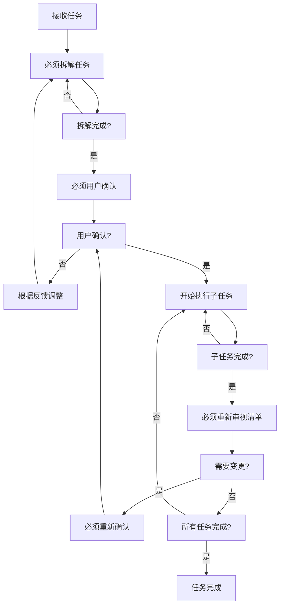
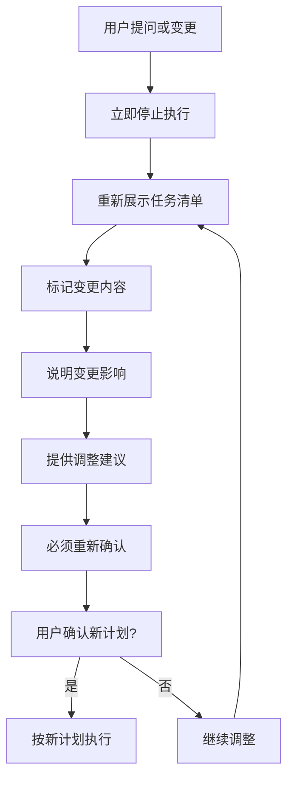

# 任务管理指南

## 核心理念

- **简洁明了**: 描述清晰，避免冗余
- **精准匹配**: 信息高度聚焦，仅提供任务相关上下文
- **模式驱动**: 根据任务性质选择最适合的专业模式
- **价值导向**: 每个任务明确价值点和预期产出

## 任务层级

### 两层架构

```
调度层 (orchestrator)
    ↓ 任务分解与委派
执行层 (各专业模式)
```

### 层级职责

| 层级       | 职责                         | 模式           |
| ---------- | ---------------------------- | -------------- |
| **调度层** | 任务分解、依赖管理、结果汇总 | `orchestrator` |
| **执行层** | 专业实现、原子操作、直接交付 | 各专业模式     |

### 任务流向

1. **复杂任务进入调度层**

   - `orchestrator` 接收并分析
   - 分解为可执行的子任务
   - 委派给对应的专业模式

2. **子任务进入执行层**
   - 各模式按专业领域执行
   - 完成后返回结果
   - 由 `orchestrator` 汇总

## 模式协作机制

### 模式选择指南

详见 new_task.md

### 协作流程

#### 标准流程

1. **任务接收** → `orchestrator`

   - 分析任务复杂度
   - 识别所需专业领域
   - 制定任务分解策略

2. **任务分解** → `orchestrator`

   - 创建子任务清单
   - 确定任务依赖关系
   - 分配执行模式

3. **专业执行** → 各专业模式

   - 按专业领域执行
   - 必要时进行模式间协作
   - 保持上下文传递

4. **结果汇总** → `orchestrator`
   - 收集各子任务结果
   - 验证整体完成度
   - 准备最终交付

#### 典型场景

**新功能开发**:

```
orchestrator → architect → code → debug → doc-writer
     ↓           ↓        ↓       ↓          ↓
  任务分解 → 架构设计 → 代码实现 → 测试调试 → 文档编写
```

**系统重构**:

```
orchestrator → project-research → architect → code → giter
     ↓                ↓              ↓        ↓        ↓
  任务分解 → 代码库分析 → 重构方案设计 → 重构实施 → 版本管理
```

## 工作流程

### 执行原则

1. **模式切换**: 禁止使用 `switch_mode`，通过 `new_task` 转换
2. **任务粒度**: 非 orchestrator 模式下，任务必须原子化
3. **决策确认**: L1 级决策需通过 `ask_followup_question` 确认
4. **信息呈现**: 使用流程图、清单、表格等可视化方式
5. **模式专业化**: 严格专业分工，超出能力的任务必须委派
6. **上下文精简**: 仅传递任务相关上下文，避免过载

### 🚨 四大必须执行机制

#### 机制一：必须拆解后执行

- **强制要求**: 任何任务必须先进行完整拆解，绝对禁止直接开始执行
- **拆解标准**: 将复杂任务分解为原子化、可独立验证的子任务
- **拆解内容**: 明确每个子任务的目标、边界、依赖关系和验收标准
- **执行前提**: 只有完成拆解并获得用户确认后，才能开始任何执行动作

#### 机制二：必须用户确认

- **强制要求**: 任务拆解完成后必须向用户正式确认，禁止擅自执行
- **确认内容**: 完整展示任务清单、执行路径、资源需求、时间预估、风险评估
- **确认工具**: 必须使用 `ask_followup_question` 工具进行正式确认
- **等待反馈**: 在获得用户明确确认前，必须保持等待状态，不得执行任何操作

#### 机制三：必须重新确认

- **强制要求**: 用户提出任何问题、意见或变更时，必须立即停止当前执行
- **重新展示**: 将更新后的任务清单（包含用户提出的变更）完整展示
- **重新确认**: 必须再次使用 `ask_followup_question` 获得用户对更新后计划的确认
- **变更追溯**: 清晰标记变更内容，说明变更影响和调整建议

#### 机制四：必须持续审视

- **强制要求**: 每个子任务完成后，必须立即重新审视整个任务清单
- **审视内容**: 检查已完成任务对后续任务的影响，识别需要调整的内容
- **变更处理**: 如有变更，必须重新展示更新后的任务清单并获得用户确认
- **持续同步**: 确保用户始终了解最新的任务状态和执行计划

### 机制执行流程图



### 用户变更处理流程



### 优化策略

- **批量操作**: `apply_diff` 处理多个修改，`read_file` 最多 5 个
- **性能优化**: 缓存频繁访问信息，使用脚本替代命令链
- **质量保证**: 执行前验证前置条件，关键节点更新状态
- **上下文管理**: 仅传递任务相关信息，使用 `task_id_list` 追踪来源

## 任务清单管理

### 动态更新原则

| 原则         | 要求               | 操作规范                                         |
| ------------ | ------------------ | ------------------------------------------------ |
| **及时性**   | 状态变更后立即更新 | 增量更新，遵循 pending → in_progress → completed |
| **准确性**   | 清单与实际执行一致 | 保留历史记录，不删除已完成或失败任务             |
| **完整性**   | 包含所有相关任务   | 批量操作，实时广播状态变更                       |
| **可追溯性** | 保留状态变更历史   | 版本控制，为每次更新创建快照                     |

### 执行反馈机制

- **成功完成**: 更新状态为已完成，记录实际用时
- **部分完成**: 拆分未完成部分，更新完成百分比
- **执行失败**: 记录失败原因，创建重试任务
- **需求变更**: 创建新任务反映变更，标记原任务废弃

## 最佳实践

- **任务设计**: 清晰、具体、可衡量。明确验收标准，设置任务边界，考虑依赖关系
- **执行策略**: 关键路径优先。并行执行无依赖任务，及时处理阻塞，持续沟通
- **协作优化**: 明确职责边界。清晰信息传递，定期进度同步，记录关键决策
- **清单管理**: 及时更新状态。动态调整，增量更新，保持可读性，建立反馈循环

## 多层级任务管理

### 结构设计

**核心原则**：层级深度 ≤4 层，使用点号编号（如 1.1.1），父子任务依赖明确。

**编号格式**：

```
1. [ ] 一级任务
   1.1. [ ] 二级任务
      1.1.1. [ ] 三级任务
```

**状态管理**：

- 父任务状态根据子任务自动计算
- 状态流转：pending → in_progress → completed
- 支持增量更新和批量操作

### 执行原则

**设计要求**：

- 叶子任务 1-3 天内完成
- 自顶向下分解
- 明确任务依赖关系
- 支持动态调整

**管理规范**：

- 优先处理关键路径任务
- 并行执行无依赖任务
- 及时更新任务状态
- 定期回顾调整结构

### 典型协作场景

**新功能开发**：

```
orchestrator → architect → code → debug → doc-writer
```

**系统重构**：

```
orchestrator → project-research → architect → code → giter
```

**问题排查**：

```
orchestrator → debug → code → ask → doc-writer
```
