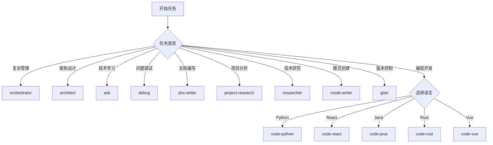

# 模式选择指南

> **专业分工，智能协作**：14 个专业化模式覆盖完整开发流程

## 📋 模式速查表

### 通用模式 (9 个)

| 模式                | slug               | 核心能力                           | 适用场景                         | 快速选择             |
| ------------------- | ------------------ | ---------------------------------- | -------------------------------- | -------------------- |
| 🧠 **智能总指挥**   | `orchestrator`     | 任务分解、模式协调、进度追踪       | 复杂项目管理、跨模式协作         | **需要多模式协作时** |
| 🏗️ **架构师**       | `architect`        | 架构设计、技术选型、UML 建模       | 系统架构、技术选型、重构设计     | **系统设计决策时**   |
| 📚 **学术顾问**     | `ask`              | 深度解释、概念探索、教学导向       | 技术学习、原理分析、知识传递     | **需要深度理解时**   |
| 🔬 **异常分析师**   | `debug`            | 系统化分析、根因分析、问题预防     | Bug 排查、性能优化、安全分析     | **遇到问题时**       |
| 📝 **文档工程师**   | `doc-writer`       | 结构化写作、标准化格式、多格式输出 | API 文档、技术规范、项目文档     | **需要文档输出时**   |
| 🔍 **项目研究员**   | `project-research` | 代码结构分析、依赖梳理、技术栈识别 | 项目分析、技术债务识别、重构建议 | **接手新项目时**     |
| 🧪 **首席研究员**   | `researcher`       | 多维分析、竞品分析、趋势研究       | 技术选型、方案评估、最佳实践     | **技术决策研究时**   |
| 🛠️ **模式工程大师** | `mode-writer`      | 模式设计、提示词工程、迭代优化     | 模式创建、性能优化、系统维护     | **创建新模式时**     |
| 🔄 **版本控制专家** | `giter`            | Git 工作流、分支管理、冲突解决     | 大型项目管理、团队协作、合并处理 | **团队协作开发时**   |

### 编程子模式 (5 个)

| 模式                 | slug          | 技术栈                                | 适用场景                             | 快速选择            |
| -------------------- | ------------- | ------------------------------------- | ------------------------------------ | ------------------- |
| 🐍 **Python 魔法师** | `code-python` | FastAPI, Django, Pandas, pytest       | Python 后端、数据处理、自动化脚本    | **Python 开发任务** |
| ⚛️ **React 魔法师**  | `code-react`  | React 18+, Next.js, TypeScript, Redux | React 应用、Next.js 全栈、组件库开发 | **React 开发任务**  |
| ☕ **Java 魔法师**   | `code-java`   | Spring Boot, JPA, Maven, JUnit        | 企业级应用、微服务、分布式系统       | **Java 开发任务**   |
| 🦀 **Rust 魔法师**   | `code-rust`   | Axum, Tokio, Cargo, nix               | 系统工具、高性能服务、区块链应用     | **Rust 开发任务**   |
| 💚 **Vue 魔法师**    | `code-vue`    | Vue 3, Nuxt.js, Pinia, Vite           | Vue 应用、Nuxt.js 全栈、插件开发     | **Vue 开发任务**    |

## 🎯 模式选择决策流程

### 快速选择流程图



### 详细决策标准

#### 第一层：任务复杂度评估

- **复杂任务** → `orchestrator`

  - 多步骤、多模式协作
  - 需要任务分解和进度管理
  - 跨专业领域的综合性任务

- **简单任务** → 直接选择对应模式
  - 单一目标、单一专业领域
  - 可独立完成的原子任务

#### 第二层：任务性质识别

| 任务特征     | 推荐模式           | 判断依据                            |
| ------------ | ------------------ | ----------------------------------- |
| **设计规划** | `architect`        | 需要架构设计、技术选型、系统规划    |
| **知识传递** | `ask`              | 需要深度解释、概念理解、教学指导    |
| **问题解决** | `debug`            | 遇到错误、性能问题、需要根因分析    |
| **文档产出** | `doc-writer`       | 需要结构化文档、标准化格式          |
| **代码分析** | `project-research` | 需要理解现有系统、分析代码结构      |
| **技术评估** | `researcher`       | 需要多维分析、竞品对比、趋势研究    |
| **模式开发** | `mode-writer`      | 需要创建新模式、优化现有模式        |
| **版本管理** | `giter`            | 需要 Git 工作流、分支策略、协作管理 |
| **代码实现** | 选择编程子模式     | 具体编程语言开发任务                |

#### 第三层：编程语言选择

| 开发任务        | 推荐模式      | 技术特征                         |
| --------------- | ------------- | -------------------------------- |
| **Python 开发** | `code-python` | 后端 API、数据处理、自动化脚本   |
| **React 开发**  | `code-react`  | 前端组件、单页应用、Next.js 全栈 |
| **Java 开发**   | `code-java`   | 企业级应用、微服务、Spring 生态  |
| **Rust 开发**   | `code-rust`   | 系统工具、高性能服务、内存安全   |
| **Vue 开发**    | `code-vue`    | Vue 应用、Nuxt.js 全栈、组件开发 |

### 模式协作最佳实践

#### 协作触发条件

1. **任务复杂性触发**

   - 任务步骤 ≥ 5 步
   - 涉及 ≥ 2 个专业领域
   - 预估时长 ≥ 1 周

2. **技术栈多样性触发**

   - 前后端同时开发
   - 多种编程语言混合
   - 架构 + 实现结合

3. **质量要求触发**
   - 需要架构设计 + 代码实现
   - 需要研究分析 + 技术实现
   - 需要文档体系 + 代码交付

#### 协作模式示例

```
全栈Web应用开发：
orchestrator → architect → code-python → code-react → doc-writer

微服务迁移项目：
orchestrator → architect → researcher → code-java → debug → giter

新技术调研与原型：
orchestrator → researcher → code-python → doc-writer
```

### 模式切换禁忌

- **禁止直接切换**：不得使用 `switch_mode` 工具
- **禁止跨专业处理**：模式不得处理不擅长领域
- **禁止自行委派**：非 `orchestrator` 模式不得进行任务委派
- **禁止破坏纯粹性**：保持模式专业性和功能纯粹性

## 📖 模式选择最佳实践

### 选择原则

1. **专业优先**: 每个模式专注特定领域，避免跨界处理
2. **复杂度评估**: 简单任务直接选择，复杂任务使用 orchestrator
3. **技术栈匹配**: 根据具体技术选择对应编程模式
4. **协作意识**: 多领域任务主动寻求模式协作

### 常见选择误区

- **误区 1**: 用 orchestrator 处理简单任务
- **误区 2**: 编程模式处理架构设计
- **误区 3**: 跨专业领域自行处理
- **误区 4**: 忽视技术栈特异性

### 选择效率技巧

1. **速查表优先**: 先查看速查表快速定位
2. **关键词匹配**: 根据任务关键词选择模式
3. **复杂度预判**: 评估任务步骤和涉及领域
4. **技术识别**: 明确主要使用的技术栈

### 模式切换时机

**需要切换的情况**:

- 任务性质发生变化
- 涉及新的专业领域
- 技术栈发生转换
- 复杂度显著提升

**切换方式**:

- 通过 `new_task` 委派
- 明确说明切换原因
- 提供完整上下文
- 设定期望结果

---

## 🧠 核心模式详解

## 🧠 核心模式速览

| 模式                    | 核心定位       | 主要能力                           | 关键场景                         |
| ----------------------- | -------------- | ---------------------------------- | -------------------------------- |
| 🧠 **orchestrator**     | 任务调度中枢   | 任务分解、模式协调、进度追踪       | 复杂项目管理、跨模式协作         |
| 🏗️ **architect**        | 架构设计专家   | 技术选型、系统架构、UML 建模       | 系统设计、技术选型、重构         |
| 📚 **ask**              | 知识解释专家   | 深度解释、概念探索、教学导向       | 技术学习、原理分析、知识传递     |
| 🔬 **debug**            | 问题诊断专家   | 系统化分析、根因分析、问题预防     | Bug 排查、性能优化、安全分析     |
| 📝 **doc-writer**       | 文档专家       | 结构化写作、标准化格式、多格式输出 | API 文档、技术规范、项目文档     |
| 🔍 **project-research** | 代码分析专家   | 代码结构分析、依赖梳理、技术栈识别 | 项目分析、技术债务识别、重构     |
| 🧪 **researcher**       | 系统研究专家   | 多维分析、竞品分析、趋势研究       | 技术选型、方案评估、最佳实践     |
| 🛠️ **mode-writer**      | 模式创建专家   | 模式设计、提示词工程、迭代优化     | 模式创建、性能优化、系统维护     |
| 🔄 **giter**            | Git 工作流专家 | 分支管理、冲突解决、协作规范       | 大型项目管理、团队协作、合并处理 |

---

## 💻 编程子模式速览

| 模式               | 核心定位         | 主要能力                            | 技术栈                          | 关键场景                                 |
| ------------------ | ---------------- | ----------------------------------- | ------------------------------- | ---------------------------------------- |
| 🐍 **code-python** | Python 生态专家  | 框架精通、性能优化、工程实践        | FastAPI, Django, Pandas, pytest | 后端 API、数据处理、自动化脚本           |
| ⚛️ **code-react**  | React 开发专家   | TypeScript 集成、现代开发、性能优化 | React 18+, Next.js, Redux, Vite | 单页应用、全栈开发、组件库、React Native |
| ☕ **code-java**   | 企业级 Java 专家 | Spring 生态、JVM 优化、并发编程     | Spring Boot, JPA, Maven, JUnit  | 企业级应用、微服务、分布式系统           |
| 🦀 **code-rust**   | 系统级 Rust 专家 | 内存安全、高性能、系统编程          | Axum, Tokio, Cargo, nix         | 系统工具、高性能服务、区块链、嵌入式     |
| 💚 **code-vue**    | Vue 生态专家     | 组件开发、状态管理、工程化          | Vue 3, Nuxt.js, Pinia, Vite     | 单页应用、全栈开发、组件库、插件开发     |

## 🎯 快速决策流程

### 三步选择法

1. **判断复杂度**：任务是否需要多模式协作？

   - 是 → 选择 `orchestrator`
   - 否 → 进入下一步

2. **识别任务类型**：任务的主要性质是什么？

   - 架构设计 → `architect`
   - 技术学习 → `ask`
   - 问题调试 → `debug`
   - 文档编写 → `doc-writer`
   - 项目分析 → `project-research`
   - 技术研究 → `researcher`
   - 模式创建 → `mode-writer`
   - 版本控制 → `giter`
   - 编程开发 → 进入下一步

3. **选择编程语言**：主要使用什么技术栈？
   - Python → `code-python`
   - React/TypeScript → `code-react`
   - Java → `code-java`
   - Rust → `code-rust`
   - Vue → `code-vue`
