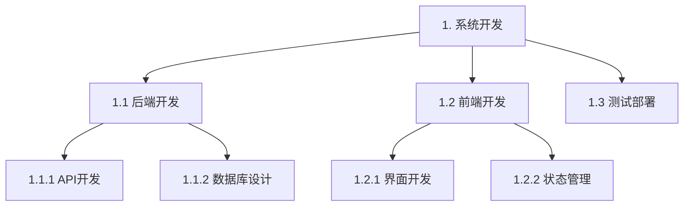

# 任务管理指南

## 核心理念

- **简洁明了**: 描述清晰，避免冗余
- **精准匹配**: 信息高度聚焦，仅提供任务相关上下文
- **模式驱动**: 根据任务性质选择最适合的专业模式
- **价值导向**: 每个任务明确价值点和预期产出

## 任务层级

### 两层架构

```
调度层 (orchestrator)
    ↓ 任务分解与委派
执行层 (各专业模式)
```

### 层级职责

| 层级       | 职责                         | 模式           |
| ---------- | ---------------------------- | -------------- |
| **调度层** | 任务分解、依赖管理、结果汇总 | `orchestrator` |
| **执行层** | 专业实现、原子操作、直接交付 | 各专业模式     |

### 任务流向

1. **复杂任务进入调度层**

   - `orchestrator` 接收并分析
   - 分解为可执行的子任务
   - 委派给对应的专业模式

2. **子任务进入执行层**
   - 各模式按专业领域执行
   - 完成后返回结果
   - 由 `orchestrator` 汇总

## 模式协作机制

### 模式选择指南

详细模式职责和选择标准请参考 new_task.md#模式选择指南

### 协作流程

#### 标准流程

1. **任务接收** → `orchestrator`

   - 分析任务复杂度
   - 识别所需专业领域
   - 制定任务分解策略

2. **任务分解** → `orchestrator`

   - 创建子任务清单
   - 确定任务依赖关系
   - 分配执行模式

3. **专业执行** → 各专业模式

   - 按专业领域执行
   - 必要时进行模式间协作
   - 保持上下文传递

4. **结果汇总** → `orchestrator`
   - 收集各子任务结果
   - 验证整体完成度
   - 准备最终交付

#### 典型场景

**新功能开发**:

```
orchestrator → architect → code → debug → doc-writer
     ↓           ↓        ↓       ↓          ↓
  任务分解 → 架构设计 → 代码实现 → 测试调试 → 文档编写
```

**系统重构**:

```
orchestrator → project-research → architect → code → giter
     ↓                ↓              ↓        ↓        ↓
  任务分解 → 代码库分析 → 重构方案设计 → 重构实施 → 版本管理
```

## 工作流程

### 执行原则

1. **模式切换**: 禁止使用 `switch_mode`，通过 `new_task` 转换
2. **任务粒度**: 非 orchestrator 模式下，任务必须原子化
3. **决策确认**: L1 级决策需通过 `ask_followup_question` 确认
4. **信息呈现**: 使用流程图、清单、表格等可视化方式
5. **模式专业化**: 严格专业分工，超出能力的任务必须委派
6. **上下文精简**: 仅传递任务相关上下文，避免过载

### 优化策略

#### 批量操作

- 单个 `apply_diff` 处理多个修改
- 合并 `read_file` 请求（最多 5 个）

#### 性能优化

- 合并相似操作，减少工具调用
- 缓存频繁访问的信息
- 使用脚本替代命令链

#### 质量保证

- 执行前验证前置条件
- 关键节点更新任务状态
- 保持输出一致性

### 上下文管理

#### 传递原则

- 使用 `task_id_list` 追踪任务来源
- 在 `metadata.dependencies` 中声明依赖
- 保持信息精简完整

#### 信息过滤

- 仅传递任务直接相关信息
- 避免复制整个历史上下文
- 使用引用而非嵌入大型内容

## 任务清单管理

### 动态更新原则

- **及时性**: 任务状态变更后立即更新
- **准确性**: 确保清单与实际执行一致
- **完整性**: 包含所有相关任务
- **可追溯性**: 保留状态变更历史

### 执行反馈机制

1. **成功完成**

   - 更新任务状态为已完成
   - 记录实际用时和资源消耗
   - 解除依赖任务的阻塞

2. **部分完成**

   - 拆分未完成部分为新任务
   - 更新完成百分比
   - 调整依赖关系

3. **执行失败**

   - 记录失败原因和解决方案
   - 创建重试任务或替代方案
   - 通知相关方

4. **需求变更**
   - 创建新任务反映变更
   - 标记原任务为废弃
   - 建立新旧任务关联

### 更新操作规范

- **增量更新**: 仅变更需要修改的任务项
- **保留历史**: 不删除已完成或失败的记录
- **状态流转**: 遵循 pending → in_progress → completed
- **批量操作**: 单一操作更新多个相关任务

### 清单同步策略

- **实时广播**: 任务状态变更立即通知相关模式
- **版本控制**: 为每次更新创建快照
- **冲突解决**: 建立更新优先级机制
- **一致性检查**: 定期验证清单一致性

## 最佳实践

### 任务设计

- ✅ 任务描述清晰、具体、可衡量
- ✅ 明确定义验收标准
- ✅ 合理设置任务边界
- ✅ 考虑任务间依赖关系

### 执行策略

- ✅ 优先处理关键路径任务
- ✅ 并行执行无依赖的任务
- ✅ 及时识别和处理阻塞
- ✅ 保持与用户持续沟通

### 协作优化

- ✅ 明确各模式职责边界
- ✅ 建立清晰的信息传递机制
- ✅ 定期同步任务进度
- ✅ 记录关键决策和变更

### 任务清单管理

- ✅ 及时更新任务状态
- ✅ 根据执行结果动态调整
- ✅ 使用更新而非覆盖
- ✅ 保持清单可读性
- ✅ 建立反馈循环


## 多层级任务管理

### 多层级任务结构

**设计原则**：
- **层级深度**：建议不超过 4 层，避免过度嵌套
- **父子关系**：明确父子任务间的依赖和继承关系
- **粒度控制**：每个任务应具有明确的交付物
- **编号规范**：使用点号分隔的层级编号（如 1.1.1）

#### 层级编号规范

```
1. [ ] 一级任务
   1.1. [ ] 二级任务
      1.1.1. [ ] 三级任务
      1.1.2. [ ] 三级任务
   1.2. [ ] 二级任务
2. [ ] 一级任务
```

#### 任务状态管理规则

1. **自动状态计算**
   - 父任务状态根据所有子任务自动计算
   - 全部子任务完成 → 父任务自动完成
   - 任一子任务进行中 → 父任务标记为进行中
   - 子任务失败 → 父任务标记为阻塞

2. **状态流转规则**
   ```
   子任务状态变化 → 自动更新父任务
   父任务手动完成 → 强制完成所有子任务
   父任务取消 → 级联取消所有子任务
   ```

3. **完成度计算**
   - 加权平均：根据子任务权重计算父任务完成度
   - 简单平均：所有子任务完成度的算术平均值
   - 关键路径：基于关键路径任务计算整体进度

### 多层级任务示例

#### 示例1：系统开发任务

```
1. [x] 电商平台系统开发
   1.1. [x] 后端服务开发
      1.1.1. [x] 用户服务API
      1.1.2. [x] 商品服务API
      1.1.3. [x] 订单服务API
   1.2. [x] 前端界面开发
      1.2.1. [x] 用户管理模块
      1.2.2. [x] 商品展示模块
      1.2.3. [x] 购物车模块
   1.3. [-] 数据库设计与优化
      1.3.1. [x] 数据库架构设计
      1.3.2. [x] 索引优化
      1.3.3. [ ] 性能测试与调优
```

#### 示例2：重构项目任务

```
1. [ ] 系统架构重构
   1.1. [ ] 现有系统分析
      1.1.1. [ ] 代码质量评估
      1.1.2. [ ] 性能瓶颈分析
      1.1.3. [ ] 技术债务梳理
   1.2. [ ] 新架构设计
      1.2.1. [ ] 微服务拆分方案
      1.2.2. [ ] 服务间通信设计
      1.2.3. [ ] 数据一致性方案
   1.3. [ ] 分阶段迁移
      1.3.1. [ ] 用户服务迁移
      1.3.2. [ ] 订单服务迁移
      1.3.3. [ ] 支付服务迁移
```

### 多层级任务更新规则

#### 更新策略

1. **增量更新**
   - 仅更新发生变化的任务及其父任务
   - 保持未变动任务的状态不变
   - 自动传播状态变更到上级任务

2. **批量操作**
   - 支持批量更新同一层级的多个任务
   - 支持批量调整任务优先级
   - 支持批量修改任务负责人

3. **冲突处理**
   - 并发更新时采用乐观锁机制
   - 记录更新历史，支持回滚操作
   - 冲突时提示用户选择保留版本

#### 版本控制

- 每次更新创建任务快照
- 支持查看任务历史状态
- 支持任务变更比较
- 支持恢复到历史版本

### 多层级任务可视化格式

#### 1. 缩进列表格式

```
📋 项目任务清单
├── 1. [x] 需求分析阶段
│   ├── 1.1. [x] 用户调研
│   ├── 1.2. [x] 竞品分析
│   └── 1.3. [x] 需求文档编写
├── 2. [-] 设计阶段
│   ├── 2.1. [x] 原型设计
│   ├── 2.2. [x] UI设计
│   └── 2.3. [ ] 技术方案设计
└── 3. [ ] 开发阶段
    ├── 3.1. [ ] 前端开发
    ├── 3.2. [ ] 后端开发
    └── 3.3. [ ] 测试
```

#### 2. 表格格式

| 任务ID | 任务名称 | 状态 | 进度 | 负责人 | 截止日期 |
|--------|----------|------|------|--------|----------|
| 1 | 系统开发 | 进行中 | 65% | Team A | 2025-03-01 |
| 1.1 | 后端开发 | 已完成 | 100% | Alice | 2025-02-15 |
| 1.2 | 前端开发 | 进行中 | 50% | Bob | 2025-02-28 |
| 1.2.1 | 用户模块 | 已完成 | 100% | Bob | 2025-02-10 |
| 1.2.2 | 商品模块 | 进行中 | 30% | Bob | 2025-02-20 |

#### 3. 树状图格式



#### 4. 看板格式

```
📋 任务看板
┌─────────────┬─────────────┬─────────────┬─────────────┐
│   待办      │   进行中    │   已完成    │    阻塞     │
├─────────────┼─────────────┼─────────────┼─────────────┤
│1. 系统开发  │             │             │             │
│├─1.1 需求分析│             │             │             │
│├─1.2 架构设计│1.2.1 技术选型│             │             │
│└─1.3 开发计划│             │             │             │
└─────────────┴─────────────┴─────────────┴─────────────┘
```

### 多层级任务最佳实践

#### 设计原则

1. **自顶向下分解**
   - 先定义高层目标，再逐步细化
   - 确保每个任务都有明确的交付物
   - 保持任务间的逻辑关系清晰

2. **合理控制粒度**
   - 叶子任务应该能在 1-3 天内完成
   - 避免任务过大难以跟踪
   - 避免任务过小增加管理开销

3. **明确的依赖关系**
   - 使用任务依赖定义执行顺序
   - 识别关键路径任务
   - 避免循环依赖

4. **动态调整机制**
   - 定期回顾和调整任务结构
   - 支持任务的拆分和合并
   - 保持任务清单的实时性

#### 执行策略

1. **分层执行**
   - 优先完成关键路径任务
   - 并行执行无依赖的任务
   - 及时更新任务状态

2. **进度跟踪**
   - 使用完成度指标量化进度
   - 定期进行进度审查会议
   - 识别和解决阻塞问题

3. **资源分配**
   - 根据任务优先级分配资源
   - 平衡工作量分配
   - 考虑团队成员的专长

4. **风险管理**
   - 识别每个层级的风险点
   - 制定风险应对策略
   - 建立任务缓冲时间

#### 工具支持

1. **自动化工具**
   - 使用项目管理工具支持多层级任务
   - 配置自动化状态更新规则
   - 集成到开发工作流中

2. **可视化展示**
   - 提供多种视图展示任务结构
   - 支持任务过滤和搜索
   - 实时更新任务状态

3. **报告生成**
   - 自动生成进度报告
   - 支持自定义报告格式
   - 导出任务数据用于分析

### 任务清单管理最佳实践（多层级扩展）

#### 多层级任务设计
- ✅ 使用点号分隔的层级编号系统
- ✅ 控制层级深度在合理范围内（≤4层）
- ✅ 确保每个叶子任务可独立执行和验证
- ✅ 明确定义父子任务的依赖关系

#### 多层级任务执行
- ✅ 优先处理关键路径上的任务
- ✅ 并行执行同一层级无依赖的任务
- ✅ 子任务状态自动更新父任务状态
- ✅ 定期回顾和调整任务结构

#### 多层级任务可视化
- ✅ 根据需要选择合适的展示格式
- ✅ 保持展示格式的一致性
- ✅ 支持多维度查看任务信息
- ✅ 提供任务筛选和搜索功能