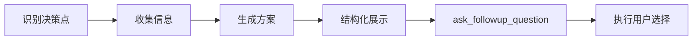

# 决策流程规范

> AI 与用户间的标准化决策互动流程，确保用户始终掌握最终控制权。

## 核心原则

| 原则         | 说明                                  |
| ------------ | ------------------------------------- |
| **决策主权** | 用户拥有最终决策权，AI 仅提供方案建议 |
| **信息透明** | 每次决策提供完整上下文和结构化选项    |
| **交互高效** | 优先封闭式选项，降低用户决策成本      |

## 决策场景分级

### 🔴 关键决策（必须触发）

以下场景必须通过 `ask_followup_question` 请求用户决策：

| 场景           | 触发条件         | 示例                   |
| -------------- | ---------------- | ---------------------- |
| **需求澄清**   | 指令存在歧义     | 多种理解方式时主动确认 |
| **方案选择**   | 存在多个技术路径 | 技术栈选择、架构决策   |
| **破坏性操作** | 涉及删除/覆盖    | 文件删除、数据清空     |
| **信息缺失**   | 缺少必要参数     | 路径、凭证等关键信息   |

### 🟡 建议决策（推荐触发）

| 场景         | 触发条件     | 示例               |
| ------------ | ------------ | ------------------ |
| **优化机会** | 发现改进空间 | 性能优化、代码重构 |
| **扩展建议** | 识别潜在功能 | 新特性、集成方案   |

## 标准决策流程

## 工具使用规范

### ✅ 最佳实践

- **结构化对比**：使用表格展示方案优劣
- **简洁选项**：`suggest` 仅包含行动指令
- **推荐明确**：始终给出专业建议及理由

### ❌ 避免事项

- 开放性问题（如"接下来做什么？"）
- 复杂的 `suggest` 内容
- 未经确认的越权操作
