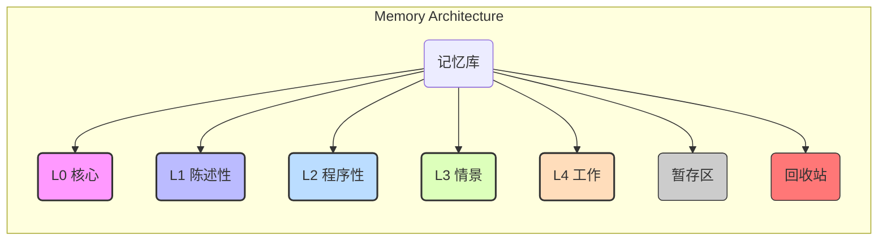

# 记忆库工作流规范

> **记忆库是所有任务的核心驱动力。本规范定义了记忆的架构、工作流和交互协议，其优先级高于一切。**

---

## 1. 记忆库架构 (Memory Architecture)

记忆库采用分层与压缩相结合的架构，确保信息的高效检索与持久化。

### 1.1 记忆分层模型

| 路径 | 层级 | 描述 | 生命周期 |
| --- | --- | --- | --- |
| `.memory/L0_core/` | **核心记忆** | 定义 AI 身份、核心指令、价值观。 | 永不卸载、永不修改。 |
| `.memory/L1_declarative/` | **陈述性记忆** | “是什么”的知识，如项目规范、事实数据。 | 长期持久化。 |
| `.memory/L2_procedural/` | **程序性记忆** | “如何做”的知识，如可复用的工作流、SOP。 | 长期持久化。 |
| `.memory/L3_episodic/` | **情景记忆** | 已完成任务的日志，用于复盘和优化。 | 归档，不直接参与新任务。 |
| `.memory/L4_working/` | **工作记忆** | 当前任务的临时上下文。 | 任务开始时构建，结束后清理。 |
| `.memory/staging/` | **暂存区** | 写入 L1/L2 前的临时存放区。 | 临时。 |
| `.memory/.trash/` | **回收站** | 待删除文件的临时存放区。 | 临时。 |

### 1.2 认知压缩引擎

- **摘要优先 (Summary First)**: 检索时，首先扫描轻量的摘要索引 (`index.json`)，命中后再加载完整的记忆文件本体，实现高效筛选。
- **指针化引用 (Pointer Reference)**: 冗长内容（如代码块）在持久化时被替换为指针 (`mem://<layer>/<id>`)，在工作记忆中按需解析，节约上下文。

---

## 2. 核心工作流 (Core Workflow)

### 阶段 1: 初始化与规划

1.  **认知加载 (Cognitive Loading)**:
    - **首要动作**: 任务启动时，必须执行分层、按需、摘要优先的认知加载流程，构建工作记忆 (L4)。
    - **状态检查**: 检查 `.memory/memory.lock` 文件，确定记忆库状态。若不存在，则置为 `PAUSED` 并提请初始化。
2.  **强制明示状态**:
    - 在每次响应前，**必须**明确标示当前记忆库的激活状态 (`[记忆库: ON]`, `[记忆库: OFF]`, `[记忆库: PAUSED]`)。
3.  **需求分析与方案设计**:
    - 遵循 [规划规范]，对用户需求进行分析、方案设计与对比，并最终通过 `ask_followup_question` 提请用户决策。

### 阶段 2: 迭代执行

1.  **任务执行**: 严格按照任务清单，在工作记忆 (L4) 的上下文中执行任务。
2.  **动态学习**: 任何新发现的关键信息、中间结论，都**必须立即写入**当前的工作记忆。
3.  **状态追踪**: 在每个子任务开始和结束时，**必须**使用 `update_todo_list` 更新任务状态。

### 阶段 3: 复盘与沉淀

1.  **强制复盘**: 每个子任务结束后，**必须**立即对工作记忆进行复盘，提炼可复用价值。
2.  **提请持久化**: 通过 `ask_followup_question` 向用户提请审批“记忆候选卡片”，建议存入 L1 或 L2 层级。

### 阶段 4: 收尾与清理

1.  **最终持久化**: 父任务完成后，进行全面复盘，将所有有价值信息沉淀到 L1/L2 记忆库。
2.  **归档日志**: 将完整的执行记录归档至情景记忆 (L3)。
3.  **清理记忆**: **必须**由 `orchestrator` 在任务结束后，调用 `memory` 模式的 `cleanup` 工作流清理工作记忆 (L4)。

---

## 3. 交互与集成 (Interaction & Integration)

### 3.1 模式职责与权限

- **`orchestrator` (总指挥)**:
  - **唯一权限**: 对 `.memory/` 目录拥有**编辑权**。
  - **核心职责**: 驱动整个记忆工作流，调用 `memory` 模式执行具体操作，并负责工作记忆的清理。
- **`memory` (记忆中枢)**:
  - **定位**: 记忆库的结构工程师，提供原子化的工作流（如 `init`, `cleanup`, `summarize`）。**不决策，只操作**。
- **其他模式**:
  - **权限**: 默认对 `.memory/` 目录**只读**。
  - **核心职责**: 在 `orchestrator` 构建的 L4 上下文中执行任务，并主动识别有价值信息提请持久化。

### 3.2 交互协议

- **沉淀必须提请**: AI 应主动识别可复用的新信息，并通过 `ask_followup_question` 附带理由提议存入记忆库。
- **清理必须受控**: **仅** `orchestrator` 模式拥有清理工作记忆的权限，并在顶层任务完全结束后执行。

### 3.3 与其他规则的集成

- **决策流程**: 所有决策过程（选项、结果）都将被详细记录到工作记忆中，以便追溯和复盘。
- **任务评估**: 任务的复杂度评估过程和结果，将作为程序性记忆 (L2) 沉淀，用于优化未来的评估模型。