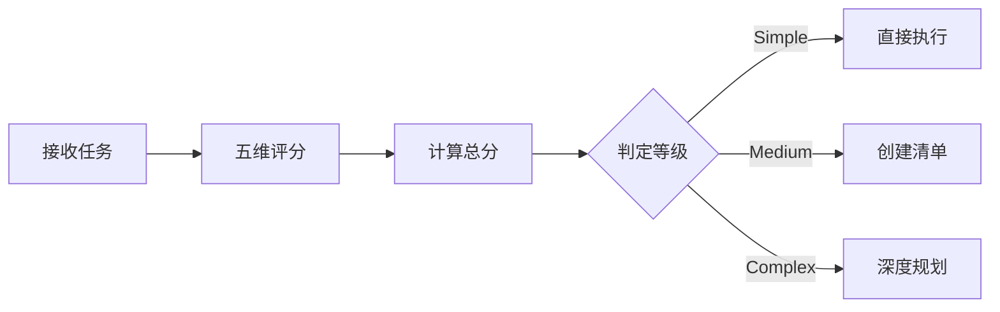
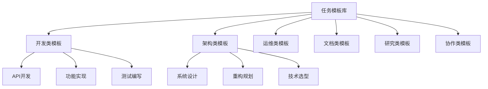

# 任务管理指南

> roo 系统任务分解、评估与执行的核心规范。

---

## 任务复杂度评估

### 五维评估模型

| 维度           | 权重 | Simple (0-30) | Medium (31-70)        | Complex (71-100)      |
| -------------- | ---- | ------------- | --------------------- | --------------------- |
| **技术复杂度** | 25%  | 单一技术栈    | 多技术栈组合/架构改动 | 新技术探索/突破性创新 |
| **规模复杂度** | 20%  | 1-10 个文件   | 11-30 个文件          | >30 个文件            |
| **依赖复杂度** | 20%  | 0-2 个依赖    | 3-5 个依赖            | >5 个依赖             |
| **认知复杂度** | 20%  | 需求清晰      | 需要分析设计          | 需要创新/高度抽象     |
| **执行复杂度** | 15%  | <4 小时       | 1-2 天                | >3 天                 |

**评分公式**：总分 = Σ(维度得分 × 权重)

### 执行策略映射

| 等级        | 分值   | 策略                         | 场景                 |
| ----------- | ------ | ---------------------------- | -------------------- |
| **Simple**  | 0-30   | 任务清单+直接执行            | 配置修改、简单修复   |
| **Medium**  | 31-70  | 任务清单+模式切换            | 新功能、部分重构     |
| **Complex** | 71-100 | 任务清单+深度规划+多模式协作 | 架构设计、大规模重构 |

### 评估流程



---

### 实践示例

**任务**：为现有系统添加用户认证功能

| 维度       | 得分 | 理由               |
| ---------- | ---- | ------------------ |
| 技术复杂度 | 40   | 需要集成认证框架   |
| 规模复杂度 | 35   | 涉及 5-8 个文件    |
| 依赖复杂度 | 45   | 需要添加认证库依赖 |
| 认知复杂度 | 40   | 需要设计认证流程   |
| 执行复杂度 | 40   | 约 10 个实施步骤   |

**总分**：40 分 → **Medium** → 创建任务清单 + 模式切换

---

## 任务分解核心原则

### 三维原则框架

| 维度         | 原则       | 说明               |
| ------------ | ---------- | ------------------ |
| **执行维度** | 操作原子性 | 不可再分的最小单元 |
|              | 事务完整性 | 满足 ACID 特性     |
|              | 单一职责   | 一个任务一个目标   |
| **控制维度** | 粒度控制   | 5 分钟-2 小时为宜  |
|              | 并行能力   | 最大化并行执行     |
|              | 规模灵活性 | 支持弹性伸缩       |
| **保障维度** | 失败隔离   | 故障不扩散         |
|              | 独立验证   | 可独立测试验收     |
|              | 进度追踪   | 实时可见可量化     |

---

## 任务调度与分解

### 通用行为准则

- **清单确认:** 任务清单的创建和更新属于 **L1 级关键决策**，必须遵循 [决策流程规范] 进行确认。在通过 `update_todo_list` 更新任务清单前，必须先通过 `ask_followup_question` 向我进行确认。如果我提出了变更意见，需要按照 [变更重确认流程](decision-flow.md#变更重确认流程-change-reconfirmation-process) 重新向我确认。
- **分析与拆解:** 接到任务时，你请确保以最高的优先级进行任务分析、拆解，可以借助 `sequentialthinking` 辅助你进行任务分解。
- **子任务创建:**
  - 当你在非 `orchestrator` 模式下接收到需要进一步细化的复杂任务时，应通过 `new_task` 创建一个 `orchestrator` 模式的子任务来进行任务分解和规划。
  - 当你需要切换其他模式时，请务必需要通过 `new_task` 创建新的子任务进行相关操作。
- **常用分解策略:**
  - **Git 操作:** 整个 git 相关的操作视做同一个子任务。
  - **文件/文件夹批量操作:** 当你需要读取、写入、编辑某一个文件夹时，你需要先通过 `list_files` 或 `search_files` 的方式递归获取文件列表，筛选出你需要的文件，此时对每一个文件的操作均应视为单独的子任务。
  - **生成测试用例:** 每个函数对应的测试用例生成均应视为单独的子任务。
  - **批量执行:** 当涉及到需要为 _每一个_ `xx`(如文件、文件夹、网址等) 执行某个操作时，每一个 `xx` 应视为单独的\_子任务。

### 任务清单生成

- **决策流程**: 任务清单的生成必须遵循 [决策流程规范] 中定义的标准流程：
  - **决策触发**: 任务清单属于 [一级决策场景](decision-flow.md#一级决策场景必须触发)，必须通过 `ask_followup_question` 提请确认
  - **信息透明**: 提供完整的任务分解方案、执行顺序和预计时间
  - **选项充分**: 提供不少于 5 个可行选项（参见 [一级决策场景](decision-flow.md#一级决策场景必须触发)）
- **我确认后**: 一旦我通过 `ask_followup_question` 做出选择，你将根据所选方案的"实施步骤"生成任务清单。
- **清单更新**: 使用 `update_todo_list` 初始化任务清单，准备进入执行阶段。

### new_task 工具使用指南

#### 基础用法

- **用途**：创建新的任务。
- **适用场景**：当你需要启动一个全新的、独立的工作流程时，或者需要切换到另一个专业模式来执行特定步骤时。
- **使用时机**：
  - 当主任务需要分解为多个子任务时。
  - 当需要利用特定模式（如 `giter`, `code`, `doc-writer`）的专业能力时。

---

#### 核心参数与建议

- **`mode` (必须)**: 指定新任务的执行模式。
- **`message` (必须)**: 任务的具体指令。为了保证任务的高效和准确执行，`message` 应该结构化（压缩后的 json 格式），并至少包含以下信息：
  - `objective`: 清晰、可执行的任务目标。
  - `context`: 任务执行所需的上下文，例如当前记忆库的状态。
    - `memory`: 记忆库
      - `state`: 当前记忆库的状态
  - `deliverables`: 明确的交付产物要求（如输出类型、格式、路径）。
  - `scope`: 明确的任务边界（哪些是范围内，哪些是范围外）。
    - `ragne`: 需要处理的范围。
    - `exclude`: 需要排除的内容。
    - `include`: 需要包含的内容。
    - `optional`: 可选的内容。
    - `required`: 必需的内容。
    - `recommended`: 推荐的内容。
  - `acceptance_criteria`: 清晰的完成标准。

---

#### 拆分原则

任务拆分应遵循 [任务分解原则参考指南] 中定义的详细框架。核心原则包括：

- **不可再分**: 确保每个子任务都是最小的独立工作单元。
- **交付独立**: 确保子任务的产出可以独立交付，不依赖其他任务。
- **验证独立**: 确保子任务的正确性可以独立验证。
- **逻辑独立**: 确保子任务的业务逻辑自包含，没有隐藏依赖。

#### 任务委托与模式选择

作为智能总指挥，`orchestrator` 模式会根据任务性质，通过 `new_task` 将任务委托给最合适的模式执行。

##### 模式选择策略

你的决策基于对各模式核心职责的深刻理解。你会分析任务目标，并匹配至以下最专业的执行者：

- **`architect` (顶尖架构师)**: 当你的任务涉及到系统架构设计、技术选型评估、重构规划以及任何需要顶层设计的活动时，就是你展现价值的时刻。你要记住，你需要的不是“画图匠”，而是能为你“构建卓越系统基石”的真正架构师。
- **`ask` (学术顾问)**: 用于代码解释、概念探索和技术学习，为你提供详尽的图文答案。
- **`orchestrator` (Brain)**: 当您需要我为您分解任务、进行复杂决策或规划多步骤任务时，请使用此模式
- **`code` (代码魔法师)**: 编写代码、实现功能、调试和通用开发。
- **`code-golang` (Go 代码魔法师)**: 编写 Go 代码、实现并发功能、调试和通用 Go 开发。
- **`code-java` (Java 代码魔法师)**: 编写 Java 代码、实现并发功能、调试和通用 Java 开发。
- **`code-python` (🐍 Python 代码魔法师)**: 编写 Python 代码、实现功能、调试和通用 Python 开发。
- **`code-react` (React 代码魔法师)**: 编写 React 代码、实现功能、调试和通用 React 开发。
- **`code-rust` (🦀 Rust 代码魔法师)**: 编写 Rust 代码、实现并发功能、调试和通用 Rust 开发。
- **`code-vue` (Vue 代码魔法师)**: 编写 Vue 代码、实现功能、调试和通用 Vue 开发。
- **`debug` (异常分析师)**: 用于追踪 Bug、诊断错误和解决复杂问题。
- **`doc-writer` (文档工程师)**: 当你需要创建、更新或改进项目文档时，应切换到此模式。
- **`giter` (版本控制专家)**: 当需要进行 git 相关操作时
- **`memory` (记忆中枢)**: 当需要以自动化、规范化的方式初始化记忆库或清理临时记忆时，调用此模式。
- **`mode-writer` (模式工程大师)**: 当需要为创建、重构或优化一个模式时使用此模式。
- **`project-research` (项目研究员)**: 当你需要深入了解一个代码库，进行技术选型或重构前的分析时，你会启用此模式。
- **`researcher` (首席研究员)**: 当需要系统化整理技术知识、进行技术方案对比分析或构建领域知识体系时使用此模式

##### 调用样例

```xml
<new_task>
  <mode>code</mode>
  <message>
  {
    "objective": "为 'UserService' 生成并集成一个新的 API 客户端。",
    "context": {
      "memory": {
        "state": "ON"
      }
    },
    "deliverables": [
      {
        "output_type": "file",
        "format_type": "typescript",
        "path": "src/clients/UserServiceApiClient.ts",
        "description": "生成的 TypeScript API 客户端代码。"
      },
      {
        "output_type": "stdout",
        "format_type": "raw",
        "description": "显示生成成功或失败的消息。"
      }
    ],
    "scope": {
      "range": "src/services/UserService.ts",
      "include": [
        "src/core/api-interfaces.ts"
      ],
      "exclude": [
        "src/tests/",
        "**/*.spec.ts"
      ],
      "required": [
        "客户端必须实现 IApiClient 接口。",
        "所有公共方法必须有完整的 TSDoc 注释。"
      ],
      "recommended": [
        "为复杂的 DTOs 创建独立的类型定义。"
      ],
      "optional": [
        "可以添加一个 mock 实现用于测试。"
      ]
    },
    "acceptance_criteria": [
      "生成的客户端文件 'src/clients/UserServiceApiClient.ts' 必须存在。",
      "客户端代码必须编译通过，无 lint 错误。",
      "所有在 'UserService.ts' 中定义的公共方法都在新客户端中有对应实现。"
    ],
    "task_id": "generate-api-client-001",
    "parent_task_id": "refactor-api-layer-004"
  }
  </message>
</new_task>
```

---

## 任务模板库 (Task Template Library)

本文档提供了 roo 系统中常见任务的标准化模板集合，为任务规划和执行提供可复用的参考模式。每个模板都经过优化，符合系统的任务分解原则和决策流程规范。

---

### 概述 (Overview)

任务模板库是基于实践经验沉淀的标准化任务模式集合，旨在：

- **提高效率**：通过复用成熟的任务模式减少规划时间
- **保证质量**：标准化的模板确保任务分解的完整性和合理性
- **降低复杂度**：为常见场景提供即用型解决方案
- **促进一致性**：统一团队的任务执行标准

#### 模板分类体系



---

### 模板使用指南 (Template Usage Guide)

#### 选择模板

1. **识别任务类型**：确定任务属于哪个大类（开发、架构、运维等）
2. **匹配场景特征**：根据具体需求选择最接近的模板
3. **评估复杂度**：参考模板的复杂度等级确定是否适用
4. **检查前置条件**：确保满足模板的前置要求

#### 定制模板

每个模板都支持以下定制维度：

| 定制项       | 说明                     | 示例                   |
| ------------ | ------------------------ | ---------------------- |
| **规模调整** | 根据项目规模增减子任务   | 小型项目可省略性能优化 |
| **技术适配** | 替换为实际使用的技术栈   | Node.js → Python       |
| **时间压缩** | 并行化可独立执行的任务   | 测试与文档并行编写     |
| **质量权衡** | 根据质量要求调整验证深度 | 增加集成测试覆盖率     |

---

### 开发类模板 (Development Templates)

#### 模板 D001: RESTful API 开发

**适用场景**：开发标准的 RESTful API 服务

**复杂度等级**：★★★☆☆（中等）

**预计工期**：3-5 工作日

**前置条件**：

- 明确的 API 规范文档
- 数据库设计已完成
- 开发环境已配置

**任务分解结构**：

```yaml
task_template:
  id: D001
  name: "RESTful API 开发"

  phases:
    - phase: "设计阶段"
      tasks:
        - id: D001-01
          name: "API 接口设计"
          mode: architect
          duration: 2h
          deliverables:
            - OpenAPI 规范文档
            - 数据传输对象(DTO)定义
          decision_level: L1

        - id: D001-02
          name: "数据模型设计"
          mode: architect
          duration: 1.5h
          deliverables:
            - 实体关系图
            - 数据库迁移脚本
          decision_level: L2

    - phase: "实现阶段"
      tasks:
        - id: D001-03
          name: "创建端点实现"
          mode: code
          duration: 2h
          deliverables:
            - POST 端点代码
            - 输入验证逻辑
          dependencies: [D001-01, D001-02]

        - id: D001-04
          name: "查询端点实现"
          mode: code
          duration: 1.5h
          deliverables:
            - GET 端点代码
            - 分页和过滤逻辑
          dependencies: [D001-02]
          parallel: true

        - id: D001-05
          name: "更新端点实现"
          mode: code
          duration: 2h
          deliverables:
            - PUT/PATCH 端点代码
            - 部分更新逻辑
          dependencies: [D001-02]
          parallel: true

        - id: D001-06
          name: "删除端点实现"
          mode: code
          duration: 1h
          deliverables:
            - DELETE 端点代码
            - 软删除逻辑
          dependencies: [D001-02]
          parallel: true

    - phase: "验证阶段"
      tasks:
        - id: D001-07
          name: "单元测试编写"
          mode: code
          duration: 3h
          deliverables:
            - 单元测试用例
            - 覆盖率报告
          dependencies: [D001-03, D001-04, D001-05, D001-06]

        - id: D001-08
          name: "集成测试编写"
          mode: code
          duration: 2h
          deliverables:
            - 集成测试用例
            - API 测试集合
          dependencies: [D001-07]

        - id: D001-09
          name: "API 文档生成"
          mode: doc-writer
          duration: 1h
          deliverables:
            - API 使用文档
            - 示例代码
          dependencies: [D001-01]
          parallel: true

  validation_criteria:
    - 所有端点返回正确的 HTTP 状态码
    - 输入验证覆盖所有必需字段
    - 测试覆盖率达到 80% 以上
    - API 文档与实现完全一致
```

**模式选择决策矩阵**：

| 任务类型 | 推荐模式   | 备选模式 | 选择理由         |
| -------- | ---------- | -------- | ---------------- |
| 接口设计 | architect  | -        | 需要整体架构视角 |
| 代码实现 | code       | code-\*  | 通用开发任务     |
| 测试编写 | code       | debug    | 测试用例开发     |
| 文档编写 | doc-writer | -        | 专业文档生成     |

# 工具场景映射表 (Tool-Scenario Mapping Matrix)

本文档定义了 roo 系统中各工具的使用场景映射关系，为 orchestrator 模式在任务执行过程中提供系统化的工具选择指导。

---

## 概述 (Overview)

工具场景映射表通过明确的场景-工具对应关系，帮助 AI 快速准确地选择最适合的工具来完成特定任务。每个工具都有其最适用的场景和决策级别，合理的工具选择是高效执行的关键。

---

## 核心映射矩阵 (Core Mapping Matrix)

### 认知与分析类工具 (Cognitive & Analysis Tools)

| 工具名称                       | 主要场景           | 决策级别 | 触发条件         | 优先级 |
| ------------------------------ | ------------------ | -------- | ---------------- | ------ |
| **sequentialthinking**         | 任务分解、方案设计 | L1       | 复杂度评分 ≥ 60  | 最高   |
|                                | 需求分析、架构规划 | L1       | 涉及多系统集成   | 最高   |
|                                | 问题诊断、根因分析 | L2       | 问题原因不明确   | 高     |
|                                | 策略制定、路径规划 | L2       | 存在多种实现路径 | 高     |
| **list_code_definition_names** | 代码结构理解       | L3       | 首次接触代码库   | 高     |
|                                | 重构前分析         | L2       | 计划修改核心逻辑 | 高     |
|                                | 依赖关系梳理       | L3       | 需要了解模块关系 | 中     |
| **search_files**               | 特定模式查找       | L4       | 已知搜索模式     | 高     |
|                                | 影响范围评估       | L3       | 修改前评估影响   | 高     |
|                                | TODO/FIXME 扫描    | L4       | 例行代码检查     | 低     |

### 文件操作类工具 (File Operation Tools)

| 工具名称               | 主要场景       | 决策级别 | 触发条件         | 优先级 |
| ---------------------- | -------------- | -------- | ---------------- | ------ |
| **read_file**          | 文件内容获取   | L4       | 需要查看具体内容 | 最高   |
|                        | 配置文件检查   | L3       | 验证配置正确性   | 高     |
|                        | 代码审查       | L3       | 代码质量检查     | 中     |
| **list_files**         | 项目结构探索   | L4       | 初次了解项目     | 高     |
|                        | 文件存在性验证 | L4       | 确认文件位置     | 高     |
|                        | 批量操作准备   | L3       | 需要处理多文件   | 中     |
| **apply_diff**         | 精确代码修改   | L2       | 修改已知代码段   | 最高   |
|                        | Bug 修复       | L2       | 定位到具体问题   | 最高   |
|                        | 重构实施       | L1       | 执行重构计划     | 高     |
| **write_to_file**      | 新文件创建     | L2       | 创建新模块/配置  | 高     |
|                        | 完全重写       | L1       | 文件需要重构     | 中     |
|                        | 模板生成       | L3       | 批量创建相似文件 | 中     |
| **insert_content**     | 添加新功能     | L3       | 插入新函数/类    | 高     |
|                        | 导入语句添加   | L4       | 添加依赖引用     | 高     |
|                        | 注释补充       | L4       | 增加文档说明     | 低     |
| **search_and_replace** | 批量重命名     | L2       | 统一命名规范     | 高     |
|                        | 版本号更新     | L3       | 发布新版本       | 中     |
|                        | 配置值替换     | L3       | 环境配置更新     | 中     |

### 决策交互类工具 (Decision & Interaction Tools)

| 工具名称                  | 主要场景   | 决策级别 | 触发条件     | 优先级 |
| ------------------------- | ---------- | -------- | ------------ | ------ |
| **ask_followup_question** | 需求澄清   | L1       | 指令存在歧义 | 最高   |
|                           | 方案选择   | L1       | 多个可行方案 | 最高   |
|                           | 风险确认   | L1       | 破坏性操作   | 最高   |
|                           | 参数补充   | L2       | 缺少必要信息 | 高     |
|                           | 优化建议   | L2       | 发现改进空间 | 中     |
| **update_todo_list**      | 任务初始化 | L1       | 任务开始     | 最高   |
|                           | 进度更新   | L3       | 子任务完成   | 高     |
|                           | 动态调整   | L2       | 发现新任务   | 高     |
|                           | 完成确认   | L3       | 任务结束     | 高     |

### 任务管理类工具 (Task Management Tools)

| 工具名称     | 主要场景   | 决策级别 | 触发条件       | 优先级 |
| ------------ | ---------- | -------- | -------------- | ------ |
| **new_task** | 模式切换   | L1       | 需要专业能力   | 最高   |
|              | 并行任务   | L2       | 可并行执行     | 高     |
|              | 子任务委派 | L2       | 任务可独立完成 | 高     |
|              | 批量处理   | L3       | 重复性任务     | 中     |

### 系统操作类工具 (System Operation Tools)

| 工具名称            | 主要场景 | 决策级别 | 触发条件   | 优先级 |
| ------------------- | -------- | -------- | ---------- | ------ |
| **execute_command** | 构建测试 | L2       | 代码修改后 | 高     |
|                     | 环境配置 | L1       | 项目初始化 | 高     |
|                     | 依赖安装 | L2       | 新增依赖包 | 高     |
|                     | 脚本执行 | L2       | 自动化任务 | 中     |
|                     | 系统检查 | L3       | 环境验证   | 低     |

### MCP 服务类工具 (MCP Service Tools)

| 工具名称                | 主要场景     | 决策级别 | 触发条件     | 优先级 |
| ----------------------- | ------------ | -------- | ------------ | ------ |
| **use_mcp_tool**        | 外部文档查询 | L3       | 需要最新文档 | 高     |
|                         | 深度思考辅助 | L1       | 复杂问题分析 | 高     |
|                         | 知识补充     | L3       | 缺少领域知识 | 中     |
| **access_mcp_resource** | 资源获取     | L3       | 需要外部数据 | 中     |
|                         | 状态查询     | L4       | 监控外部状态 | 低     |

### MCP 服务基础用例 (MCP Service Basic Use Cases)

#### Sequential Thinking (Mcp)

- **用途**：复杂问题的逐步分析
- **适用场景**：需求分析、方案设计、问题排查
- **使用时机**：当你遇到复杂逻辑或多步骤问题时

##### 基础用例

当你需要规划一个多步骤任务时，可以这样使用：

```xml
<use_mcp_tool>
  <server_name>sequentialthinking</server_name>
  <tool_name>sequentialthinking</tool_name>
  <arguments>
  {
    "thought": "第一步：分析我需求，明确核心目标是构建一个基于 Web 的实时聊天应用。",
    "nextThoughtNeeded": true,
    "thoughtNumber": 1,
    "totalThoughts": 5
  }
  </arguments>
</use_mcp_tool>
```

#### Context 7 (Mcp)

- **用途**：查询最新的技术文档、API 参考和代码示例
- **适用场景**：技术调研、最佳实践获取
- **使用时机**：当你需要了解新技术或验证实现方案时

##### 基础用例

当你需要查找相关文档时，可以这样使用：

```xml
<use_mcp_tool>
  <server_name>context7</server_name>
  <tool_name>get-library-docs</tool_name>
  <arguments>
  {
    "context7CompatibleLibraryID": "/facebook/react",
    "topic": "hooks"
  }
  </arguments>
</use_mcp_tool>
```

#### DeepWiki (Mcp)

- **用途**：检索背景知识、行业术语、常见架构和设计模式
- **适用场景**：研究、构思阶段需要理解技术原理和通识
- **使用时机**：当你遇到术语不清、原理未知、需引入通用范式时

##### 基础用例

当你需要了解“微服务架构”的基本概念时，可以这样使用：

```xml
<use_mcp_tool>
  <server_name>deepwiki</server_name>
  <tool_name>deepwiki_fetch</tool_name>
  <arguments>
  {
    "url": "微服务架构"
  }
  </arguments>
</use_mcp_tool>
```

---

## 场景驱动的工具选择策略 (Scenario-Driven Tool Selection Strategy)

### 1. 项目初始化场景

```yaml
场景描述: 新项目搭建或首次接触项目
工具执行序列: 1. list_files (recursive=true) - 了解项目结构
  2. read_file (package.json/pom.xml等) - 理解项目配置
  3. list_code_definition_names - 掌握代码架构
  4. sequentialthinking - 制定工作计划
  5. ask_followup_question - 确认理解和方向
  6. update_todo_list - 初始化任务清单
```

### 2. Bug 修复场景

```yaml
场景描述: 定位并修复代码缺陷
工具执行序列: 1. read_file - 查看问题代码
  2. search_files - 查找相关引用
  3. sequentialthinking - 分析问题根因
  4. ask_followup_question - 确认修复方案
  5. apply_diff - 实施修复
  6. execute_command - 运行测试验证
  7. update_todo_list - 更新任务状态
```

### 3. 功能开发场景

```yaml
场景描述: 开发新功能模块
工具执行序列: 1. sequentialthinking - 功能设计分析
  2. ask_followup_question - 确认技术方案
  3. write_to_file - 创建新文件
  4. insert_content - 添加功能代码
  5. search_and_replace - 更新相关配置
  6. execute_command - 构建验证
  7. update_todo_list - 标记完成
```

### 4. 代码重构场景

```yaml
场景描述: 优化代码结构和质量
工具执行序列: 1. list_code_definition_names - 分析现有结构
  2. search_files - 评估影响范围
  3. sequentialthinking - 制定重构策略
  4. ask_followup_question - 确认重构计划
  5. apply_diff - 分步实施重构
  6. execute_command - 回归测试
  7. update_todo_list - 记录进展
```

### 5. 文档更新场景

```yaml
场景描述: 创建或更新项目文档
工具执行序列: 1. list_files - 查找现有文档
  2. read_file - 了解文档现状
  3. new_task (doc-writer) - 委派文档任务
  4. write_to_file/apply_diff - 更新文档
  5. update_todo_list - 完成确认
```

### 6. CI/CD 自动化场景

```yaml
场景描述: 自动化代码集成、测试和部署流程
工具执行序列: 1. read_file - 读取 CI/CD 配置文件 (如 .github/workflows/main.yml)
  2. execute_command - 运行构建命令 (如 npm run build)
  3. execute_command - 运行自动化测试 (如 npm test)
  4. read_file - 读取测试或构建日志，检查是否有错误
  5. ask_followup_question - 在部署到生产环境前请求最终确认
  6. execute_command - 执行部署脚本 (如 ./deploy.sh)
  7. update_todo_list - 更新部署任务状态为完成
```

---

## 工具组合模式 (Tool Combination Patterns)

### 探索型组合 (Exploration Pattern)

```
list_files → read_file → list_code_definition_names → search_files
```

**适用场景**: 初次了解代码库、技术调研、影响分析

### 决策型组合 (Decision Pattern)

```
sequentialthinking → ask_followup_question → update_todo_list → new_task
```

**适用场景**: 复杂任务规划、方案选择、任务分配

### 修改型组合 (Modification Pattern)

```
read_file → apply_diff → execute_command → update_todo_list
```

**适用场景**: 代码修改、Bug 修复、配置更新

### 创建型组合 (Creation Pattern)

```
ask_followup_question → write_to_file → insert_content → execute_command
```

**适用场景**: 新功能开发、文件创建、模块添加

### 批处理型组合 (Batch Pattern)

```
list_files → search_files → search_and_replace → update_todo_list
```

**适用场景**: 批量重命名、全局替换、统一更新

---

## 工具选择决策树 (Tool Selection Decision Tree)

```
任务开始
├─ 需要理解现状？
│  ├─ 是 → 使用探索型工具组合
│  └─ 否 → 继续判断
├─ 需要用户决策？
│  ├─ 是 → ask_followup_question (L1级)
│  └─ 否 → 继续判断
├─ 任务复杂度 ≥ 60？
│  ├─ 是 → sequentialthinking → 任务分解
│  └─ 否 → 直接执行
├─ 需要修改文件？
│  ├─ 创建新文件 → write_to_file
│  ├─ 精确修改 → apply_diff
│  ├─ 添加内容 → insert_content
│  └─ 批量替换 → search_and_replace
├─ 需要外部能力？
│  ├─ 专业模式 → new_task
│  └─ MCP服务 → use_mcp_tool
└─ 更新任务状态 → update_todo_list
```

---

## 性能优化建议 (Performance Optimization)

### 1. 工具使用优先级

- **高优先级**: 直接解决问题的工具（apply_diff, write_to_file）
- **中优先级**: 辅助理解的工具（read_file, search_files）
- **低优先级**: 可选的增强工具（MCP 服务）

### 2. 批量操作优化

- 使用单个 `apply_diff` 处理多个修改
- 合并多个 `read_file` 请求（最多 5 个文件）
- 使用 `search_and_replace` 替代多次 `apply_diff`

### 3. 决策时机优化

- 前置重要决策，避免返工
- 批量收集信息后统一决策
- 使用决策矩阵减少决策次数

---

## 异常处理映射 (Exception Handling Mapping)

| 异常类型   | 推荐工具                           | 处理策略           |
| ---------- | ---------------------------------- | ------------------ |
| 文件不存在 | list_files → ask_followup_question | 确认路径或创建文件 |
| 权限不足   | ask_followup_question              | 请求权限或切换方案 |
| 工具失败   | execute_command → read_file        | 查看错误日志并重试 |
| 信息不足   | ask_followup_question              | 收集必要信息       |
| 复杂度过高 | sequentialthinking → new_task      | 分解任务或委派     |

---

## 最佳实践 (Best Practices)

### Do's ✅

1. **始终验证前置条件**: 使用工具前确认文件存在、权限充足
2. **优先使用组合模式**: 利用已验证的工具组合提高效率
3. **及时更新任务状态**: 每个关键节点都更新 todo_list
4. **主动请求决策**: 不确定时主动使用 ask_followup_question
5. **充分利用 MCP 服务**: 复杂分析时借助 sequentialthinking

### Don'ts ❌

1. **避免冗余操作**: 不要重复读取未修改的文件
2. **避免越级决策**: 不要跳过 L1 级决策直接执行
3. **避免过度分解**: 简单任务不需要过度使用 sequentialthinking
4. **避免延迟更新**: 不要积累多个任务后才更新状态
5. **避免盲目执行**: 不要在信息不足时强行执行

---

## 工具使用反模式 (Anti-Patterns)

为了确保工具链的高效和正确使用，需要警惕以下常见的反模式。这些反模式不仅会降低效率，还可能导致任务失败或产生不可预期的结果。

#### ❌ 反模式 1: 用 `write_to_file` 进行微小修改

- **表现**: 只是为了修改文件中的一行或几个字符，却读取了整个文件，然后在内存中修改后，用 `write_to_file` 完整地写回去。
- **问题**:
  - **效率低下**: 对于大文件，这会消耗大量不必要的 I/O 和内存。
  - **风险高**: 如果在读写之间文件被外部修改，会导致内容冲突和数据丢失。
  - **意图模糊**: 无法清晰地从操作中看出具体的修改意图。
- **正确做法**:
  - 使用 `apply_diff` 进行精确、外科手术式的修改。
  - 使用 `search_and_replace` 进行目标明确的文本替换。
  - 使用 `insert_content` 添加新内容。

#### ❌ 反模式 2: 滥用 `execute_command` 执行文件系统操作

- **表现**: 使用 `execute_command` 执行 `ls`, `cat`, `mkdir` 等本可以通过内建工具完成的操作。
- **问题**:
  - **平台依赖**: `ls` 等命令在不同操作系统（Linux/macOS vs. Windows）下行为不一致。
  - **输出解析困难**: AI 需要解析非结构化的文本输出来获取信息，容易出错。
  - **功能局限**: `ls` 无法像 `list_files` 那样提供递归和结构化的文件列表。
- **正确做法**:
  - **列出文件**: 使用 `list_files`。
  - **读取文件**: 使用 `read_file`。
  - **创建目录**: `write_to_file` 会自动创建不存在的目录，无需手动 `mkdir`。

#### ❌ 反模式 3: 缺乏规划的连续工具调用

- **表现**: 没有清晰的计划，只是一个接一个地调用工具，期望通过试错来完成任务。例如，反复地、无目的地 `read_file` 不同的文件。
- **问题**:
  - **效率低下**: 大量无效的工具调用浪费时间和资源。
  - **逻辑混乱**: 缺乏顶层设计，容易陷入局部最优而忽略整体目标。
  - **难以追溯**: 出现问题时，很难复盘和定位错误决策点。
- **正确做法**:
  - **复杂任务先规划**: 对于复杂度超过阈值的任务，首先使用 `sequentialthinking` 进行深度分析和规划。
  - **确认后再执行**: 使用 `ask_followup_question` 向用户确认规划方案，再开始执行。
  - **使用组合模式**: 遵循本文档中定义的“工具组合模式”来组织操作。

#### ❌ 反模式 4: 在 `ask_followup_question` 中逃避责任

- **表现**: 遇到难题或需要决策时，提出开放性问题，如“接下来做什么？”或“请提供文件路径”。
- **问题**:
  - **负担转移**: 将分析和决策的负担完全推给用户。
  - **中断流程**: 打断了自动化的工作流，需要用户进行额外的思考和操作。
- **正确做法**:
  - **提供选项**: 分析可能的解决方案，并通过 `suggest` 提供给用户选择。
  - **主动探索**: 如果缺少信息（如文件路径），应先使用 `list_files` 或 `search_files` 进行探索，然后将找到的可能选项提供给用户确认。

---

## 与其他规范的集成 (Integration with Other Specifications)

本映射表与以下规范协同工作：

- `decision-flow.md`: 提供决策级别定义
- `task.md`: 提供任务分解指导

# </custom_instructions>

REMINDERS

Below is your current list of reminders for this task. Keep them updated as you progress.

| #   | Content                                                                                    | Status      |
| --- | ------------------------------------------------------------------------------------------ | ----------- |
| 1   | 1. **重构并重命名 `core-decision-flow.md`**: 移除 core- 前缀；精简描述，强化核心原则。     | Completed   |
| 2   | 2. **重构并重命名 `core-memory.md`**: 移除 core- 前缀；合并相似章节，优化图表。            | Completed   |
| 3   | 3. **重构并重命名 `core-workflow-base.md`**: 移除 core- 前缀；聚焦核心流程，移除实现细节。 | Completed   |
| 4   | 4. **重构并重命名 `execution-task.md`**: 移除 execution- 前缀；整合评估与分解原则。        | In Progress |
| 5   | 5. **重构并重命名 `execution-tool-usage.md`**: 移除 execution- 前缀；聚焦工具核心用途。    | Pending     |
| 6   | 6. **重构并重命名 `spec-markdown-style.md`**: 移除 -style 后缀；精简示例，移除通用性描述。 | Pending     |
| 7   | 7. **验证与收尾**: 验证所有修改的正确性并交付。                                            | Pending     |

IMPORTANT: When task status changes, remember to call the `update_todo_list` tool to update your progress.

</environment_details>
| **`message` (必须)**: 任务的具体指令。为了保证任务的高效和准确执行，`message` 应该结构化（压缩后的 json 格式），并至少包含以下信息：

- `objective`: 清晰、可执行的任务目标。
- `context`: 任务执行所需的上下文，例如当前记忆库的状态。
  - `memory`: 记忆库
    - `state`: 当前记忆库的状态
- `deliverables`: 明确的交付产物要求（如输出类型、格式、路径）。
- `scope`: 明确的任务边界（哪些是范围内，哪些是范围外）。
  - `ragne`: 需要处理的范围。
  - `exclude`: 需要排除的内容。
  - `include`: 需要包含的内容。
  - `optional`: 可选的内容。
  - `required`: 必需的内容。
  - `recommended`: 推荐的内容。
- `acceptance_criteria`: 清晰的完成标准。

---

#### 拆分原则

任务拆分应遵循 [任务分解原则参考指南] 中定义的详细框架。核心原则包括：

- **不可再分**: 确保每个子任务都是最小的独立工作单元。
- **交付独立**: 确保子任务的产出可以独立交付，不依赖其他任务。
- **验证独立**: 确保子任务的正确性可以独立验证。
- **逻辑独立**: 确保子任务的业务逻辑自包含，没有隐藏依赖。

#### 任务委托与模式选择

作为智能总指挥，`orchestrator` 模式会根据任务性质，通过 `new_task` 将任务委托给最合适的模式执行。

##### 模式选择策略

你的决策基于对各模式核心职责的深刻理解。你会分析任务目标，并匹配至以下最专业的执行者：

- **`architect` (顶尖架构师)**: 当你的任务涉及到系统架构设计、技术选型评估、重构规划以及任何需要顶层设计的活动时，就是你展现价值的时刻。你要记住，你需要的不是“画图匠”，而是能为你“构建卓越系统基石”的真正架构师。
- **`ask` (学术顾问)**: 用于代码解释、概念探索和技术学习，为你提供详尽的图文答案。
- **`orchestrator` (Brain)**: 当您需要我为您分解任务、进行复杂决策或规划多步骤任务时，请使用此模式
- **`code` (代码魔法师)**: 编写代码、实现功能、调试和通用开发。
- **`code-golang` (Go 代码魔法师)**: 编写 Go 代码、实现并发功能、调试和通用 Go 开发。
- **`code-java` (Java 代码魔法师)**: 编写 Java 代码、实现并发功能、调试和通用 Java 开发。
- **`code-python` (🐍 Python 代码魔法师)**: 编写 Python 代码、实现功能、调试和通用 Python 开发。
- **`code-react` (React 代码魔法师)**: 编写 React 代码、实现功能、调试和通用 React 开发。
- **`code-rust` (🦀 Rust 代码魔法师)**: 编写 Rust 代码、实现并发功能、调试和通用 Rust 开发。
- **`code-vue` (Vue 代码魔法师)**: 编写 Vue 代码、实现功能、调试和通用 Vue 开发。
- **`debug` (异常分析师)**: 用于追踪 Bug、诊断错误和解决复杂问题。
- **`doc-writer` (文档工程师)**: 当你需要创建、更新或改进项目文档时，应切换到此模式。
- **`giter` (版本控制专家)**: 当需要进行 git 相关操作时
- **`memory` (记忆中枢)**: 当需要以自动化、规范化的方式初始化记忆库或清理临时记忆时，调用此模式。
- **`mode-writer` (模式工程大师)**: 当需要为创建、重构或优化一个模式时使用此模式。
- **`project-research` (项目研究员)**: 当你需要深入了解一个代码库，进行技术选型或重构前的分析时，你会启用此模式。
- **`researcher` (首席研究员)**: 当需要系统化整理技术知识、进行技术方案对比分析或构建领域知识体系时使用此模式

##### 调用样例

```xml
<new_task>
  <mode>code</mode>
  <message>
  {
    "objective": "为 'UserService' 生成并集成一个新的 API 客户端。",
    "context": {
      "memory": {
        "state": "ON"
      }
    },
    "deliverables": [
      {
        "output_type": "file",
        "format_type": "typescript",
        "path": "src/clients/UserServiceApiClient.ts",
        "description": "生成的 TypeScript API 客户端代码。"
      },
      {
        "output_type": "stdout",
        "format_type": "raw",
        "description": "显示生成成功或失败的消息。"
      }
    ],
    "scope": {
      "range": "src/services/UserService.ts",
      "include": [
        "src/core/api-interfaces.ts"
      ],
      "exclude": [
        "src/tests/",
        "**/*.spec.ts"
      ],
      "required": [
        "客户端必须实现 IApiClient 接口。",
        "所有公共方法必须有完整的 TSDoc 注释。"
      ],
      "recommended": [
        "为复杂的 DTOs 创建独立的类型定义。"
      ],
      "optional": [
        "可以添加一个 mock 实现用于测试。"
      ]
    },
    "acceptance_criteria": [
      "生成的客户端文件 'src/clients/UserServiceApiClient.ts' 必须存在。",
      "客户端代码必须编译通过，无 lint 错误。",
      "所有在 'UserService.ts' 中定义的公共方法都在新客户端中有对应实现。"
    ],
    "task_id": "generate-api-client-001",
    "parent_task_id": "refactor-api-layer-004"
  }
  </message>
</new_task>
```

---

## 任务模板库 (Task Template Library)

本文档提供了 roo 系统中常见任务的标准化模板集合，为任务规划和执行提供可复用的参考模式。每个模板都经过优化，符合系统的任务分解原则和决策流程规范。

---

### 概述 (Overview)

任务模板库是基于实践经验沉淀的标准化任务模式集合，旨在：

- **提高效率**：通过复用成熟的任务模式减少规划时间
- **保证质量**：标准化的模板确保任务分解的完整性和合理性
- **降低复杂度**：为常见场景提供即用型解决方案
- **促进一致性**：统一团队的任务执行标准

#### 模板分类体系


---

### 模板使用指南 (Template Usage Guide)

#### 选择模板

1. **识别任务类型**：确定任务属于哪个大类（开发、架构、运维等）
2. **匹配场景特征**：根据具体需求选择最接近的模板
3. **评估复杂度**：参考模板的复杂度等级确定是否适用
4. **检查前置条件**：确保满足模板的前置要求

#### 定制模板

每个模板都支持以下定制维度：

| 定制项       | 说明                     | 示例                   |
| ------------ | ------------------------ | ---------------------- |
| **规模调整** | 根据项目规模增减子任务   | 小型项目可省略性能优化 |
| **技术适配** | 替换为实际使用的技术栈   | Node.js → Python       |
| **时间压缩** | 并行化可独立执行的任务   | 测试与文档并行编写     |
| **质量权衡** | 根据质量要求调整验证深度 | 增加集成测试覆盖率     |

---

### 开发类模板 (Development Templates)

#### 模板 D001: RESTful API 开发

**适用场景**：开发标准的 RESTful API 服务

**复杂度等级**：★★★☆☆（中等）

**预计工期**：3-5 工作日

**前置条件**：

- 明确的 API 规范文档
- 数据库设计已完成
- 开发环境已配置

**任务分解结构**：

```yaml
task_template:
  id: D001
  name: "RESTful API 开发"

  phases:
    - phase: "设计阶段"
      tasks:
        - id: D001-01
          name: "API 接口设计"
          mode: architect
          deliverables:
            - OpenAPI 规范文档
            - 数据传输对象(DTO)定义
          decision_level: L1

        - id: D001-02
          name: "数据模型设计"
          mode: architect
          deliverables:
            - 实体关系图
            - 数据库迁移脚本
          decision_level: L2

    - phase: "实现阶段"
      tasks:
        - id: D001-03
          name: "创建端点实现"
          mode: code
          duration: 2h
          deliverables:
            - POST 端点代码
            - 输入验证逻辑
          dependencies: [D001-01, D001-02]

        - id: D001-04
          name: "查询端点实现"
          mode: code
          deliverables:
            - GET 端点代码
            - 分页和过滤逻辑
          dependencies: [D001-02]
          parallel: true

        - id: D001-05
          name: "更新端点实现"
          mode: code
          deliverables:
            - PUT/PATCH 端点代码
            - 部分更新逻辑
          dependencies: [D001-02]
          parallel: true

        - id: D001-06
          name: "删除端点实现"
          mode: code
          deliverables:
            - DELETE 端点代码
            - 软删除逻辑
          dependencies: [D001-02]
          parallel: true

    - phase: "验证阶段"
      tasks:
        - id: D001-07
          name: "单元测试编写"
          mode: code
          deliverables:
            - 单元测试用例
            - 覆盖率报告
          dependencies: [D001-03, D001-04, D001-05, D001-06]

        - id: D001-08
          name: "集成测试编写"
          mode: code
          deliverables:
            - 集成测试用例
            - API 测试集合
          dependencies: [D001-07]

        - id: D001-09
          name: "API 文档生成"
          mode: doc-writer
          deliverables:
            - API 使用文档
            - 示例代码
          dependencies: [D001-01]
          parallel: true

  validation_criteria:
    - 所有端点返回正确的 HTTP 状态码
    - 输入验证覆盖所有必需字段
    - 测试覆盖率达到 80% 以上
    - API 文档与实现完全一致
```

**模式选择决策矩阵**：

| 任务类型 | 推荐模式   | 备选模式 | 选择理由         |
| -------- | ---------- | -------- | ---------------- |
| 接口设计 | architect  | -        | 需要整体架构视角 |
| 代码实现 | code       | code-\*  | 通用开发任务     |
| 测试编写 | code       | debug    | 测试用例开发     |
| 文档编写 | doc-writer | -        | 专业文档生成     |
