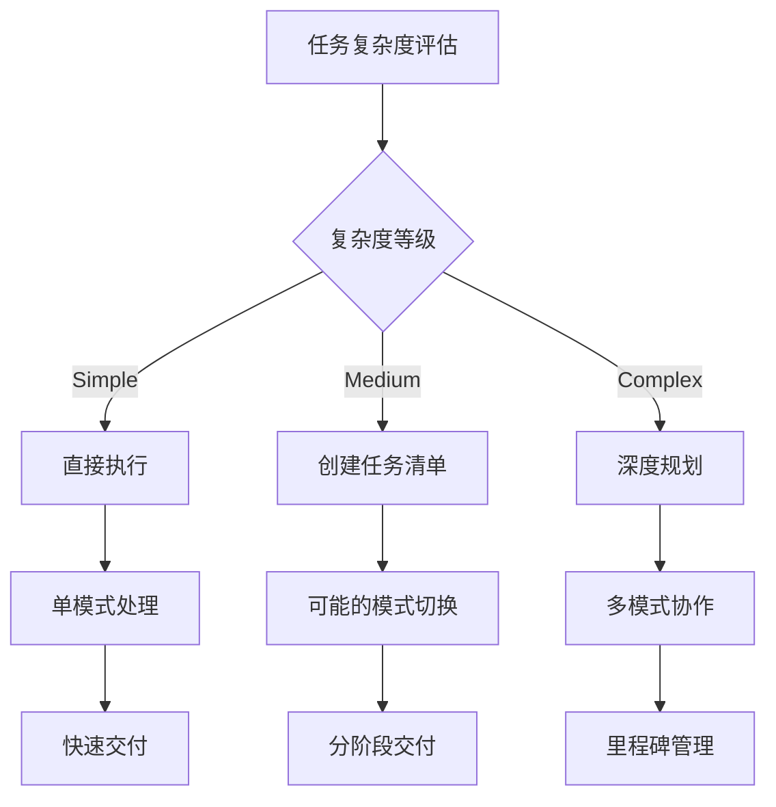
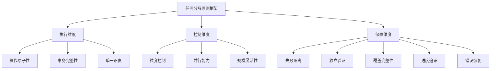
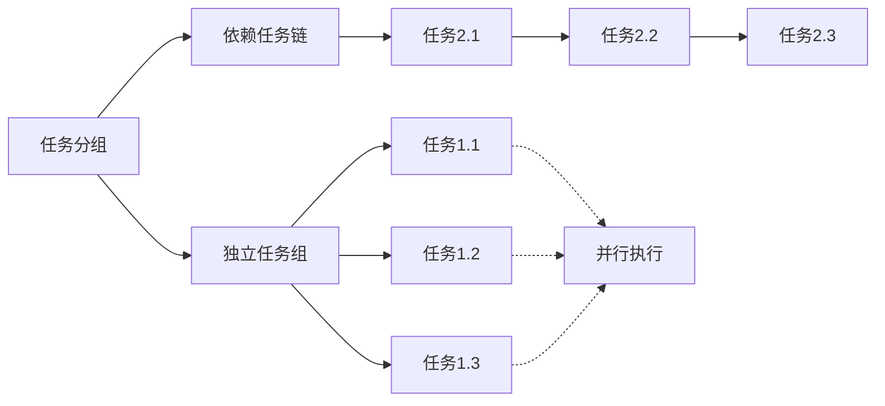
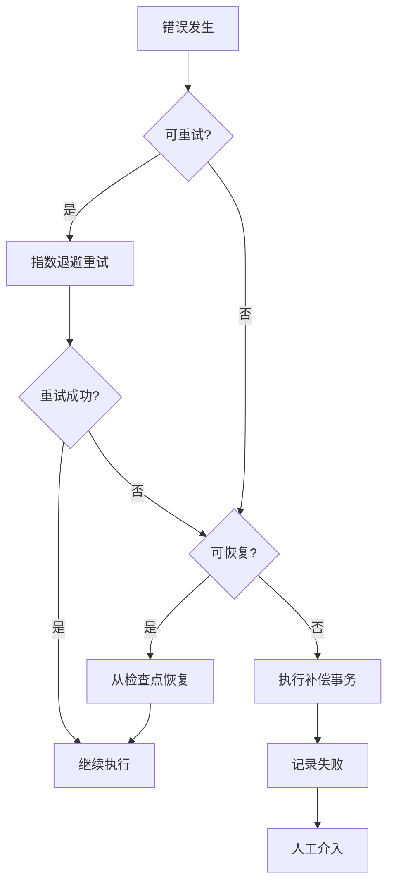
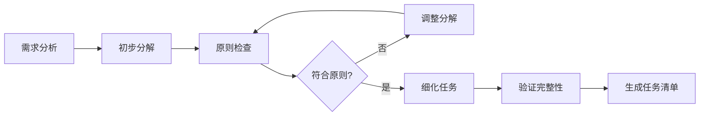
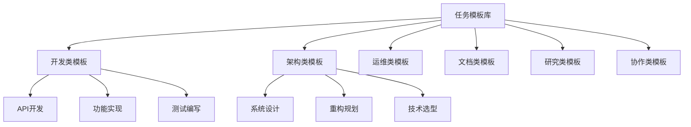

# 任务管理综合指南

本文档是 roo 系统中关于任务管理、分解、评估和执行的权威指南，整合了任务分解原则、复杂度评估、调度执行和模板库的核心内容，为所有任务相关活动提供统一、标准化的参考框架。

---

## 任务复杂度评估框架 (Task Complexity Assessment Framework)

本文档定义了 roo 系统中任务复杂度的评估机制，通过标准化的评估流程和量化指标，帮助 AI 准确识别任务复杂度，从而选择合适的执行策略和资源分配方案。

---

### 概述 (Overview)

在 AI 驱动的任务执行系统中，准确评估任务复杂度是确保高效执行的关键前提。不同复杂度的任务需要不同的处理策略：

- **简单任务** 可以直接执行，无需复杂的规划
- **中等任务** 需要适度的分解和协调
- **复杂任务** 需要深度规划、多模式协作和精细的进度管理

本框架提供了一套科学、系统的评估方法，确保每个任务都能得到恰当的处理。

---

### 核心原则 (Core Principles)

#### 1. 客观量化原则

- **数据驱动**: 基于可量化的指标进行评估，避免主观判断
- **多维评估**: 从多个维度综合评估，避免片面性
- **动态调整**: 随着任务执行，可以重新评估和调整策略

#### 2. 实用导向原则

- **执行优先**: 评估的目的是更好地执行，而非评估本身
- **成本效益**: 评估过程本身要简洁高效，避免过度分析
- **清晰可操作**: 评估结果直接对应具体的执行策略

#### 3. 集成协同原则

- **规则协同**: 与现有的决策流程、任务管理规则无缝集成
- **模式联动**: 评估结果指导模式选择和切换决策
- **记忆沉淀**: 评估经验形成可复用的知识

---

### 评估维度 (Assessment Dimensions)

#### 1. 技术复杂度 (Technical Complexity) - 权重 25%

评估任务涉及的技术难度和专业性要求。

| 分值          | 特征描述               | 示例                       |
| ------------- | ---------------------- | -------------------------- |
| **0-20 分**   | 单一技术栈，常规操作   | 修改配置文件、添加简单功能 |
| **21-40 分**  | 多技术栈组合，需要集成 | 前后端联调、API 对接       |
| **41-60 分**  | 架构级改动，性能优化   | 系统重构、数据库优化       |
| **61-80 分**  | 新技术探索，复杂算法   | 引入新框架、实现复杂算法   |
| **81-100 分** | 突破性创新，技术攻坚   | 自研框架、解决技术难题     |

#### 2. 规模复杂度 (Scale Complexity) - 权重 20%

评估任务的工作量和影响范围。

| 分值          | 特征描述   | 量化指标                         |
| ------------- | ---------- | -------------------------------- |
| **0-20 分**   | 局部修改   | 1-3 个文件，<100 行代码          |
| **21-40 分**  | 模块级改动 | 4-10 个文件，100-500 行代码      |
| **41-60 分**  | 功能级开发 | 11-30 个文件，500-2000 行代码    |
| **61-80 分**  | 系统级实现 | 31-100 个文件，2000-10000 行代码 |
| **81-100 分** | 项目级工程 | >100 个文件，>10000 行代码       |

#### 3. 依赖复杂度 (Dependency Complexity) - 权重 20%

评估任务的外部依赖和协作需求。

| 分值          | 特征描述   | 依赖特点                       |
| ------------- | ---------- | ------------------------------ |
| **0-20 分**   | 独立任务   | 无外部依赖，自包含             |
| **21-40 分**  | 轻度依赖   | 1-2 个稳定依赖，文档完善       |
| **41-60 分**  | 中度依赖   | 3-5 个依赖，需要配置集成       |
| **61-80 分**  | 重度依赖   | 6-10 个依赖，版本兼容问题      |
| **81-100 分** | 复杂依赖网 | >10 个依赖，循环依赖，冲突解决 |

#### 4. 认知复杂度 (Cognitive Complexity) - 权重 20%

评估理解和设计任务所需的思维负荷。

| 分值          | 特征描述 | 认知要求                  |
| ------------- | -------- | ------------------------- |
| **0-20 分**   | 直观明确 | 需求清晰，解决方案唯一    |
| **21-40 分**  | 需要分析 | 需求需解释，有 2-3 种方案 |
| **41-60 分**  | 需要设计 | 需求需细化，方案需权衡    |
| **61-80 分**  | 需要创新 | 需求模糊，需创造性解决    |
| **81-100 分** | 高度抽象 | 需求演进中，需探索性研究  |

#### 5. 执行复杂度 (Execution Complexity) - 权重 15%

评估任务执行的步骤复杂性和时间跨度。

| 分值          | 特征描述 | 执行特点              |
| ------------- | -------- | --------------------- |
| **0-20 分**   | 单步操作 | 1-3 个步骤，<1 小时   |
| **21-40 分**  | 顺序执行 | 4-10 个步骤，1-4 小时 |
| **41-60 分**  | 分支流程 | 11-20 个步骤，1-2 天  |
| **61-80 分**  | 迭代优化 | 21-50 个步骤，3-5 天  |
| **81-100 分** | 复杂编排 | >50 个步骤，>1 周     |

---

### 复杂度等级 (Complexity Levels)

基于五个维度的加权总分，将任务分为三个复杂度等级：

#### Simple (简单任务) - 总分 0-30 分

**特征识别**：

- 单一维度得分较低（通常某个维度 <20 分）
- 需求明确，解决方案清晰
- 可以在单个模式内完成
- 执行时间通常在 2 小时内

**执行策略**：

- 直接在当前模式执行
- 无需创建任务清单
- 简单的进度反馈即可
- 结果直接交付

**典型场景**：

- 修改单个配置参数
- 添加简单的验证规则
- 修复明确的语法错误
- 生成标准化文档

#### Medium (中等任务) - 总分 31-70 分

**特征识别**：

- 多个维度得分中等（20-60 分）
- 需要一定的分析和设计
- 可能需要 2-3 个模式协作
- 执行时间在 2 小时到 2 天之间

**执行策略**：

- 创建结构化任务清单
- 可能需要模式切换
- 定期更新任务进度
- 分阶段交付成果

**典型场景**：

- 实现新的功能模块
- 重构部分代码结构
- 集成第三方服务
- 编写完整的测试套件

#### Complex (复杂任务) - 总分 71-100 分

**特征识别**：

- 多个维度得分较高（>60 分）
- 需要深度规划和设计
- 需要多模式深度协作
- 执行时间超过 2 天

**执行策略**：

- 必须进行深度思考（sequentialthinking）
- 创建详细的任务分解计划
- 建立检查点和里程碑
- 持续的进度监控和风险管理
- 阶段性复盘和调整

**典型场景**：

- 系统架构设计与实现
- 大规模代码重构
- 性能优化专项
- 新技术栈迁移

---

### 评估流程 (Assessment Process)

#### 阶段 1：触发评估

**触发条件**：

1. 接收到新的用户任务请求
2. 任务执行遇到重大变更
3. 子任务独立性需要评估

**评估时机**：

- 在任务规划阶段之前
- 在决定是否创建任务清单之前
- 在选择执行模式之前

#### 阶段 2：维度评分

**评分步骤**：

1. **信息收集**：分析任务描述，识别关键信息
2. **逐维评分**：按照五个维度分别评分
3. **权重计算**：应用各维度权重计算总分
4. **等级判定**：根据总分确定复杂度等级

**评分公式**：

```
总分 = 技术复杂度 × 0.25 + 规模复杂度 × 0.20 +
       依赖复杂度 × 0.20 + 认知复杂度 × 0.20 +
       执行复杂度 × 0.15
```

#### 阶段 3：策略决策

基于评估结果，决定执行策略：



#### 阶段 4：记录与学习

**记录内容**：

- 各维度评分详情
- 总分和等级判定
- 选择的执行策略
- 实际执行效果

**持续优化**：

- 将评估经验沉淀到记忆库
- 定期复盘评估准确性
- 调整评分标准和权重

---

### 与现有规则的集成 (Integration with Existing Rules)

#### 与决策流程的集成

根据 [`decision-flow.md`](decision-flow.md) 的规范：

- **Simple 任务**：可以减少决策确认环节，提高执行效率
- **Medium 任务**：遵循标准决策流程
- **Complex 任务**：需要额外的决策确认点和风险评估

#### 与任务管理的集成

根据 [`task.md`](task.md) 的规范：

- **Simple 任务**：无需 `update_todo_list`
- **Medium 任务**：建议使用任务清单
- **Complex 任务**：必须使用详细的任务分解和清单管理

#### 与记忆库的集成

根据 [`memory.md`](memory.md) 的规范：

- **评估记录**：作为程序性记忆（L2）存储
- **经验沉淀**：复杂任务的评估经验形成可复用模板
- **模式学习**：不同类型任务的评估模式持续优化

#### 与工作流的集成

根据 [`workflow-base.md`](workflow-base.md) 的规范：

- 评估在"需求分析与方案设计"阶段之前进行
- 评估结果影响后续的方案设计深度
- Complex 任务触发强制的 `sequentialthinking` 流程

---

### 应用示例 (Application Examples)

#### 示例 1：简单任务评估

**任务描述**：修改配置文件中的 API 端点地址

**评估过程**：
| 维度 | 得分 | 理由 |
|------|------|------|
| 技术复杂度 | 10 | 简单的配置修改 |
| 规模复杂度 | 5 | 单文件，几行改动 |
| 依赖复杂度 | 0 | 无外部依赖 |
| 认知复杂度 | 10 | 需求明确清晰 |
| 执行复杂度 | 5 | 单步操作 |

**总分计算**：10×0.25 + 5×0.20 + 0×0.20 + 10×0.20 + 5×0.15 = 6.25 分

**复杂度等级**：Simple

**执行策略**：直接修改文件，无需额外规划

#### 示例 2：中等任务评估

**任务描述**：为现有系统添加用户认证功能

**评估过程**：
| 维度 | 得分 | 理由 |
|------|------|------|
| 技术复杂度 | 40 | 需要集成认证框架 |
| 规模复杂度 | 35 | 涉及 5-8 个文件 |
| 依赖复杂度 | 45 | 需要添加认证库依赖 |
| 认知复杂度 | 40 | 需要设计认证流程 |
| 执行复杂度 | 40 | 约 10 个实施步骤 |

**总分计算**：40×0.25 + 35×0.20 + 45×0.20 + 40×0.20 + 40×0.15 = 40 分

**复杂度等级**：Medium

**执行策略**：

1. 创建任务清单
2. 可能需要 architect 模式设计
3. code 模式实现
4. 分阶段测试和交付

#### 示例 3：复杂任务评估

**任务描述**：将单体应用重构为微服务架构

**评估过程**：
| 维度 | 得分 | 理由 |
|------|------|------|
| 技术复杂度 | 85 | 架构级重大改造 |
| 规模复杂度 | 90 | 影响整个系统 |
| 依赖复杂度 | 80 | 大量新增依赖和服务间通信 |
| 认知复杂度 | 85 | 需要深度架构设计 |
| 执行复杂度 | 95 | 数百个步骤，跨周期执行 |

**总分计算**：85×0.25 + 90×0.20 + 80×0.20 + 85×0.20 + 95×0.15 = 86.5 分

**复杂度等级**：Complex

**执行策略**：

1. 必须进行深度思考和规划
2. 创建详细的迁移路线图
3. 设置多个检查点和里程碑
4. 多模式深度协作
5. 持续的风险监控和管理

---

### 最佳实践 (Best Practices)

#### Do's ✅

1. **快速评估**：评估过程应该快速高效，不要过度分析
2. **动态调整**：随着对任务理解的深入，可以调整评估结果
3. **经验积累**：将评估经验沉淀下来，形成组织知识
4. **工具辅助**：对于 Complex 任务，使用 sequentialthinking 辅助评估
5. **透明沟通**：向用户说明评估结果和选择的执行策略

#### Don'ts ❌

1. **过度评估**：不要为了评估而评估，Simple 任务快速判断即可
2. **僵化执行**：评估结果是参考，可以根据实际情况调整
3. **忽视反馈**：执行后要验证评估的准确性，持续改进
4. **单一维度**：不要只看某个维度，要综合评估
5. **忽略上下文**：要考虑用户的时间要求、质量标准等因素

---

### 异常处理 (Exception Handling)

#### 边界情况

**情况 1：维度冲突**

- 描述：某些维度极高，某些维度极低
- 处理：以最高维度为主导，适当上调等级

**情况 2：信息不足**

- 描述：无法准确评估某些维度
- 处理：通过 ask_followup_question 获取更多信息

**情况 3：动态变化**

- 描述：执行过程中复杂度显著变化
- 处理：重新评估，调整执行策略

#### 降级策略

当评估系统出现问题时：

1. 默认按 Medium 复杂度处理
2. 创建基础任务清单
3. 保持与用户的沟通
4. 记录异常供后续分析

---

### 总结 (Summary)

任务复杂度评估框架是 roo 系统智能化任务管理的重要组成部分。通过科学的评估方法和清晰的执行策略映射，我们能够：

- **提高效率**：为简单任务节省不必要的流程
- **确保质量**：为复杂任务提供充分的规划和管理
- **持续优化**：通过经验积累不断改进评估准确性

本框架与现有的决策、任务、记忆等规则体系紧密集成，共同构成了一个完整、高效的任务执行系统。

---

## 任务分解原则参考指南 (Task Decomposition Principles Reference Guide)

本文档系统化地阐述了任务分解的核心原则框架，为 roo 系统中的任务规划和执行提供标准化指导。这些原则基于三维金字塔框架，确保任务分解的科学性、可控性和可靠性。

---

### 概述与背景 (Overview & Background)

在复杂系统的任务管理中，**科学的任务分解**是确保项目成功的基石。本指南建立了一套基于三维原则框架的任务分解方法论，旨在：

- **标准化任务拆分流程**：提供一致的分解标准和方法
- **优化执行效率**：通过原子化和并行化提升执行效率
- **增强风险控制**：通过隔离和验证机制降低失败影响
- **提升管理透明度**：通过追踪和度量实现精准管理

#### 核心价值主张

1. **可预测性**：每个子任务的范围、产出和验收标准清晰可预测
2. **可并行性**：独立的任务单元支持并行执行，缩短总体周期
3. **可追溯性**：完整的执行记录支持问题定位和经验沉淀
4. **可复用性**：标准化的任务模式可在不同项目间复用

---

### 三维原则框架 (Three-Dimensional Principle Framework)

任务分解原则采用三维金字塔结构，从执行、控制、保障三个维度全面覆盖任务分解的各个方面：



#### 维度定义

| 维度         | 关注点             | 核心目标               | 原则数量 |
| ------------ | ------------------ | ---------------------- | -------- |
| **执行维度** | 任务的基本执行特性 | 确保任务可执行、可完成 | 3 个     |
| **控制维度** | 任务的管理和调度   | 优化资源利用和执行效率 | 3 个     |
| **保障维度** | 任务的质量和可靠性 | 降低风险、提升成功率   | 5 个     |

---

### 执行维度原则详解 (Execution Dimension Principles)

#### 原则 1：操作原子性 (Operational Atomicity)

##### 定义

每个任务必须是不可再分的最小操作单元，要么完全成功，要么完全失败，不存在部分完成的中间状态。

##### 核心要求

- **不可分割**：任务内部不能包含可独立执行的子操作
- **状态二元**：只有"未开始"、"执行中"、"已完成"、"已失败"四种状态
- **回滚能力**：失败时能够完全回滚到执行前状态

##### 应用场景

```markdown
✅ 正确示例：

- 任务：创建单个 API 端点
- 任务：更新一个配置文件
- 任务：执行一次数据库迁移

❌ 错误示例：

- 任务：实现用户管理模块（应拆分为多个端点）
- 任务：重构整个服务层（应按功能模块拆分）
```

##### 实践指南

1. **识别原子边界**：找到不可再分的最小功能单元
2. **验证完整性**：确保任务包含完整的输入、处理、输出
3. **设计回滚机制**：预先设计失败时的恢复方案

#### 原则 2：事务完整性 (Transactional Integrity)

##### 定义

任务必须在单一事务边界内完成，确保数据一致性和操作完整性。

##### 核心要求

- **ACID 特性**：满足原子性、一致性、隔离性、持久性
- **边界明确**：事务的开始和结束点清晰定义
- **状态一致**：任务完成后系统状态必须一致

##### 应用场景

```javascript
// 正确的事务性任务设计
async function updateUserProfile(userId, profileData) {
  const transaction = await db.beginTransaction();
  try {
    await updateUser(userId, profileData, transaction);
    await updateAuditLog(userId, "profile_update", transaction);
    await sendNotification(userId, "profile_updated", transaction);
    await transaction.commit();
  } catch (error) {
    await transaction.rollback();
    throw error;
  }
}
```

##### 实践指南

1. **明确事务边界**：在任务开始时定义事务范围
2. **处理并发冲突**：设计锁机制避免资源竞争
3. **保证幂等性**：重复执行不产生副作用

#### 原则 3：单一职责 (Single Responsibility)

##### 定义

每个任务只负责一个明确的功能或目标，不承担多重职责。

##### 核心要求

- **目标单一**：一个任务只实现一个业务目标
- **关注点分离**：不同关注点拆分为不同任务
- **职责明确**：任务描述能用一句话说清

##### 应用场景

```yaml
# 正确的单一职责任务
tasks:
  - name: "验证用户输入"
    responsibility: "检查输入数据的格式和完整性"

  - name: "查询用户信息"
    responsibility: "从数据库获取用户详细信息"

  - name: "生成访问令牌"
    responsibility: "创建JWT访问令牌"

# 违反单一职责的任务
bad_task:
  name: "处理用户登录"
  responsibilities:
    - "验证输入"
    - "查询用户"
    - "验证密码"
    - "生成令牌"
    - "记录日志" # 职责过多，应拆分
```

##### 实践指南

1. **使用动词+名词命名**：如"创建订单"、"发送邮件"
2. **限制代码行数**：单个任务实现不超过 100 行
3. **遵循高内聚低耦合**：任务内部紧密相关，任务间松散耦合

---

### 控制维度原则详解 (Control Dimension Principles)

#### 原则 4：粒度控制 (Granularity Control)

##### 定义

任务粒度应当适中，既不过于粗放导致难以管理，也不过于细碎导致管理成本过高。

##### 核心要求

- **时间合理**：单个任务执行时间在 5 分钟到 2 小时之间
- **复杂度适中**：认知负载在合理范围内
- **可度量性**：粒度支持有效的进度度量

##### 粒度评估矩阵

| 粒度级别     | 执行时间       | 代码行数   | 适用场景 | 管理成本 |
| ------------ | -------------- | ---------- | -------- | -------- |
| **超细粒度** | < 5 分钟       | < 20 行    | 关键算法 | 高       |
| **细粒度**   | 5-30 分钟      | 20-100 行  | 功能实现 | 中       |
| **中粒度**   | 30 分钟-2 小时 | 100-500 行 | 模块开发 | 低       |
| **粗粒度**   | > 2 小时       | > 500 行   | 需要拆分 | 极高     |

##### 实践指南

1. **采用时间盒技术**：限定任务在时间盒内完成
2. **应用 WBS 分解**：使用工作分解结构逐层细化
3. **动态调整粒度**：根据团队能力和项目阶段调整

#### 原则 5：并行能力 (Parallelization Capability)

##### 定义

任务设计应最大化并行执行的可能性，减少串行依赖，提升整体效率。

##### 核心要求

- **依赖最小化**：减少任务间的依赖关系
- **资源独立**：不同任务使用独立的资源
- **无状态设计**：任务执行不依赖共享状态

##### 并行化模式



##### 实践指南

1. **识别关键路径**：找出必须串行的任务链
2. **解耦依赖关系**：通过接口和契约解耦
3. **资源池化管理**：避免资源竞争和死锁

#### 原则 6：规模灵活性 (Scale Flexibility)

##### 定义

任务分解方案应能适应不同规模的需求变化，支持弹性伸缩。

##### 核心要求

- **可伸缩性**：支持任务数量的动态调整
- **模块化设计**：任务可组合、可拆分
- **配置化管理**：通过配置调整任务规模

##### 规模适配策略

```typescript
interface TaskScalingStrategy {
  // 小规模：快速原型
  small: {
    taskCount: "10-20";
    granularity: "coarse";
    parallelism: "low";
  };

  // 中规模：标准开发
  medium: {
    taskCount: "50-100";
    granularity: "medium";
    parallelism: "medium";
  };

  // 大规模：企业项目
  large: {
    taskCount: "200+";
    granularity: "fine";
    parallelism: "high";
  };
}
```

##### 实践指南

1. **预留扩展点**：在设计时考虑未来扩展
2. **使用任务模板**：标准化常见任务类型
3. **建立任务库**：积累可复用的任务定义

---

### 保障维度原则详解 (Assurance Dimension Principles)

#### 原则 7：失败隔离 (Failure Isolation)

##### 定义

单个任务的失败不应影响其他独立任务的执行，失败影响范围必须可控。

##### 核心要求

- **故障边界**：明确定义故障传播边界
- **熔断机制**：自动阻止故障扩散
- **降级策略**：提供备选执行方案

##### 隔离级别设计

```markdown
Level 1 - 完全隔离：

- 独立进程/容器执行
- 独立的资源配额
- 故障不影响其他任务

Level 2 - 逻辑隔离：

- 独立的执行上下文
- 异常捕获和处理
- 故障影响可控

Level 3 - 资源隔离：

- 独立的数据库连接
- 独立的文件句柄
- 资源泄漏不扩散
```

##### 实践指南

1. **实施断路器模式**：防止级联失败
2. **设置超时机制**：避免无限等待
3. **建立监控告警**：及时发现和处理故障

#### 原则 8：独立验证 (Independent Verification)

##### 定义

每个任务的完成标准和验证方法必须独立定义，不依赖其他任务的结果。

##### 核心要求

- **验收标准明确**：定义可量化的完成标准
- **测试独立性**：单元测试不依赖外部状态
- **自动化验证**：支持自动化测试和验收

##### 验证体系结构

```yaml
verification_framework:
  pre_conditions:
    - 输入数据验证
    - 环境状态检查
    - 依赖服务可用性

  execution_validation:
    - 单元测试覆盖率 > 80%
    - 集成测试通过
    - 性能基准达标

  post_conditions:
    - 输出数据完整性
    - 状态一致性检查
    - 资源正确释放
```

##### 实践指南

1. **采用 TDD 开发**：测试驱动的任务实现
2. **定义验收标准清单**：明确的 DoD（Definition of Done）
3. **实施持续验证**：CI/CD 中的自动化验证

#### 原则 9：覆盖完整性 (Coverage Completeness)

##### 定义

任务分解必须完整覆盖所有需求，不遗漏任何功能点或边界情况。

##### 核心要求

- **需求追踪**：每个需求都有对应任务
- **场景覆盖**：正常和异常场景全覆盖
- **边界处理**：明确处理边界条件

##### 覆盖度检查矩阵

| 覆盖维度     | 检查项     | 验证方法     | 目标值     |
| ------------ | ---------- | ------------ | ---------- |
| **功能覆盖** | 所有功能点 | 需求追踪矩阵 | 100%       |
| **场景覆盖** | 业务场景   | 场景测试用例 | ≥95%       |
| **异常覆盖** | 异常处理   | 异常注入测试 | ≥90%       |
| **性能覆盖** | 性能指标   | 性能测试     | 全部达标   |
| **安全覆盖** | 安全要求   | 安全扫描     | 无高危漏洞 |

##### 实践指南

1. **使用覆盖度工具**：代码和需求覆盖度分析
2. **建立检查清单**：系统化的完整性检查
3. **定期评审**：阶段性的覆盖度评审

#### 原则 10：进度追踪 (Progress Tracking)

##### 定义

任务执行进度必须可实时追踪，支持精确的进度度量和预测。

##### 核心要求

- **状态可见**：任务状态实时更新
- **进度可量化**：使用量化指标度量进度
- **预测准确**：基于历史数据预测完成时间

##### 追踪指标体系

```javascript
const trackingMetrics = {
  // 基础指标
  basic: {
    tasksCompleted: "number",
    tasksInProgress: "number",
    tasksRemaining: "number",
    completionRate: "percentage",
  },

  // 效率指标
  efficiency: {
    velocityTrend: "tasks/day",
    cycleTime: "hours/task",
    leadTime: "hours",
    throughput: "tasks/week",
  },

  // 质量指标
  quality: {
    defectRate: "defects/task",
    reworkRate: "percentage",
    firstPassYield: "percentage",
  },
};
```

##### 实践指南

1. **实施看板管理**：可视化任务流动
2. **使用燃尽图**：跟踪剩余工作量
3. **建立仪表板**：实时监控关键指标

#### 原则 11：错误恢复 (Error Recovery)

##### 定义

任务设计必须包含错误恢复机制，确保失败后能够快速恢复或重试。

##### 核心要求

- **重试机制**：自动或手动重试能力
- **状态恢复**：从检查点恢复执行
- **补偿事务**：失败后的补偿操作

##### 恢复策略层次



##### 实践指南

1. **实施检查点机制**：定期保存执行状态
2. **设计幂等操作**：支持安全的重试
3. **建立回滚方案**：快速回退到稳定状态

---

### 原则应用指南 (Principle Application Guide)

#### 应用流程



#### 决策树

在进行任务分解时，可以使用以下决策树指导原则应用：

```markdown
1. 任务是否可以进一步拆分？
   ├─ 是 → 应用【操作原子性】继续拆分
   └─ 否 → 进入下一步

2. 任务是否涉及多个职责？
   ├─ 是 → 应用【单一职责】分离职责
   └─ 否 → 进入下一步

3. 任务执行时间是否合理？
   ├─ 过长(>2 小时) → 应用【粒度控制】细化
   ├─ 过短(<5 分钟) → 考虑合并相关任务
   └─ 合理 → 进入下一步

4. 是否存在并行执行机会？
   ├─ 是 → 应用【并行能力】优化
   └─ 否 → 检查依赖关系

5. 失败影响是否可控？
   ├─ 否 → 应用【失败隔离】
   └─ 是 → 任务分解完成
```

#### 原则优先级

当多个原则存在冲突时，按以下优先级处理：

1. **操作原子性** - 最高优先级，确保任务完整性
2. **失败隔离** - 保障系统稳定性
3. **单一职责** - 保持清晰的任务边界
4. **独立验证** - 确保质量可控
5. **粒度控制** - 平衡管理成本
6. 其他原则根据具体场景权衡

---

### 实践案例 (Practice Cases)

#### 案例 1：API 开发任务分解

**场景描述**：开发一个用户管理 RESTful API，包含 CRUD 操作。

**原始任务**：

```
实现用户管理API
```

**应用原则分解后**：

```yaml
tasks:
  - id: task-001
    name: "设计API接口规范"
    principles: [单一职责, 覆盖完整性]
    duration: 1h

  - id: task-002
    name: "创建用户数据模型"
    principles: [操作原子性, 事务完整性]
    duration: 30m

  - id: task-003
    name: "实现创建用户端点"
    principles: [单一职责, 独立验证]
    duration: 1h
    dependencies: [task-002]

  - id: task-004
    name: "实现查询用户端点"
    principles: [单一职责, 并行能力]
    duration: 45m
    dependencies: [task-002]

  - id: task-005
    name: "实现更新用户端点"
    principles: [事务完整性, 错误恢复]
    duration: 1h
    dependencies: [task-002]

  - id: task-006
    name: "实现删除用户端点"
    principles: [事务完整性, 失败隔离]
    duration: 45m
    dependencies: [task-002]

  - id: task-007
    name: "编写单元测试"
    principles: [独立验证, 覆盖完整性]
    duration: 2h
    dependencies: [task-003, task-004, task-005, task-006]

  - id: task-008
    name: "编写API文档"
    principles: [覆盖完整性, 进度追踪]
    duration: 1h
    dependencies: [task-001]
```

#### 案例 2：数据迁移任务分解

**场景描述**：将遗留系统的 100 万条用户数据迁移到新系统。

**应用原则的分解策略**：

```javascript
const migrationStrategy = {
  // 应用规模灵活性原则
  batching: {
    batchSize: 1000, // 每批处理1000条
    totalBatches: 1000,
    parallelBatches: 10, // 并行处理10批
  },

  // 应用失败隔离原则
  errorHandling: {
    failureIsolation: "batch", // 批次级别隔离
    retryStrategy: "exponential-backoff",
    maxRetries: 3,
  },

  // 应用进度追踪原则
  tracking: {
    checkpoints: "every-batch",
    progressReporting: "real-time",
    metrics: ["processed", "failed", "remaining"],
  },

  // 应用错误恢复原则
  recovery: {
    resumeFromCheckpoint: true,
    rollbackCapability: true,
    compensationTransactions: true,
  },
};
```

#### 案例 3：微服务拆分任务分解

**场景描述**：将单体应用拆分为 5 个微服务。

**原则应用矩阵**：

| 服务     | 应用的关键原则       | 分解策略         |
| -------- | -------------------- | ---------------- |
| 用户服务 | 单一职责、失败隔离   | 按功能域垂直拆分 |
| 订单服务 | 事务完整性、错误恢复 | 保持事务边界完整 |
| 支付服务 | 失败隔离、独立验证   | 强隔离和独立测试 |
| 库存服务 | 并行能力、事务完整性 | 支持并发更新     |
| 通知服务 | 规模灵活性、进度追踪 | 异步处理和监控   |

---

## 任务调度与分解

### 通用行为准则

- **清单确认:** 任务清单的创建和更新属于 **L1 级关键决策**，必须遵循 [决策流程规范](decision-flow.md) 进行确认。在通过 `update_todo_list` 更新任务清单前，必须先通过 `ask_followup_question` 向我进行确认。如果我提出了变更意见，需要按照 [变更重确认流程](decision-flow.md#变更重确认流程-change-reconfirmation-process) 重新向我确认。
- **分析与拆解:** 接到任务时，你请确保以最高的优先级进行任务分析、拆解，可以借助 `sequentialthinking` 辅助你进行任务分解。
- **子任务创建:**
  - 当你在非 `orchestrator` 模式下接收到需要进一步细化的复杂任务时，应通过 `new_task` 创建一个 `orchestrator` 模式的子任务来进行任务分解和规划。
  - 当你需要切换其他模式（orchestrator 除外）时，请务必需要通过 `new_task` 创建新的子任务进行相关操作。
  - 当需要进行任务分解和规划时，请务必使用 `switch_mode` 切换到 `orchestrator` 模式进行任务分解和规划。
    ```
    <switch_mode>
    <mode_slug>orchestrator</mode_slug>
    <reason>{{相关说明}}</reason>
    </switch_mode>
    ```
- **常用分解策略:**
  - **Git 操作:** 整个 git 相关的操作视做同一个子任务。
  - **文件/文件夹批量操作:** 当你需要读取、写入、编辑某一个文件夹时，你需要先通过 `list_files` 或 `search_files` 的方式递归获取文件列表，筛选出你需要的文件，此时对每一个文件的操作均应视为单独的子任务。
  - **生成测试用例:** 每个函数对应的测试用例生成均应视为单独的子任务。
  - **批量执行:** 当涉及到需要为 _每一个_ `xx`(如文件、文件夹、网址等) 执行某个操作时，每一个 `xx` 应视为单独的\_子任务。

### 任务清单生成

- **决策流程**: 任务清单的生成必须遵循 [决策流程规范](decision-flow.md) 中定义的标准流程：
  - **决策触发**: 任务清单属于 [一级决策场景](decision-flow.md#一级决策场景必须触发)，必须通过 `ask_followup_question` 提请确认
  - **信息透明**: 提供完整的任务分解方案、执行顺序和预计时间
  - **选项充分**: 提供不少于 5 个可行选项（参见 [决策场景示例 - 任务清单确认](decision-flow.md#场景-5-任务清单确认)）
- **我确认后**: 一旦我通过 `ask_followup_question` 做出选择，你将根据所选方案的"实施步骤"生成任务清单。
- **清单更新**: 使用 `update_todo_list` 初始化任务清单，准备进入执行阶段。

### new_task 工具使用指南

#### 基础用法

- **用途**：创建新的任务。
- **适用场景**：当你需要启动一个全新的、独立的工作流程时，或者需要切换到另一个专业模式来执行特定步骤时。
- **使用时机**：
  - 当主任务需要分解为多个子任务时。
  - 当需要利用特定模式（如 `giter`, `code`, `doc-writer`）的专业能力时。

---

#### 核心参数与建议

- **`mode` (必须)**: 指定新任务的执行模式。
- **`message` (必须)**: 任务的具体指令。为了保证任务的高效和准确执行，`message` 应该结构化（压缩后的 json 格式），并至少包含以下信息：
  - `objective`: 清晰、可执行的任务目标。
  - `context`: 任务执行所需的上下文，例如当前记忆库的状态。
    - `memory`: 记忆库
      - `state`: 当前记忆库的状态
  - `deliverables`: 明确的交付产物要求（如输出类型、格式、路径）。
  - `scope`: 明确的任务边界（哪些是范围内，哪些是范围外）。
    - `ragne`: 需要处理的范围。
    - `exclude`: 需要排除的内容。
    - `include`: 需要包含的内容。
    - `optional`: 可选的内容。
    - `required`: 必需的内容。
    - `recommended`: 推荐的内容。
  - `acceptance_criteria`: 清晰的完成标准。

---

#### 拆分原则

任务拆分应遵循 [任务分解原则参考指南](task-decomposition-principles.md) 中定义的详细框架。核心原则包括：

- **不可再分**: 确保每个子任务都是最小的独立工作单元。
- **交付独立**: 确保子任务的产出可以独立交付，不依赖其他任务。
- **验证独立**: 确保子任务的正确性可以独立验证。
- **逻辑独立**: 确保子任务的业务逻辑自包含，没有隐藏依赖。

#### 任务委托与模式选择

作为智能总指挥，`orchestrator` 模式会根据任务性质，通过 `new_task` 将任务委托给最合适的模式执行。

##### 模式选择策略

你的决策基于对各模式核心职责的深刻理解。你会分析任务目标，并匹配至以下最专业的执行者：

- **`architect` (顶尖架构师)**: 当你的任务涉及到系统架构设计、技术选型评估、重构规划以及任何需要顶层设计的活动时，就是你展现价值的时刻。你要记住，你需要的不是“画图匠”，而是能为你“构建卓越系统基石”的真正架构师。
- **`ask` (学术顾问)**: 用于代码解释、概念探索和技术学习，为你提供详尽的图文答案。
- **`orchestrator` (Brain)**: 当您需要我为您分解任务、进行复杂决策或规划多步骤任务时，请使用此模式
- **`code` (代码魔法师)**: 编写代码、实现功能、调试和通用开发。
- **`code-golang` (Go 代码魔法师)**: 编写 Go 代码、实现并发功能、调试和通用 Go 开发。
- **`code-java` (Java 代码魔法师)**: 编写 Java 代码、实现并发功能、调试和通用 Java 开发。
- **`code-python` (🐍 Python 代码魔法师)**: 编写 Python 代码、实现功能、调试和通用 Python 开发。
- **`code-react` (React 代码魔法师)**: 编写 React 代码、实现功能、调试和通用 React 开发。
- **`code-rust` (🦀 Rust 代码魔法师)**: 编写 Rust 代码、实现并发功能、调试和通用 Rust 开发。
- **`code-vue` (Vue 代码魔法师)**: 编写 Vue 代码、实现功能、调试和通用 Vue 开发。
- **`debug` (异常分析师)**: 用于追踪 Bug、诊断错误和解决复杂问题。
- **`doc-writer` (文档工程师)**: 当你需要创建、更新或改进项目文档时，应切换到此模式。
- **`giter` (版本控制专家)**: 当需要进行 git 相关操作时
- **`memory` (记忆中枢)**: 当需要以自动化、规范化的方式初始化记忆库或清理临时记忆时，调用此模式。
- **`mode-writer` (模式工程大师)**: 当需要为创建、重构或优化一个模式时使用此模式。
- **`project-research` (项目研究员)**: 当你需要深入了解一个代码库，进行技术选型或重构前的分析时，你会启用此模式。
- **`researcher` (首席研究员)**: 当需要系统化整理技术知识、进行技术方案对比分析或构建领域知识体系时使用此模式

**模式切换决策**: 模式切换属于 [一级决策场景](decision-flow.md#一级决策场景必须触发)，需要遵循 [模式切换决策示例](decision-flow.md#场景-7-模式切换决策) 进行确认。

##### 调用样例

```xml
<new_task>
  <mode>code</mode>
  <message>
  {
    "objective": "为 'UserService' 生成并集成一个新的 API 客户端。",
    "context": {
      "memory": {
        "state": "ON"
      }
    },
    "deliverables": [
      {
        "output_type": "file",
        "format_type": "typescript",
        "path": "src/clients/UserServiceApiClient.ts",
        "description": "生成的 TypeScript API 客户端代码。"
      },
      {
        "output_type": "stdout",
        "format_type": "raw",
        "description": "显示生成成功或失败的消息。"
      }
    ],
    "scope": {
      "range": "src/services/UserService.ts",
      "include": [
        "src/core/api-interfaces.ts"
      ],
      "exclude": [
        "src/tests/",
        "**/*.spec.ts"
      ],
      "required": [
        "客户端必须实现 IApiClient 接口。",
        "所有公共方法必须有完整的 TSDoc 注释。"
      ],
      "recommended": [
        "为复杂的 DTOs 创建独立的类型定义。"
      ],
      "optional": [
        "可以添加一个 mock 实现用于测试。"
      ]
    },
    "acceptance_criteria": [
      "生成的客户端文件 'src/clients/UserServiceApiClient.ts' 必须存在。",
      "客户端代码必须编译通过，无 lint 错误。",
      "所有在 'UserService.ts' 中定义的公共方法都在新客户端中有对应实现。"
    ],
    "task_id": "generate-api-client-001",
    "parent_task_id": "refactor-api-layer-004"
  }
  </message>
</new_task>
```

---

## 任务模板库 (Task Template Library)

本文档提供了 roo 系统中常见任务的标准化模板集合，为任务规划和执行提供可复用的参考模式。每个模板都经过优化，符合系统的任务分解原则和决策流程规范。

---

### 概述 (Overview)

任务模板库是基于实践经验沉淀的标准化任务模式集合，旨在：

- **提高效率**：通过复用成熟的任务模式减少规划时间
- **保证质量**：标准化的模板确保任务分解的完整性和合理性
- **降低复杂度**：为常见场景提供即用型解决方案
- **促进一致性**：统一团队的任务执行标准

#### 模板分类体系



---

### 模板使用指南 (Template Usage Guide)

#### 选择模板

1. **识别任务类型**：确定任务属于哪个大类（开发、架构、运维等）
2. **匹配场景特征**：根据具体需求选择最接近的模板
3. **评估复杂度**：参考模板的复杂度等级确定是否适用
4. **检查前置条件**：确保满足模板的前置要求

#### 定制模板

每个模板都支持以下定制维度：

| 定制项       | 说明                     | 示例                   |
| ------------ | ------------------------ | ---------------------- |
| **规模调整** | 根据项目规模增减子任务   | 小型项目可省略性能优化 |
| **技术适配** | 替换为实际使用的技术栈   | Node.js → Python       |
| **时间压缩** | 并行化可独立执行的任务   | 测试与文档并行编写     |
| **质量权衡** | 根据质量要求调整验证深度 | 增加集成测试覆盖率     |

---

### 开发类模板 (Development Templates)

#### 模板 D001: RESTful API 开发

**适用场景**：开发标准的 RESTful API 服务

**复杂度等级**：★★★☆☆（中等）

**预计工期**：3-5 工作日

**前置条件**：

- 明确的 API 规范文档
- 数据库设计已完成
- 开发环境已配置

**任务分解结构**：

```yaml
task_template:
  id: D001
  name: "RESTful API 开发"

  phases:
    - phase: "设计阶段"
      tasks:
        - id: D001-01
          name: "API 接口设计"
          mode: architect
          duration: 2h
          deliverables:
            - OpenAPI 规范文档
            - 数据传输对象(DTO)定义
          decision_level: L1

        - id: D001-02
          name: "数据模型设计"
          mode: architect
          duration: 1.5h
          deliverables:
            - 实体关系图
            - 数据库迁移脚本
          decision_level: L2

    - phase: "实现阶段"
      tasks:
        - id: D001-03
          name: "创建端点实现"
          mode: code
          duration: 2h
          deliverables:
            - POST 端点代码
            - 输入验证逻辑
          dependencies: [D001-01, D001-02]

        - id: D001-04
          name: "查询端点实现"
          mode: code
          duration: 1.5h
          deliverables:
            - GET 端点代码
            - 分页和过滤逻辑
          dependencies: [D001-02]
          parallel: true

        - id: D001-05
          name: "更新端点实现"
          mode: code
          duration: 2h
          deliverables:
            - PUT/PATCH 端点代码
            - 部分更新逻辑
          dependencies: [D001-02]
          parallel: true

        - id: D001-06
          name: "删除端点实现"
          mode: code
          duration: 1h
          deliverables:
            - DELETE 端点代码
            - 软删除逻辑
          dependencies: [D001-02]
          parallel: true

    - phase: "验证阶段"
      tasks:
        - id: D001-07
          name: "单元测试编写"
          mode: code
          duration: 3h
          deliverables:
            - 单元测试用例
            - 覆盖率报告
          dependencies: [D001-03, D001-04, D001-05, D001-06]

        - id: D001-08
          name: "集成测试编写"
          mode: code
          duration: 2h
          deliverables:
            - 集成测试用例
            - API 测试集合
          dependencies: [D001-07]

        - id: D001-09
          name: "API 文档生成"
          mode: doc-writer
          duration: 1h
          deliverables:
            - API 使用文档
            - 示例代码
          dependencies: [D001-01]
          parallel: true

  validation_criteria:
    - 所有端点返回正确的 HTTP 状态码
    - 输入验证覆盖所有必需字段
    - 测试覆盖率达到 80% 以上
    - API 文档与实现完全一致
```

**模式选择决策矩阵**：

| 任务类型 | 推荐模式   | 备选模式 | 选择理由         |
| -------- | ---------- | -------- | ---------------- |
| 接口设计 | architect  | -        | 需要整体架构视角 |
| 代码实现 | code       | code-\*  | 通用开发任务     |
| 测试编写 | code       | debug    | 测试用例开发     |
| 文档编写 | doc-writer | -        | 专业文档生成     |
